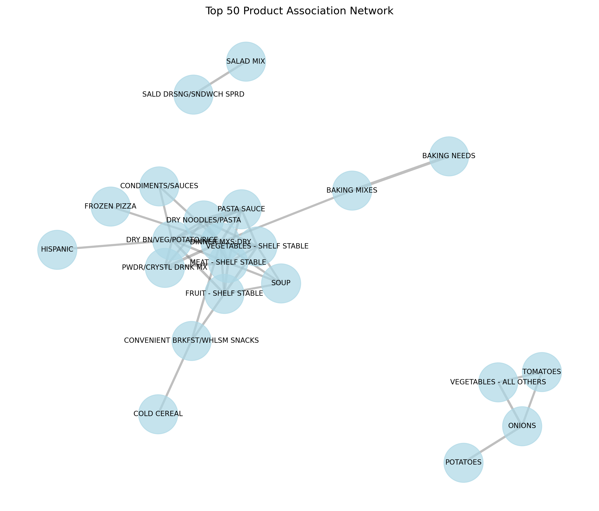
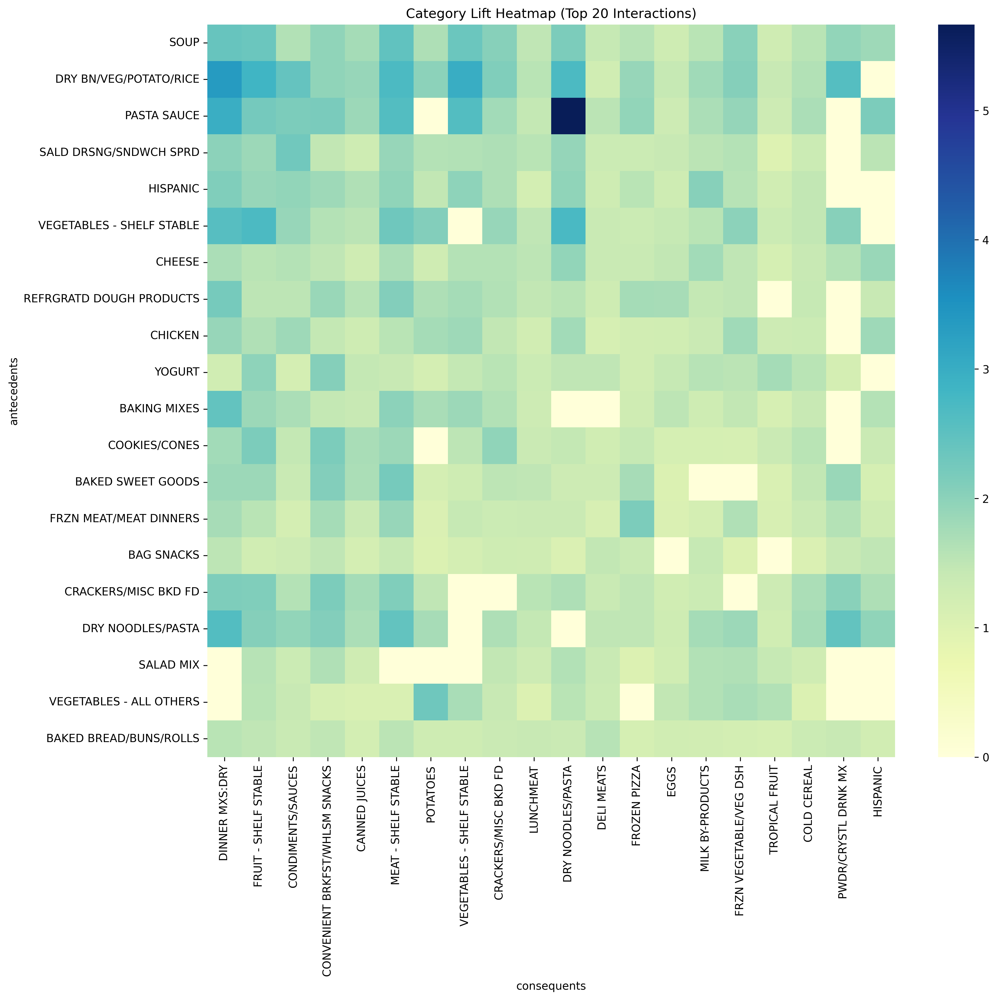
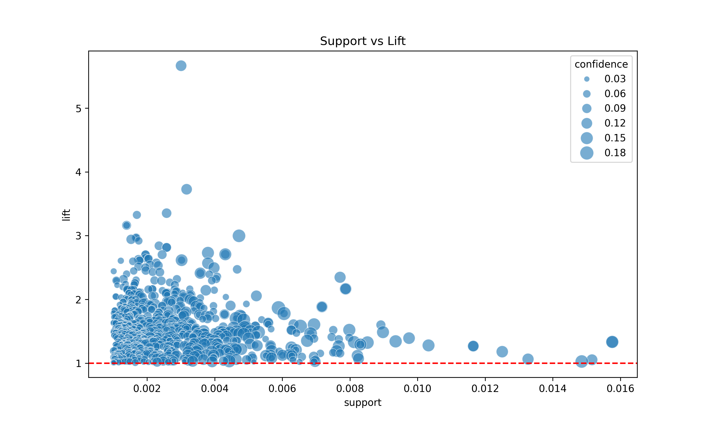

# 교차 판매 기회 및 전략 리포트 (Cross-Selling Strategic Report)

## 1. 개요 및 데이터 검증 (Overview & Validation)
- **분석 목적**: 장바구니 데이터를 통한 동시 구매 패턴 발견 및 객단가 증대 전략 수립.
- **데이터 검증 (Stability Check)**:
    - 전체 데이터를 무작위로 두 그룹(A/B)으로 나누어 교차 검증을 수행했습니다.
    - **안정성 점수 (Overlap Score)**: **93.01%**
    - 이 점수가 높을수록 발견된 연관 규칙이 특정 기간이나 고객군에 편향되지 않고 일반적임을 의미합니다.

## 2. 시각화 분석 (Visual Analytics)
### A. 상품 연관성 네트워크 (Association Network)

*중심 노드(Hub)는 여러 상품과 강하게 연결된 '앵커 상품'입니다. 이들을 매장 중심부에 배치하여 동선을 유도하십시오.*

### B. 카테고리 히트맵 (Category Heatmap)

*카테고리 간의 상호작용 강도를 나타냅니다. 짙은 색일수록 해당 카테고리 간의 교차 구매가 활발합니다.*

### C. 기회 탐색 지도 (Opportunity Map)

*우측 상단(High Support, High Lift)은 확실한 수익원이며, 좌측 상단(Low Support, High Lift)은 잠재력이 높은 틈새 시장입니다.*

## 3. 심층 전략 제언 (Strategic Deep Dive)
**[데이터가 말하는 마케팅 전략]**
본 분석에서 도출된 **'파워 번들'**과 **'히든 잼'**은 각각 다른 접근 방식이 필요합니다. 

1.  **매스 마케팅 (Mass Marketing) - 파워 번들 활용**:
    - 파워 번들은 이미 고객들에게 인지도가 높은 '국민 조합'입니다. 이들은 수익의 기반(Cash Cow)이므로, **'번들 할인(Bundle Pricing)'**보다는 **'편의성(Convenience)'**에 초점을 맞춰야 합니다. 
    - 예를 들어, 두 상품을 물리적으로 묶어 진열하거나 거리를 좁히는 것만으로도 구매 전환율을 극대화할 수 있습니다. 할인은 최소화하여 마진을 방어하십시오.

2.  **타겟 마케팅 (Target Marketing) - 히든 잼 활용**:
    - 히든 잼은 특정 취향을 가진 고객층에서만 강하게 나타나는 패턴입니다. 이는 **'개인화 추천 알고리즘'**의 핵심 자산이 됩니다. 
    - 멤버십 데이터를 활용하여 선행 상품(Antecedent)을 구매한 이력이 있는 고객에게 후행 상품(Consequent) 할인 쿠폰을 발송하십시오. 이는 고객으로 하여금 '나를 알아주는 서비스'라는 인식을 심어주어 충성도를 높입니다.

3.  **매장 레이아웃 최적화 (Store Layout Optimization)**:
    - 안정성 점수({stability_score})가 높은 규칙들은 계절이나 유행을 타지 않는 본질적인 구매 패턴입니다. 
    - 이러한 패턴을 기반으로 매장 내 'Golden Zone'을 재설계하십시오. 연관성이 높은 카테고리를 인접 배치(Cross-Merchandising)하면 고객의 체류 시간을 늘리고 자연스러운 추가 구매를 유도할 수 있습니다.

## 4. Top 10 '파워 번들' (Mass Appeal)
| 상품 A | 상품 B | 향상도 (Lift) | 신뢰도 (Confidence) | 지지도 (Support) |
| :--- | :--- | :--- | :--- | :--- |
| DRY BN/VEG/POTATO/RICE | VEGETABLES - SHELF STABLE | 3.00 | 0.16 | 0.0047 |
| VEGETABLES - SHELF STABLE | DRY NOODLES/PASTA | 2.73 | 0.07 | 0.0038 |
| VEGETABLES - SHELF STABLE | FRUIT - SHELF STABLE | 2.71 | 0.08 | 0.0043 |
| FRUIT - SHELF STABLE | VEGETABLES - SHELF STABLE | 2.71 | 0.15 | 0.0043 |
| VEGETABLES - SHELF STABLE | DINNER MXS:DRY | 2.57 | 0.07 | 0.0038 |
| COLD CEREAL | CONVENIENT BRKFST/WHLSM SNACKS | 2.50 | 0.08 | 0.0040 |
| SOUP | MEAT - SHELF STABLE | 2.47 | 0.08 | 0.0047 |
| FROZEN PIZZA | DINNER MXS:DRY | 2.41 | 0.06 | 0.0036 |
| DINNER MXS:DRY | FROZEN PIZZA | 2.41 | 0.13 | 0.0036 |
| SOUP | DINNER MXS:DRY | 2.39 | 0.06 | 0.0038 |

## 5. Top 10 '히든 잼' (Niche Targeting)
| 상품 A | 상품 B | 향상도 (Lift) | 신뢰도 (Confidence) | 지지도 (Support) |
| :--- | :--- | :--- | :--- | :--- |
| PASTA SAUCE | DRY NOODLES/PASTA | 5.66 | 0.14 | 0.0030 |
| MEAT - SHELF STABLE | DINNER MXS:DRY | 3.73 | 0.10 | 0.0032 |
| DRY BN/VEG/POTATO/RICE | DINNER MXS:DRY | 3.35 | 0.09 | 0.0026 |
| BAKING MIXES | BAKING NEEDS | 3.33 | 0.07 | 0.0017 |
| PWDR/CRYSTL DRNK MX | DINNER MXS:DRY | 3.16 | 0.08 | 0.0014 |
| DINNER MXS:DRY | PWDR/CRYSTL DRNK MX | 3.16 | 0.05 | 0.0014 |
| PASTA SAUCE | DINNER MXS:DRY | 2.97 | 0.08 | 0.0017 |
| DINNER MXS:DRY | PASTA SAUCE | 2.97 | 0.06 | 0.0017 |
| MEAT - SHELF STABLE | PWDR/CRYSTL DRNK MX | 2.94 | 0.05 | 0.0015 |
| PASTA SAUCE | DRY BN/VEG/POTATO/RICE | 2.92 | 0.08 | 0.0018 |
