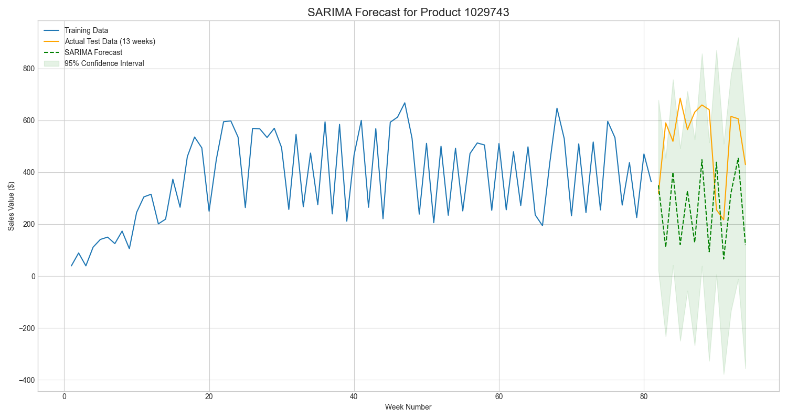

# 시계열 기반 상품 수요 예측 분석 상세 보고서

## 1. 개요

- **목표:** dunnhumby 데이터셋을 활용하여 특정 상품의 주간 판매량을 예측하는 시계열 모델을 구축하고 성능을 평가합니다.
- **선정 상품:** 총 매출액 기준 상위 5개 상품 중 가장 판매량이 높은 **상품 ID: 1029743**.
- **사용한 모델:** SARIMA(Seasonal Autoregressive Integrated Moving Average)
- **최종 모델:** `SARIMA(0, 1, 1)x(0, 1, 0, 52)`
- **주요 결과:** 테스트 데이터셋에 대한 예측의 **평균 절대 오차(MAE)는 약 $257.04**로 측정되었습니다.

---

## 2. 분석 프로세스 상세

### Step 1: 데이터 전처리 및 통합
1.  **데이터 로드:** `transaction_data`, `product`, `hh_demographic` 등 분석에 필요한 여러 CSV 파일을 Pandas DataFrame으로 로드했습니다.
2.  **데이터 타입 최적화:** 메모리 사용량을 줄이기 위해 숫자형 데이터는 `int64`에서 `int32` 등으로 다운캐스팅하고, 반복되는 문자열 데이터는 `category` 타입으로 변환했습니다.
3.  **결측치 처리:** `product` 테이블에 존재하는 의미 없는 문자열('NO SUBCOMMODITY DESCRIPTION' 등)을 `NaN`으로 변환하여 실제 결측치로 처리할 수 있도록 했습니다.
4.  **데이터 병합:** `PRODUCT_ID`와 `household_key`를 기준으로 `transaction_data`, `product`, `hh_demographic` 테이블을 병합하여 분석용 마스터 데이터셋을 구축했습니다.
5.  **저장:** 처리된 데이터는 `processed_data/master_transaction_table.parquet` 파일로 저장하여 후속 분석 단계에서 빠르고 효율적으로 로드할 수 있도록 했습니다.
- **관련 스크립트:** `01_preprocess_data.py`

### Step 2: 시계열 데이터 준비
1.  **주간 판매량 집계:** `master_transaction_table.parquet` 데이터를 로드하여, 상품별/주차별(`PRODUCT_ID`, `WEEK_NO`) `SALES_VALUE`를 합산하여 주간 판매량 데이터를 생성했습니다.
2.  **핵심 상품 선정:** 집계된 데이터를 바탕으로 총 판매량 기준 상위 5개 상품을 분석 대상으로 선정했습니다.
3.  **시계열 데이터셋 구축:** 선정된 상품들의 데이터를 `(주차)` x `(상품)` 형태의 테이블로 피벗(pivot)했습니다. 판매가 없었던 주의 결측치는 0으로 채웠습니다.
4.  **저장 및 시각화:** 완성된 시계열 데이터는 `processed_data/weekly_sales_top5_timeseries.parquet`로 저장하고, 주차별 판매량 추이를 확인하기 위한 라인 차트(`plots/weekly_sales_top5.png`)를 생성했습니다.
- **관련 스크립트:** `02_demand_forecasting_prep.py`

### Step 3: 시계열 모델링 및 예측
1.  **모델링 대상 선정:** 상위 5개 상품 중 가장 판매량이 높은 상품(ID: 1029743)의 시계열 데이터를 모델링 대상으로 선택했습니다.
2.  **데이터 분할:** 전체 시계열 기간의 80%를 훈련(training) 데이터로, 나머지 20%를 모델 성능 검증을 위한 테스트(testing) 데이터로 분할했습니다.
3.  **최적 모델 탐색:** `pmdarima` 라이브러리의 `auto_arima` 기능을 사용하여 최적의 SARIMA 모델 파라미터를 자동으로 탐색했습니다. 1년 주기의 계절성을 가정하여 계절성 주기(m)는 52로 설정했습니다.
4.  **모델 훈련 및 예측:** 탐색된 최적 모델 `SARIMA(0, 1, 1)x(0, 1, 0, 52)`를 훈련 데이터로 학습시키고, 테스트 데이터 기간에 대한 미래 판매량을 예측했습니다.
- **관련 스크립트:** `03_demand_forecasting_model.py`

---

## 3. 사용 데이터

- **원본 데이터:** `dunnhumby.db/` 디렉터리의 `transaction_data.csv`, `product.csv`, `hh_demographic.csv`
- **전처리 후 데이터:** `processed_data/master_transaction_table.parquet`
- **분석용 시계열 데이터:** `processed_data/weekly_sales_top5_timeseries.parquet`

---

## 4. 분석 방법론

### 모델: SARIMA
- **선정 이유:** SARIMA 모델은 시계열 데이터에 내재된 추세(Trend)와 계절성(Seasonality)을 모두 통계적으로 모델링할 수 있는 강력한 방법론입니다. 특히 소매 판매 데이터처럼 주기적인 패턴을 보이는 경우에 효과적입니다.
- **주요 파라미터:**
    - `(p, d, q)`: 비계절성 차수 (AR, Differencing, MA) → `(0, 1, 1)`
    - `(P, D, Q, m)`: 계절성 차수 (Seasonal AR, Differencing, MA, Period) → `(0, 1, 0, 52)`

### 성능 평가 지표: MAE (Mean Absolute Error)
- **정의:** 예측값과 실제값 차이의 절대값에 대한 평균입니다.
- **해석:** 모델의 예측이 평균적으로 실제값에서 얼마나 벗어나는지를 직관적인 금액($) 단위로 보여주기 때문에 성능 해석이 용이합니다.

---

## 5. 분석 결과 및 해석

- **모델 성능:** 테스트셋에 대한 **MAE는 약 $257.04**로 계산되었습니다. 이는 모델의 주간 판매량 예측이 실제 판매량과 평균적으로 약 $257 정도의 오차를 보인다는 것을 의미합니다.

- **시각화 결과:**
    - **위치:** `plots/sarima_forecast_product_1029743.png`
    - **해석:** 아래 그래프에서 볼 수 있듯이, 모델 예측(녹색 점선)은 실제 테스트 데이터(주황색)의 전반적인 추세를 준수하며 따라갑니다. 하지만 일부 주에서 발생하는 급격한 판매량 변동(spike)까지는 완벽하게 예측하지 못하는 한계를 보입니다.

    

- **결론:** 구축된 SARIMA 모델은 상품의 주간 판매량 추세와 계절성을 성공적으로 학습하여 미래 수요를 예측하는 기반을 마련했습니다. 하지만 MAE로 확인된 예측 오차를 고려할 때, 이 모델을 실제 재고 관리나 정밀한 프로모션 계획에 직접 활용하기보다는 추가적인 개선을 거치는 것이 바람직합니다.

---

## 6. 개선 방안

1.  **외부 변수 추가 (SARIMAX):** `causal_data`에 포함된 프로모션, 할인 정보(`display`, `mailer`)를 외부 변수(Exogenous variable)로 활용하는 SARIMAX 모델을 적용하여 예측 성능 향상을 기대할 수 있습니다.
2.  **대체 모델 활용:** Facebook에서 개발한 `Prophet`이나 딥러닝 기반의 `LSTM` 등 다른 시계열 예측 모델과 성능을 비교하여 최적의 모델을 선정할 수 있습니다.
3.  **정교한 파라미터 튜닝:** `auto_arima`에만 의존하지 않고, ACF(자기상관함수), PACF(부분자기상관함수) 플롯을 직접 분석하여 모델의 파라미터를 더 정교하게 튜닝할 수 있습니다.
4.  **이상치 처리:** 비정상적인 판매량 급증 또는 급감에 해당하는 데이터를 이상치로 간주하고, 모델 훈련 전에 이를 보간하거나 제거하는 처리 로직을 추가하여 모델의 안정성을 높일 수 있습니다.
