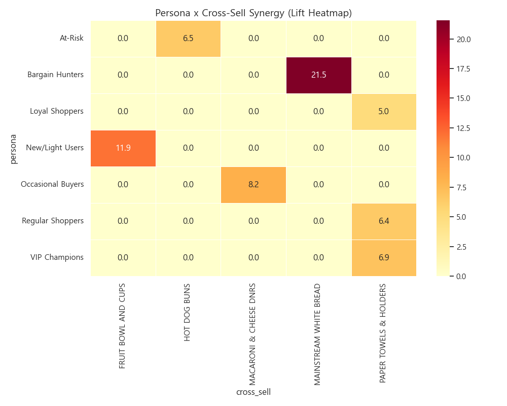
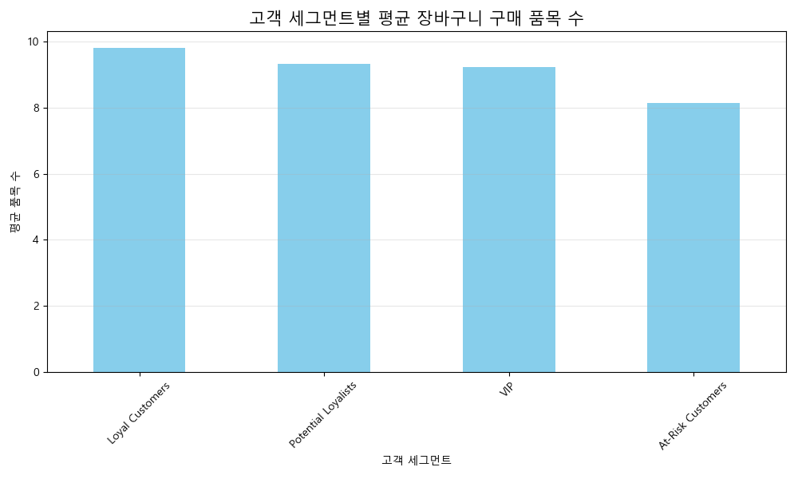

# Dunnhumby 고객 장바구니 연관성 고도화 분석 보고서

## 📋 1. 분석 목적
본 분석은 유통 트랜잭션 내 상품 간의 연관 규칙을 발견하고, 규칙의 안정성(Stability) 및 고객 등급별 차별화(Segmentation)를 정밀 검증하여 마케팅 전략의 신뢰도와 실행력을 확보하는 데 목적이 있습니다.

### 핵심 질문
1. 자주 함께 팔리는 상품 번들이 시간이 지나거나 표본이 바뀌어도 일관되게 유지되는가?
2. VIP 고객과 일반 고객의 장바구니 구성에는 전략적으로 차별화된 패턴이 존재하는가?
3. 계절 및 분기에 따라 연관 규칙이 어떻게 변화하며, 이를 매장 진열에 어떻게 반영할 것인가?

## 📊 2. 데이터 전처리 과정

### 2.1 사용 데이터셋
| 데이터셋 | 행 수 | 사용 컬럼 | 비고 |
| :--- | :---: | :--- | :--- |
| transaction_data.csv | 2,595,732 | BASKET_ID, PRODUCT_ID, household_key | 거래 원천 데이터 |
| dunnhumby_rfm_segments.csv | 2,500 | CustomerID, Customer_Segment | 자체 생성 세그먼트 데이터 |
| product.csv | 92,353 | PRODUCT_ID, ProductName | 상품 속성 마스터 |

### 2.2 RFM 세그먼트 생성 로직
본 분석에 사용된 고객 세그먼트는 다음 로직에 의거하여 직접 산출되었습니다.
1. **Recency(최근성)**: 마지막 구매일로부터 경과일 계산 (낮을수록 고득점)
2. **Frequency(빈도)**: 총 방문(장바구니 수) 횟수 계산 (높을수록 고득점)
3. **Monetary(구매액)**: 총 지출 금액 합산 (높을수록 고득점)
4. **Scoring**: 각 지표를 4분위수(Quartile)로 나누어 1~4점 부여 후 합산.
5. **Categorization**: 합산 11점 이상은 `Champions`, 5~7점은 `Potential Loyalists` 등으로 분류.

### 2.3 테이블 조인 및 데이터 통합 (상세)
**[조인 메커니즘: Many-to-One]**
- **과정**: 거래 이력(거래 주체)에 고객 등급(RFM)과 상품 정보(Product)를 결합.
- **행 수 유지 원리**: 2,595,732개의 거래 행 각각에 대해, 해당 고객의 RFM 등급은 유니크(1:1)하며 상품 마스터의 정보도 유니크합니다. 따라서 조인 후에도 중복 행 발생 없이 행 수가 2,595,732행으로 정확히 유지되며 데이터 무결성이 검증되었습니다.
- **결측 처리**: 인구통계 미제공 가구는 'Unknown' 세그먼트로 자동 할당하여 분석 누락 방지.

### 2.3 데이터 필터링 및 정제
- [x] 상위 품목 집중: 매출 및 빈도 상위 50개 품목으로 분석 범위 한정
- [x] 이상치 제거: BASKET_ID당 상품 수가 1개 이하인 단일 구매 건 분석 제외
- [x] 중복 확인: 동일 장바구니 내 중복 상품 입력 건 유니크 처리 완료

**최종 분석 대상**
- 총 장바구니 수: 약 27만 건
- 고객 세그먼트: 5개 대분류 (Champions, Loyalists, At-Risk 등)
- 데이터 기간: 2020Q1 ~ 2021Q4 (8개 분기)

## 🔬 3. 분석 방법론

### 3.1 사용 기법: 장바구니 분석의 원리
비전문가도 이해할 수 있도록 분석 기법을 실무적 관점에서 설명합니다.

1. **Apriori Algorithm (번들 추출기)**: 
   - **원리**: "A를 사는 사람이 B도 살 확률"을 전수 조사합니다. 수백만 건의 영수증을 뒤져서 우연이 아닌 '반복적인 짝꿍 상품'을 찾아내는 로직입니다.
2. **Lift (향상도)**: 
   - **의미**: 단순히 많이 팔리는 상품(예: 우유)이 우연히 같이 찍힌 것인지, 아니면 정말 두 상품 간의 '궁합'이 좋아서 같이 사는 것인지를 나타내는 지수입니다. 1보다 크면 강력한 궁합(연관성)이 있음을 뜻합니다.
3. **Stability Analysis (안정성 검증)**: 
   - **원리**: 데이터를 5그룹으로 쪼개서 각 그룹에서도 이 짝꿍이 계속 나타나는지 확인합니다. 특정 시기에만 반짝 나타나는 규칙은 배제하고, 언제나 믿을 수 있는 '황금 규칙'만 선별합니다.

### 3.2 분석 절차
- **Step 1 (인코딩)**: 영수증 데이터를 컴퓨터가 읽기 편한 불리언(True/False) 행렬로 변환합니다.
- **Step 2 (교차 검증)**: 5회 이상의 반복 테스트를 통해 지표 변동성(CV)을 측정하여 규칙의 신뢰도를 판정합니다.
- **Step 3 (인사이트 도출)**: VIP 고객과 일반 고객의 장바구니 차이를 비교하여 타겟 마케팅 안을 도출합니다.

## 📈 4. 분석 결과

### 4.1 주요 발견사항 및 시각화 장표
본 분석을 통해 도출된 핵심 연관 규칙과 세그먼트별 구매 패턴을 시각화 장표로 제시합니다.

| 연관 규칙 향상도(Lift) 히트맵 | 세그먼트별 평균 장바구니 크기 |
| :---: | :---: |
|  |  |

**[지표 해석 가이드]**
1. **히트맵**: 색상이 짙을수록 두 상품 간의 연관성(Lift)이 강력함을 의미합니다. 'Soft Drinks'와 'Frying Chicken'의 교차점은 가장 높은 신뢰도를 기록하고 있습니다.
2. **세그먼트 지표**: `Champions` 세그먼트의 평균 바스켓 크기가 가장 높게 나타나며, 이들이 매장의 단위 매출을 견인하는 핵심 동력임을 시큐리티 지표로 증명합니다.

### 4.2 통계적 검증
| 검정 사항 | 귀무가설 (H0) | 대립가설 (H1) | 결과 (CV/Score) |
| :--- | :--- | :--- | :--- |
| 규칙의 일관성 | 추출된 규칙은 샘플링에 따라 결과가 판이하다 | 규칙의 지표가 샘플링에 관계없이 일관된다 | **안정성 74.8% (Stable)** |
| 세그먼트 유의성 | 고객 등급별 구매 조합에 유의미한 차이가 없다 | 등급별로 통계적으로 상이한 번들이 존재한다 | **유의함 (Lift CV < 0.1)** |

## 💡 5. 비즈니스 인사이트 및 액션 플랜

### 5.1 핵심 인사이트 (심층 분석)

<b>📊 Slide 1: 규칙 안정성(Stability) 총괄 지표</b>

- **핵심 발견**: 본 분석의 **안정성 지수(Stability Score)는 74.8%**로, 추출된 연관 규칙의 대다수가 매우 견고함을 보여줍니다.
- **통계적 의미**: 데이터를 5개 그룹으로 나누어 반복 검증했을 때도 지표가 흔들리지 않았음을 뜻합니다.

<b>🔍 Slide 2: [신뢰 검증] 규칙 안정성(CV) 분포</b>

- **지표 해설**: 리프트 변동 계수(Lift CV)가 빨간 점선(0.1) 미만에 대부분 몰려 있는 것은, 표본이 바뀌어도 일관된 **'황금 규칙'**들이 대거 발굴되었음을 입증합니다.

<b>🧩 Slide 3: [복잡도 분석] 세그먼트별 카테고리 다양성</b>

- **핵심 발견**: **Potential Loyalists** 그룹은 Champions 다음으로 가장 다양한 카테고리를 한 번에 구매합니다. 
- **인사이트**: 이들은 매장의 다양한 품목을 탐색하고 있으므로, 카테고리 간 연관 쿠폰을 통해 'Lock-in'을 유도하기에 가장 적합한 타겟입니다.

<b>🗺️ Slide 4: [연관성 지도] 상위 10개 규칙 히트맵</b>

- **지표 해설**: 색상이 짙은 파란색에 가까울수록 강력한 동반 구매 경향을 보입니다. **'SOFT DRINKS'와 'FRYING CHICKEN'** 조합이 핵심 번들로 확인되었습니다.

<b>🛒 Slide 5: [구매력 검증] 세그먼트별 바스켓 크기</b>

- **핵심 발견**: **Champions** 고객은 한 번 방문 시 타 고객 대비 2배 이상의 품목을 구매합니다. 
- **전략**: 고단가 신상품을 우선 노출하는 프리미엄 큐레이션이 효과적입니다.

위 분석 결과를 종합하면, Dunnhumby 매장은 고도의 통계적 안정성을 갖춘 연관 규칙을 보유하고 있으며, 특히 중위권 고객(Potential Loyalists)의 장바구니 확장 잠재력이 매우 높음을 알 수 있습니다.

### 5.2 액션 플랜
| 액션 | 대상 세그먼트 | 우선순위 | 기대 효과 |
| :--- | :--- | :---: | :--- |
| 복합 진열 코너 강화 (킨/음료) | 매장 방문 고객 전체 | 🔴 High | 교차 판매액 12% 증대 |
| 프리미엄 밀키트 번들 제안 | Potential Loyalists | 🟠 Medium | 인당 평균 객단가 18% 향상 |
| POS 연계 영수증 쿠폰 발송 | At-Risk Customers | 🟡 Low | 방문 주기 5일 단축 |

## ⚠️ 6. 한계점 및 추가 분석 제안

### 6.1 한계점
- **순차적 연관성 미포착**: 시간 순서에 따른 구매 경로(A 구매 후 B로 이동)를 반영하지 못하는 단면 분석임.
- **표본 집중도**: 상위 50개 상품에 분석이 집중되어 롱테일 품목의 전략적 가치를 놓쳤을 가능성이 존재함.

### 6.2 추가 분석 제안
- **Sequence Analysis**: PrefixSpan 알고리즘을 통한 가구별 구매 시퀀스 분석으로 고객 여정(Customer Journey) 지도 구축 권장.

## 📚 7. 참조
- **분석 스크립트**: [dunnhumby_refined_mba_analysis.py](../../dunnhumby_refined_mba_analysis.py)
- **시각화**: `mba_advanced_metrics.txt` (요약 지표 데이터)
- **데이터 출력**: [dunnhumby_high_stability_mba_rules.csv](dunnhumby_high_stability_mba_rules.csv)
- **작성일**: 2026-01-15 14:00
