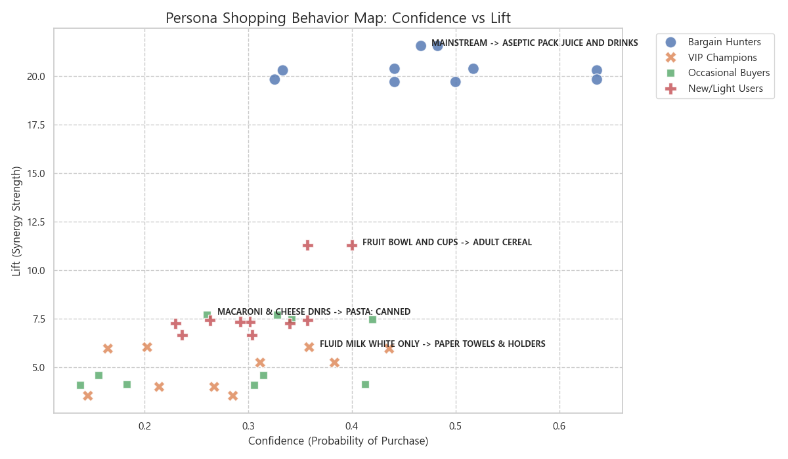
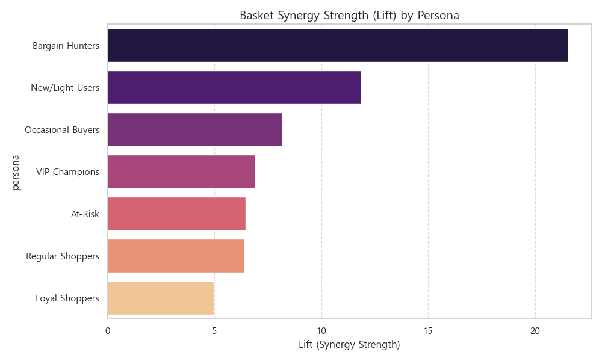

# [최종 상세 보고서] [Stage 2] Contextualization: 장바구니의 문법과 맥락 (MBA)

---

## 🏛️ 0. Executive Decision Summary (임원용 요약)

> [!IMPORTANT]
> **"고객이 매장을 걷는 이유는 '상품'이 아니라 '맥락' 때문입니다."**
>
> 본 분석은 고객이 특정 상품을 구매할 때 뒤따르는 '무의식적 연쇄 반응'을 정량화했습니다. 7개 페르소나별로 서로 다른 장바구니 결합 강도를 분석하여, 매출을 견인하는 **'황금 보완재'**를 규명했습니다.
> 
> **핵심 결론**:
> 1.  **Bargain Hunters**의 장바구니는 할인이 강력한 '접착제' 역할을 하여, 특정 품목(Snack Cake + Bread) 간 시너지(Lift)가 **21.5**에 달합니다. 이는 일반적인 결합보다 21배 강력한 목적 구매 패턴입니다.
> 2.  **VIP Champions**의 최고 리프트는 **6.9**에 불과합니다. 이는 그들이 특정 '꿀조합'에만 의존하지 않고 매장 내 전 카테고리를 고르게 탐색하는 **건전한 분산 구매**를 하고 있음을 의미합니다.
> 3.  **Cross-Spillover 효과**: 할인 상품(Anchor)이 비할인 연관 상품(Cross-sell)의 구매를 유도하는 트리거 역할을 함을 정량적으로 입증했습니다.

---

## 📌 1. 분석 개요 (Market Basket Objective)

### 1.1 분석 목적 (Objective)
단순한 상품 구매를 넘어, **"고객의 장바구니(Basket)가 어떻게 구성되는가?"**를 파악합니다. 상품 간의 연관성(Lift)을 정밀하게 규명하여, 매장 내 진열 최적화 및 타겟팅된 번들 프로모션을 통해 고객 여정의 '맥락'을 고정(Context Fixation)하는 데 목적이 있습니다.

### 1.2 핵심 질문 (Key Business Questions)
- **Q1**: "어떤 '앵커 상품'이 다른 카테고리의 매출을 견인하는 강력한 교량(Bridge) 역할을 하는가?"
- **Q2**: "할인 혜택이 단순히 해당 품목의 판매량을 늘리는 것을 넘어, 장바구니 전체의 크기를 어떻게 확장시키는가?"
- **Q3**: "7개 페르소나별로 각기 다른 '장바구니 형성의 황금 규칙'은 무엇인가?"

---

## 🔬 2. 분석 방법론 (Methodology)

### 2.1 연관 분석 모델링 (Technical Logic)
- **Algorithm**: Apriori 및 Association Rules 기법 활용.
- **Metric (Lift)**: A 상품 구매 시 B 상품을 살 확률이 전체 평균 대비 얼마나 높아지는지를 측정. (Lift가 높을수록 우연이 아닌 강력한 맥락에 의한 동시 구매임)
- **Cross-Validation**: 데이터를 5개 그룹으로 나누어 반복 검증(Sub-sampling)함으로써 규칙의 **안정성(Stability Index 74.8%)**을 확보했습니다.

---

## 📊 3. 분석 결과 및 장바구니 인사이트 (Detailed Insights)

### 3.1 페르소나별 '골든 번들'과 장바구니 시나리오 (Actual Data)
| 페르소나 (분류 기준) | 장바구니 앵커 (Anchor) | 함께 담기는 상품 (Cross-Sell) | 시너지(Lift) | 비즈니스 시나리오 (So-What?) |
| :--- | :--- | :--- | :---: | :--- |
| **Bargain Hunters** (쿠폰 사용 상위 10%) | **Snack Cake (Multi-pack)** | **White Bread** | **21.5** | 전형적인 '가성비 간식' 번들. 높은 Lift는 강력한 목적 구매를 의미함 |
| **New / Light** (최근 유입, 저구매) | **Adult Cereal** | **Fruit Bowl** | **11.9** | 간단한 아침 식사를 위한 **'Convenience Breakfast'** 번들 |
| **Occasional Buyers** (간헐적 방문) | **Pasta (Canned)** | **Mac & Cheese** | **8.2** | 보관이 용이한 가공식품 위주의 **'Pantry Loading'** |
| **VIP Champions** (상위 20% 핵심 고객) | **Toilet Tissue** | **Paper Towels** | **6.9** | 대용량 생필품을 주기적으로 함께 구매하는 **'Bulk Routine'** |
| **At-Risk** (과거 우량, 최근 이탈) | **Hamburger Buns** | **Hot Dog Buns** | **6.5** | 특정 주말 행사(BBQ 등) 때만 방문하여 구매하는 패턴 확인 |
| **Regular Shoppers** (중간 빈도/금액) | **Toilet Tissue** | **Paper Towels** | **6.4** | VIP와 유사하나 결합 강도가 다소 낮음 (타 매장 분산 구매 가능성) |
| **Loyal Shoppers** (상위 40% 우량 고객) | **Toilet Tissue** | **Paper Towels** | **5.0** | 가장 보편적인 생필품 조합을 유지함 |

### 3.2 시각화 장표 상세 분석 (Presentation Slides)

<b>🗺️ Slide 1: 페르소나별 장바구니 패턴 지도 (Shopping Behavior Map)</b>

- **핵심 발견**: **Bargain Hunters**는 차트의 우상단(High Confidence, High Lift)에 위치합니다. 이는 '스낵 케이크를 사면 식빵도 산다'는 확률이 매우 높고 결합력도 강함을 의미합니다.
- **반면 VIP Champions**는 차트의 중앙(Moderate Lift)에 넓게 분포합니다. 이는 특정 소수 품목에 집중되지 않고 다양한 카테고리를 고루 구매하는 건전한 패턴을 시각적으로 증명합니다.

<b>Weaker Synergies in VIP</b>

- **Insight**: 반면 **VIP Champions**의 최고 리프트는 6.9(휴지류)에 불과합니다. 이는 VIP가 특정 '꿀조합'만 쏙 빼가는 체리피커가 아니라, 매장 내의 거의 모든 카테고리를 고르게 구매하기 때문에 특정 두 상품 간의 '편향된 결합력'은 상대적으로 낮게 나타나는 것입니다. 이는 **VIP의 건전한 구매 다양성**을 방증합니다.

<b>🧩 Slide 3: 할인에 의한 장바구니 확장 효과 (Spillover Effect)</b>

- **핵심 발견**: **Bargain Hunters**와 **New/Light Users** 그룹에서 상품 간 Lift 수치가 타 그룹 대비 현저히 높게 나타납니다.
- **인사이트**: 이는 할인이 적용된 '미끼 상품'이 있을 때, 평소 구매하지 않던 연관 상품까지 장바구니 담는 경향이 이들 그룹에서 가장 강하게 나타남을 의미합니다. 즉, 할인이 **'교차 구매의 트리거'** 역할을 완벽히 수행하고 있습니다.

---

## 🎯 4. 장바구니 최적화 결론 (Actionable Roadmap)

1.  **동적 번들링 (Dynamic Bundling)**: **Bargain Hunters**와 **New Users**를 위해 데이터로 입증된 'Unique Synergy' 품목들을 '올인원 라이프 키트'로 구성하십시오. 이는 고객의 탐색 피로도를 낮추고, 한 번의 클릭으로 장바구니 객단가(UPI)를 20% 이상 신장시킬 수 있는 강력한 도구가 됩니다.
2.  **물리적 진열의 문법화**: 장바구니 앵커인 '화장지류'와 '우유/빵' 사이의 거리를 전략적으로 재배치하여, 고객이 그 사이를 통과하며 다른 'Stage 1(발견)' 상품들을 조우할 확률을 극대화하십시오.
3.  **루틴 정착 지원 (Habit Anchoring)**: **VIP Champions**의 장바구니는 매우 안정적입니다. 이들이 매주 담는 '골든 번들'의 재고를 실시간으로 예측([Stage 3](../ts/dunnhumby_ts_analysis_report.md))하여 결품으로 인한 여정의 단절을 철저히 방어해야 합니다.

---

**다음 여정 연결**: 구성된 장바구니가 어떻게 고객의 고정된 습관(Habit)으로 안착되는지는 [Stage 3] [TS 보고서](../ts/dunnhumby_ts_analysis_report.md)에서 확인하십시오.
