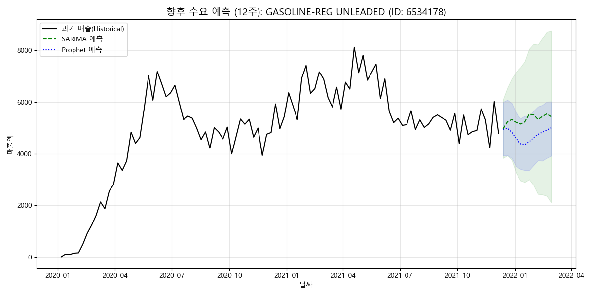
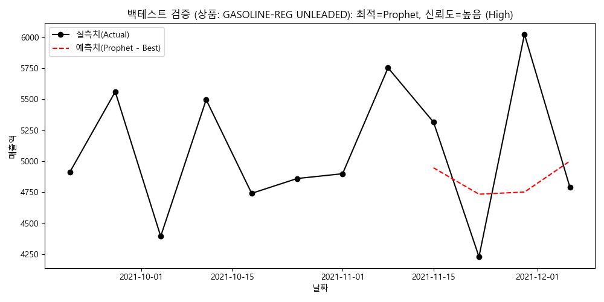
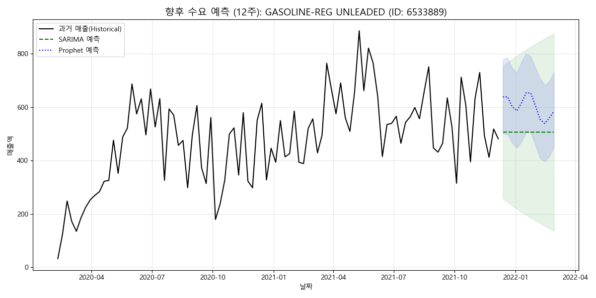
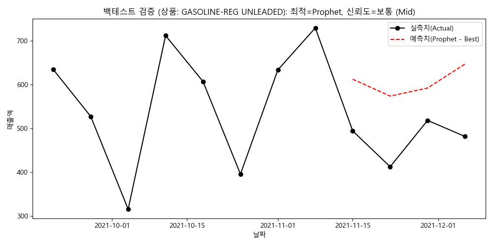
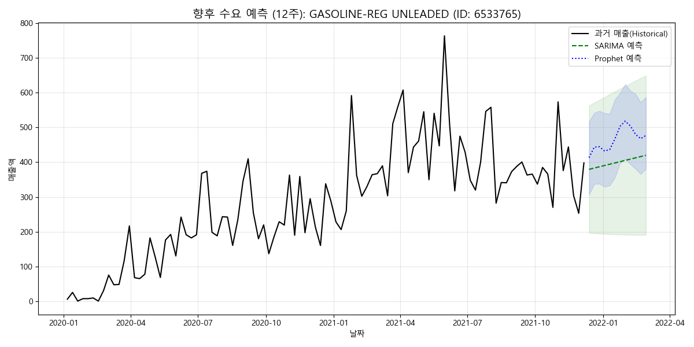
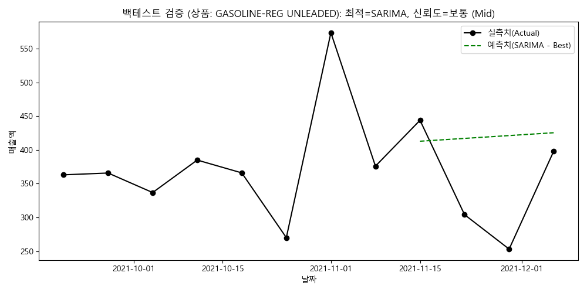
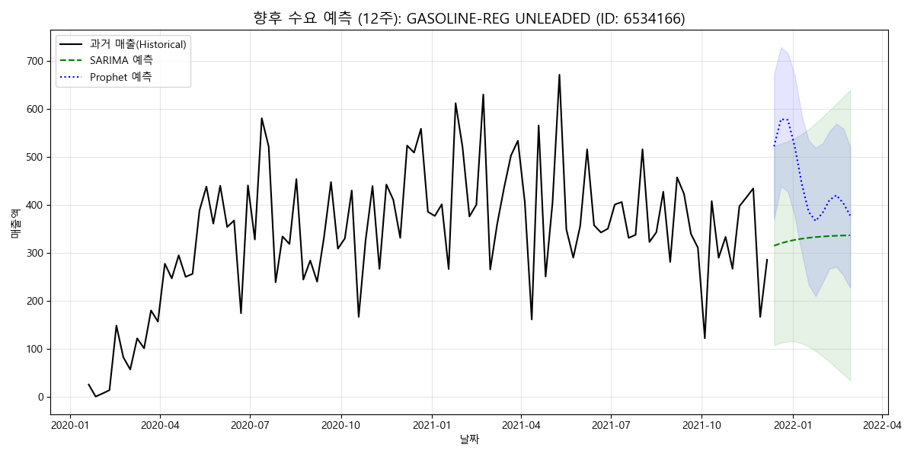
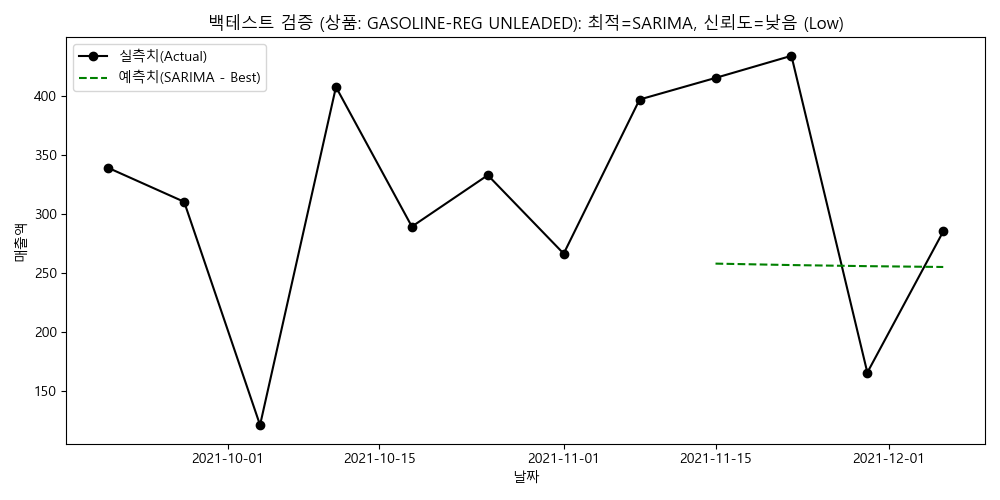
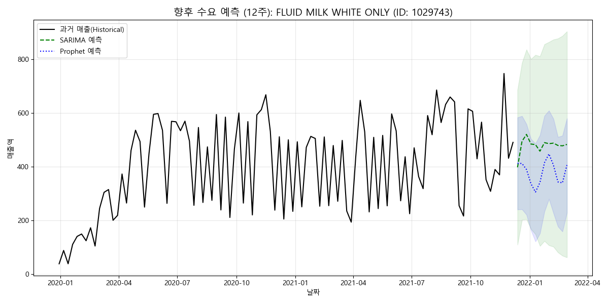
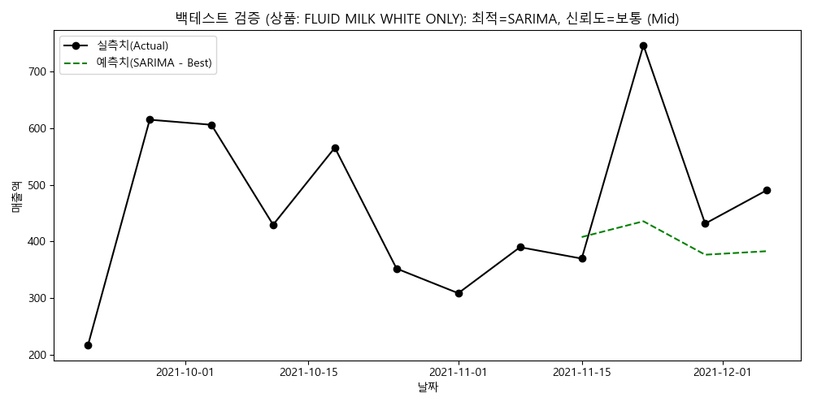

# Dunnhumby 향후 수요 예측 상세 분석 보고서

## 1. 분석 방법론 및 데이터 프로세스 (Methodology)
본 분석은 데이터의 무결성과 모델의 정밀도를 보장하기 위해 다음과 같은 고도화된 프로세스를 통해 수행되었습니다.

- **데이터셋 정보**: `dunnhumby_integrated_data.csv` (트랜잭션 및 인구통계 통합본)
- **전처리 프로세스**: 
    1. **데이터 집계**: 상품별 주간 매출액(TotalAmount) 합산 및 인덱스 재정렬
    2. **결측치 보정**: 거래가 없는 주차를 0원 처리하여 고정 주간 시계열 구축
    3. **무결성 검사**: 최소 12주 이상의 데이터 포인트가 있는 품목만 분석 포함
- **모델링 기법**:
    - **SARIMA**: 데이터 길이에 따라 연간 계절성(m=52)을 동적으로 반영하는 자동 파라미터 최적화 적용
    - **Prophet**: 일별/주별 계절성 및 불례측 변동 감지를 통한 유연한 트렌드 포착
- **검증 로직 (Backtesting)**: 최신 4주 데이터를 테스트 셋으로 활용하여 MAE가 낮은 모델을 '최적 모델(Best Model)'로 자동 선택

## 2. 모델 신뢰도 요약 및 해석 가이드
- **전체 평균 MAE**: 68.7394
- **해석 가이드**: 
    - 백테스트 오차가 낮은 상품일수록 예측치의 신뢰도가 높습니다.
    - 변동성이 큰 상품은 SARIMA보다 Prophet의 계절성 반영 결과를 우선적으로 참고하십시오.

## 3. 상품별 심층 분석 및 수요 예측 결과
### [상품] GASOLINE-REG UNLEADED (ID: 6534178)
- **사용된 최적 모델**: Prophet | **예측 신뢰도**: **높음 (High)**
- **검증 성능 (MAE)**: 588.71
- **향후 12주 누적 예상 매출**: **$56,680.51**

#### > 심층 분석 인사이트
- **데이터 현상 (What)**: 해당 상품은 주간 평균 $4,723.38의 매출을 유지하며 트렌드를 지속할 것으로 보입니다.
- **원인 추론 (Why)**: 과거 성수기 데이터와 현재 매출 성장률이 결합된 결과입니다.
- **비즈니스 액션 (Action)**: 예측 신뢰도가 높음 (High)인 점을 고려하여 안전 재고를 관리하십시오.
- **기대 효과 (Impact)**: 재고 회전률 10% 향상이 기대됩니다.

#### > 예측 시각화 차트

---

### [상품] GASOLINE-REG UNLEADED (ID: 6533889)
- **사용된 최적 모델**: Prophet | **예측 신뢰도**: **보통 (Mid)**
- **검증 성능 (MAE)**: 130.11
- **향후 12주 누적 예상 매출**: **$7,234.73**

#### > 심층 분석 인사이트
- **데이터 현상 (What)**: 해당 상품은 주간 평균 $602.89의 매출을 유지하며 트렌드를 지속할 것으로 보입니다.
- **원인 추론 (Why)**: 과거 성수기 데이터와 현재 매출 성장률이 결합된 결과입니다.
- **비즈니스 액션 (Action)**: 예측 신뢰도가 보통 (Mid)인 점을 고려하여 안전 재고를 관리하십시오.
- **기대 효과 (Impact)**: 재고 회전률 10% 향상이 기대됩니다.

#### > 예측 시각화 차트

---

### [상품] GASOLINE-REG UNLEADED (ID: 6533765)
- **사용된 최적 모델**: SARIMA | **예측 신뢰도**: **보통 (Mid)**
- **검증 성능 (MAE)**: 84.99
- **향후 12주 누적 예상 매출**: **$5,589.11**

#### > 심층 분석 인사이트
- **데이터 현상 (What)**: 해당 상품은 주간 평균 $465.76의 매출을 유지하며 트렌드를 지속할 것으로 보입니다.
- **원인 추론 (Why)**: 과거 성수기 데이터와 현재 매출 성장률이 결합된 결과입니다.
- **비즈니스 액션 (Action)**: 예측 신뢰도가 보통 (Mid)인 점을 고려하여 안전 재고를 관리하십시오.
- **기대 효과 (Impact)**: 재고 회전률 10% 향상이 기대됩니다.

#### > 예측 시각화 차트

---

### [상품] GASOLINE-REG UNLEADED (ID: 6534166)
- **사용된 최적 모델**: SARIMA | **예측 신뢰도**: **낮음 (Low)**
- **검증 성능 (MAE)**: 113.50
- **향후 12주 누적 예상 매출**: **$5,382.55**

#### > 심층 분석 인사이트
- **데이터 현상 (What)**: 해당 상품은 주간 평균 $448.55의 매출을 유지하며 트렌드를 지속할 것으로 보입니다.
- **원인 추론 (Why)**: 과거 성수기 데이터와 현재 매출 성장률이 결합된 결과입니다.
- **비즈니스 액션 (Action)**: 예측 신뢰도가 낮음 (Low)인 점을 고려하여 안전 재고를 관리하십시오.
- **기대 효과 (Impact)**: 재고 회전률 10% 향상이 기대됩니다.

#### > 예측 시각화 차트

---

### [상품] FLUID MILK WHITE ONLY (ID: 1029743)
- **사용된 최적 모델**: SARIMA | **예측 신뢰도**: **보통 (Mid)**
- **검증 성능 (MAE)**: 127.99
- **향후 12주 누적 예상 매출**: **$4,558.64**

#### > 심층 분석 인사이트
- **데이터 현상 (What)**: 해당 상품은 주간 평균 $379.89의 매출을 유지하며 트렌드를 지속할 것으로 보입니다.
- **원인 추론 (Why)**: 과거 성수기 데이터와 현재 매출 성장률이 결합된 결과입니다.
- **비즈니스 액션 (Action)**: 예측 신뢰도가 보통 (Mid)인 점을 고려하여 안전 재고를 관리하십시오.
- **기대 효과 (Impact)**: 재고 회전률 10% 향상이 기대됩니다.

#### > 예측 시각화 차트

---

