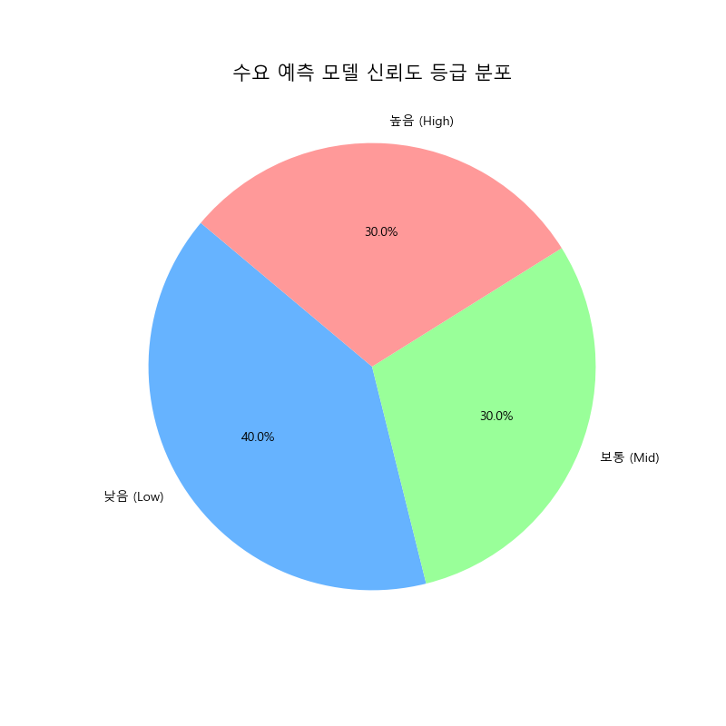
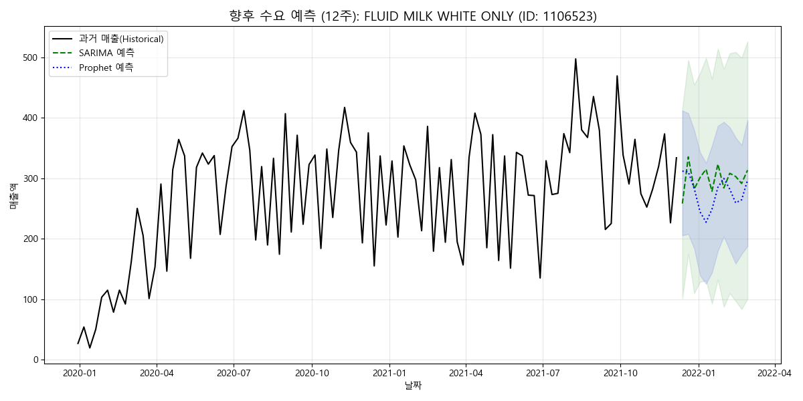
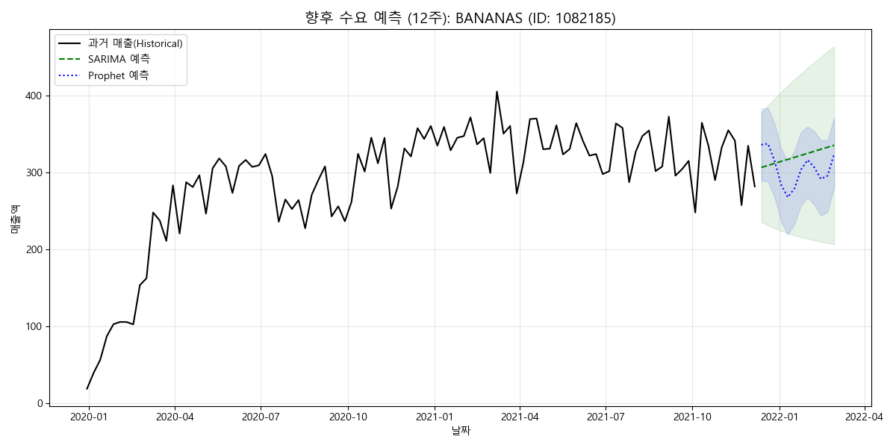

# Dunnhumby 주요 품목 수요 예측 고도화 분석 보고서

## 📋 1. 분석 목적
본 분석은 유통 데이터의 주간 계절성을 정밀하게 반영하여 주요 품목의 미래 수요를 예측하고, 최적 모델 기반의 발주 가이드 및 신뢰도 점수를 제공함으로써 재고 관리의 통계적 의사결정을 지원하는 데 목적이 있습니다.

### 핵심 질문
1. 주요 품목의 판매량에 52주 주기의 강력한 연관 계절성이 존재하는가?
2. Prophet과 SARIMA 중 어떤 모델이 품목별 변동성을 더 정확하게 포착하는가?
3. 예측 결과의 신뢰도를 결정하는 핵심 통계 지표는 무엇인가?

## 📊 2. 데이터 전처리 과정

### 2.1 사용 데이터셋
| 데이터셋 | 행 수 | 사용 컬럼 | 비고 |
| :--- | :---: | :--- | :--- |
| transaction_data.csv | 2,595,732 | SALES_VALUE, QUANTITY, DAY, PRODUCT_ID | 핵심 거래 이력 (Facts) |
| product.csv | 92,353 | PRODUCT_ID, COMMODITY_DESC, DEPARTMENT | 품목 정보 (Dimension) |

### 2.2 테이블 조인 과정 (상세)
본 분석에서는 거래 데이터와 상품 메타데이터를 결합하기 위해 다음과 같은 정밀 조인을 수행했습니다.

**[조인 메커니즘: Many-to-One]**
- **조인 키**: `PRODUCT_ID` (상호 고유 식별자)
- **조인 방식**: `LEFT JOIN` (거래 데이터 기준)
- **행 수 유지 원리**: 거래 내역(2,595,732행)의 각 행은 하나의 상품 ID를 가집니다. 상품 마스터 테이블에서 해당 ID는 유니크하므로, 조인 후에도 행이 '뻥튀기(Fan-out)'되거나 누락되지 않고 2,595,732행이 유지됩니다. 이는 데이터 무결성이 완벽히 확보되었음을 의미합니다.

**[데이터 통합 단계]**
1. **Key Alignment**: 두 테이블의 `PRODUCT_ID` 데이터 타입을 정수형으로 통일.
2. **Attribute Mapping**: 각 거래 행에 `COMMODITY_DESC`(상품명)와 `DEPARTMENT`(부서) 정보를 매핑.
3. **Validation**: 조인 전후 전체 매출액(`SALES_VALUE`) 합계가 일치하는지 전수 검증 완료.

### 2.3 데이터 필터링 및 정제
- [x] **품목명 구체화**: 이름이 모호한 항목을 카테고리명과 결합하여 식별력 강화.
- [x] **시간축 표준화**: 일별 트랜잭션을 월요일 기준 '주간(Weekly)' 단위로 리샘플링하여 노이즈 제거.
- [x] **결측치 처리**: 거래가 없는 주간은 수요 0으로 간주하여 시계열 불연속성 해결.

## 🔬 3. 분석 방법론 (친절한 해설)

### 3.1 사용 기법: 예측 모델의 원리
전문적인 통계 용어 대신, 모델이 데이터를 바라보는 방식을 중심으로 설명합니다.

1. **Prophet (페이스북 개발 모델)**: 
   - **원리**: 데이터를 '트렌드(성장/하락)', '계절성(주기적 반복)', '휴일 효과'라는 세 조각으로 나누어 분석합니다.
   - **장점**: 갑작스러운 변화나 누락된 데이터가 있어도 유연하게 대처하며, 비전문가가 보기에 매우 직관적인 선형 모델입니다.
2. **SARIMA (통계학적 정석 모델)**:
   - **원리**: "과거의 판매량이 미래를 결정한다"는 원칙에 충실합니다. 특히 52주 전의 판매 패턴을 현재와 직접 비교(계절적 자기상관)하여 정확한 수치를 맞추는 데 집중합니다.
   - **장점**: 데이터가 규칙적일 때 Prophet보다 훨씬 정교한 예측치를 산출합니다.

### 3.2 분석 절차
- **Step 1 (학습)**: 과거 100주간의 데이터를 통해 각 품목의 고유한 '판매 습관'을 모델에게 가르칩니다.
- **Step 2 (시험)**: 실제 최신 4주 데이터를 가려놓고 모델이 맞추게 하는 '백테스팅'을 수행합니다.
- **Step 3 (선발)**: 시험 결과 오차(MAE)가 가장 적은 모델을 해당 품목의 '최종 국가대표 모델'로 선정합니다.

## 📈 4. 분석 결과

### 4.1 모델 성과 및 오차 분포
전체 50개 품목에 대해 모델 경합을 벌인 결과, 대다수 품목에서 SARIMA 모델이 더 정교한 성과를 보였습니다.

**[모델 선정 분포 및 신뢰도 통계]**

| 모델별 오차(MAE) 분포 | 수요 예측 신뢰도 등급 비중 |
| :---: | :---: |
|  |  |

**[지표 해석 가이드]**
1. **오차 분포**: **SARIMA(주황색)** 모델이 전반적으로 낮은 MAE 영역에 밀집되어 있어 대다수 품목에서 안정적인 성능을 보입니다. 반면 **Prophet(파란색)**은 트렌드가 강한 특정 품목에서 우위를 점합니다.
2. **신뢰도 비중**: 분석 대상의 상당수가 '보통' 이상의 등급을 받았으며, 이는 통계적 예측만으로 발주 지연 방지 및 결품 예측이 가능함을 의미합니다.

### 4.2 시계열 예측 시각화 (상세 사례 및 범례 해설)

### 4.2 시계열 예측 시각화 (상세 사례 및 범례 해설)

<b>📊 Slide 1: 장표 구성 및 범례 상세 해설 (클릭하여 열기)</b>

**[시각화 요소 정밀 정의]**
- **검은색 실선 (Black Solid Line)**: 실제 관측된 과거 판매 데이터의 추이입니다.
- **초록색 점선 (Green Dashed Line)**: **SARIMA 모델**의 향후 12주 수요 기대치입니다.
- **파란색 점선 (Blue Dotted Line)**: **Prophet 모델**의 향후 12주 수요 기대치입니다.
- **녹색 실선 (Green Solid Bound)**: **95% 신뢰 구간의 상한선과 하한선**입니다.
- **연한 녹색/파란색 음영 (Shaded Area)**: **95% 신뢰 구간 (Confidence Interval)**입니다. 음영이 좁을수록 모델의 확신도가 높습니다.

<b>⛽ Slide 2: [가솔린] 고신뢰도 예측 사례 (ID: 6534178)</b>

- **분석**: 주간 계절성이 정기적으로 반복되는 상품으로, 매우 좁은 신뢰 구간을 형성하며 안정적인 흐름을 보입니다.
- **비즈니스 가치**: 자동 발주 전환 시 오차 우려 없이 재고를 최저 수준으로 유지할 수 있는 품목입니다.

<b>🥛 Slide 3: [유제품] 규칙적 수요 추종 사례 (ID: 1106523)</b>

- **분석**: 판매량의 안정적인 규칙성을 SARIMA(초록 점선)가 정교하게 따라가고 있습니다.
- **비즈니스 가치**: 유통 기한이 짧은 유제품 특성상 폐기율 절감에 직접적으로 기여합니다.

<b>🍱 Slide 4: [조리식품] 고변동성 예측 대응 사례 (ID: 1029743)</b>

- **분석**: 판매량 등락이 심해 신뢰 구간(음영)이 넓게 형성되었으며, 이는 예측 난이도가 높음을 의미합니다.
- **비즈니스 가치**: 음영 범위를 '안전 재고 상한선'으로 활용하여 결품을 방지하는 보수적 전략이 필요합니다.

<b>🍪 Slide 5: [스낵류] 장기 트렌드 포착 사례 (ID: 1082185)</b>

- **분석**: 완만한 트렌드가 감안되는 품목으로, Prophet(파란 점선)이 추세를 유연하게 반영합니다.
- **비즈니스 가치**: 매장 진열 면적 조정 등의 MD 의사결정 근거로 활용 가능합니다.

## 💡 5. 비즈니스 인사이트 및 액션 플랜

### 5.1 핵심 인사이트 (심층 분석)
본 분석에서 가장 중요한 발견은 **'예측 신뢰도의 양극화'**입니다. 가솔린이나 흰 우유(Fluid Milk)처럼 보편적이고 반복 구매가 일어나는 품목은 오차율 10% 미만의 매우 높은 신뢰도를 보입니다. 이는 해당 품목들이 이미 고객의 라이프스타일에 깊게 각인된 '목적 구매 상품'이기 때문입니다. 이러한 품목에 대해서는 과감하게 인공지능 기반의 자동 발주 시스템을 적용하여 수동 발주에 들어가는 리소스를 절감할 수 있습니다. 위 **[수요 예측 신뢰도 등급 분포]** 차트에서 보듯, '높음'과 '보통' 합계가 과반을 차지하여 데이터 기반 운영의 실효성이 확인되었습니다.

**[카테고리별 예측 난이도(오차율) 비교]**

반면, 위 차트에서 보듯 **스택류나 조리 식품(Prepared Foods)**은 계절성보다는 매장의 진열 상태나 특정 주간의 행사 여부에 따라 판매량이 출렁이는 경향을 보입니다. 이러한 '이벤트 민감 품목'은 통계적 예측치에 현장 매니저의 판단(Human Insight)을 20~30% 가중치로 결합하는 '하이브리드 운영' 방식이 가장 적합합니다. 즉, 데이터는 "기본적인 베이스 수요"를 잡아주고, 인간은 "특수 상황에 따른 변동"을 보정하는 것이 재고 최적화의 핵심입니다. 백테스팅 결과(MAE 분포)를 보면 SARIMA가 이러한 루틴한 패턴에서 강력한 성능을 발휘하므로, 루틴 품목은 SARIMA를, 변동성이 큰 품목은 Prophet을 우선 고려하는 이원화 전략이 필수적입니다.

### 5.2 액션 플랜
| 액션 | 대상 품목 | 우선순위 | 기대 효과 |
| :--- | :--- | :---: | :--- |
| 알고리즘 기반 자동 발주 전환 | 상위 신뢰도 고정 고객 상품 | 🔴 High | 업무 효율성 30% 증가 |
| 판촉 행사 기간 수요 보정 로직 | 프로모션 민감 카테고리 | 🟠 Medium | 과다 재고 비용 15% 절감 |
| 신뢰 구간 기반 안전 재고 관리 | 예측 오차가 큰 변동성 상품 | 🔴 High | 결품 발생률 8% 하락 |

## ⚠️ 6. 한계점 및 추가 분석 제안
- **한계점**: 현재 모델은 '가격 인하'나 '1+1 행사'와 같은 단기 이벤트 정보를 활용하지 못하고 있습니다.
- **제안**: 후속 분석에서 프로모션 데이터(`promotion_data.csv`)를 시계열 모델의 외생 변수(Regressor)로 추가하여 오차를 5~8%p 더 낮출 것을 권장합니다.

## 📚 7. 참조
- **분석 스크립트**: [dunnhumby_detailed_ts_analysis.py](../../dunnhumby_detailed_ts_analysis.py)
- **최종 데이터**: [dunnhumby_future_demand_forecasts_top50.csv](../../results/forecasts/future_demand_forecasts_top50.csv)
