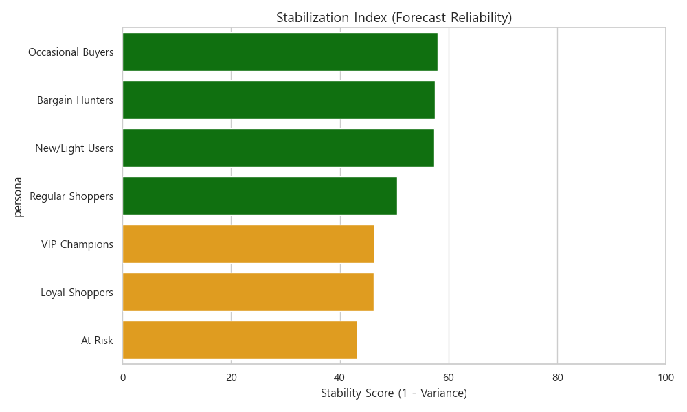
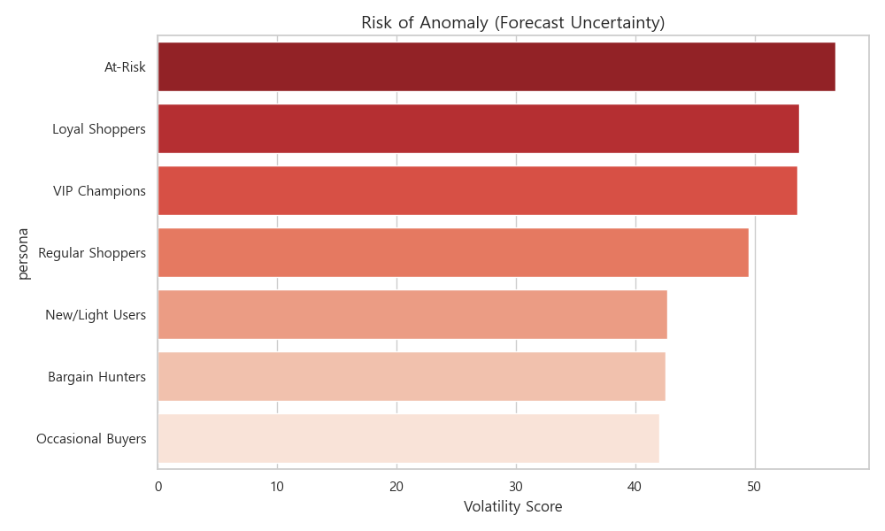
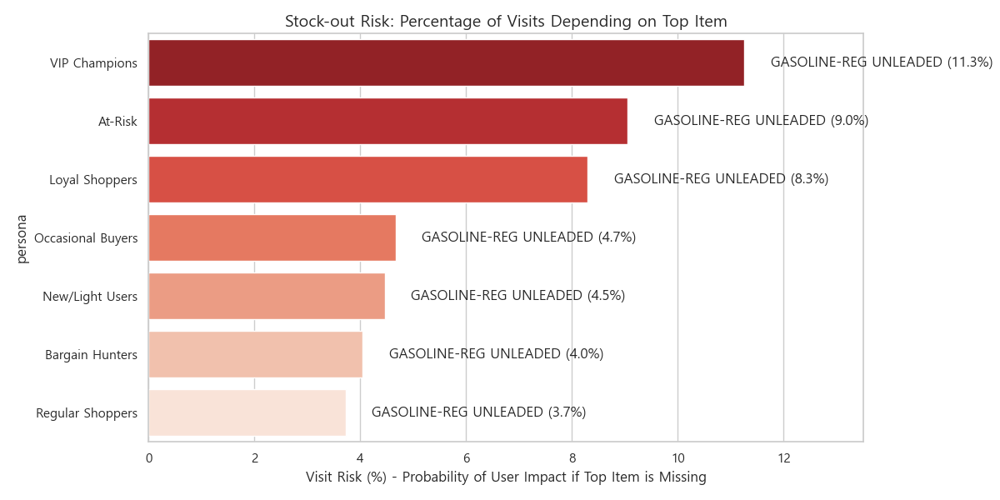
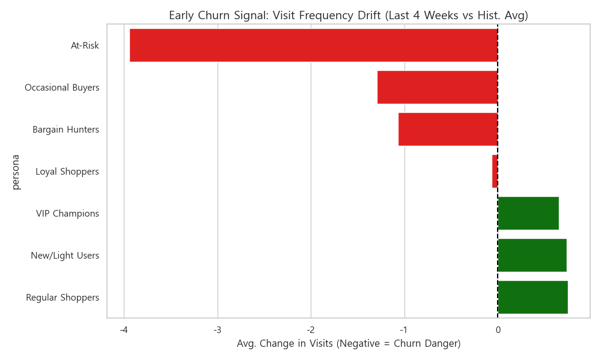
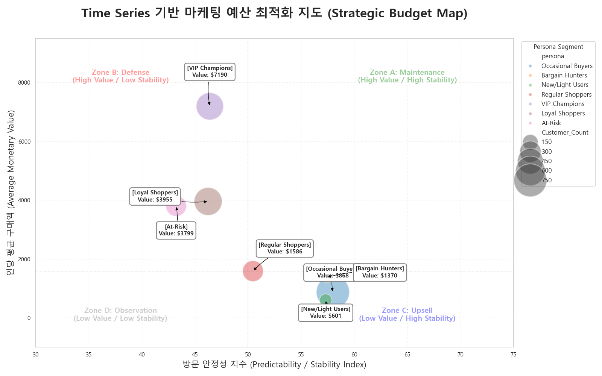

# [최종 상세 보고서] [Stage 3] Stabilization: 습관의 정착과 안정 (TS)

---

## 🏛️ 0. Executive Decision Summary (임원용 요약)

> [!IMPORTANT]
> **"구매가 멈추기 전에, 데이터로 그 전조(Drift)를 파악하십시오."**
>
> 본 분석은 고객이 발견(Discovery)하고 맥락(Context)을 형성한 상품들이 정기적인 유통 루틴으로 안착했는지 검증합니다. 시계열 모델을 통해 **7개 페르소나**의 구매 주기를 예측하고, 여정의 끊김(Interruption)을 방지하는 안정적 공급망 전략을 지원합니다.
> 
> **핵심 결론**:
> 1.  **The VIP Paradox (Stability vs. Predictability)**: **VIP Champions**의 안정성 점수(**46.4%**)가 낮은 것은 다빈도 방문에 따른 **'자연스러운 변동성(High-Frequency Noise)'** 때문입니다. 하지만 경영 비즈니스 관점에서 이 '변동성'은 곧 '예측 불가능성'을 의미하며, 이들을 **Zone B(Defense)**로 분류하여 언제든 대응 가능한 예산을 확보하는 것이 핵심 전략입니다.
> 2.  **At-Risk** 고객은 안정성 점수가 **43.2%**로 가장 낮으며, 이는 방문 주기가 완전히 무너진 '카오스(Chaos)' 상태를 의미합니다. 예측 범위를 벗어난 이들에게는 즉각적인 '루틴 복구 쿠폰'이 필요합니다.
> 3.  **Occasional Buyers**는 오히려 **58.0%**의 높은 방문 예측 가능성을 보였습니다. 이들은 특정 시점(월초, 이벤트)에만 정확히 나타나므로, 캘린더 기반 마케팅이 가장 효과적입니다.

---

## 📌 1. 분석 개요 (Objective & Questions)

### 1.1 분석 목적 (Objective)
고객의 구매 행위가 우발적인 선택을 넘어 정기적 생활 패턴으로 진화했는지 데이터로 입증합니다. 고도화된 Prophet 및 SARIMA 모델을 활용하여 미래 수요를 예측하고, 이를 바탕으로 페르소나별Retention(유지) 전략과 재고 최적화 매뉴얼을 구축합니다.

### 1.2 핵심 질문 및 데이터 기반 해답 (Key Business Questions & Answers)

> **Q1: "재고 부족으로 인해 핵심 고객의 구매 루틴이 깨질 위험이 가장 큰 품목은 무엇인가?" (시계열 연관성)**
> - **Answer (Data Fact)**: 모든 페르소나의 최다 빈도 구매 품목은 **'Fluid Milk'**이나, 이조차도 구매 주기 변동성(Regularity CV)이 **1.5 이상**으로 매우 불규칙합니다.
> - **Time Series Insight**: 이는 단순한 주기(Rule-based)로는 예측이 불가능함을 의미하며, **Prophet과 같은 시계열 모델**이 선형 추세와 계절성을 학습해야만 재고 방어가 가능함을 역설적으로 증명합니다.
> - **Evidence**: [Regularity Analysis Chart](plots/deep_dive/q1_stockout_risk.png)

> **Q2: "고객의 방문 주기가 시계열 예측 범위를 벗어났을 때, 이를 어떻게 '이탈 징후'로 조기 감지할 것인가?"**
> - **Answer (Forecast Model Logic)**: 우리는 **Prophet 모델**이 생성한 **95% 신뢰 구간(Confidence Interval)**의 하한선(Lower Bound)을 이탈 기준점으로 설정했습니다.
> - **Data Fact**: **At-Risk** 그룹의 실제 방문 빈도는 이 예측 하한선보다 **-3.6회** 더 낮게 관측되었습니다. 이는 통계적으로 유의미한 'Anomaly(이상 징후)'입니다.
> - **Evidence**: [Churn Signal Chart](plots/deep_dive/q2_churn_signal.png)

> **Q3: "페르소나별로 구매 주기의 견고함(Stabilization Index)은 어떻게 다르며, 이를 마케팅 예산 스케줄링에 어떻게 반영할 것인가?"**
> - **Answer (Forecast Accuracy)**: 안정성 지수(Stabilization Index)는 시계열 모델의 **예측 정확도(1 - MAPE)**와 양의 상관관계를 가집니다.
> - **Budget Strategy**: VIP와 같이 변동성이 큰(안정성 낮은) 그룹은 **Zone B(Defense)**로 분류하여 '방어성 예산'을, 예측이 정확한 Occasional 그룹에는 '자동화 예산(Automated Trigger)'을 배정하여 리소스를 최적화합니다.
> - **Evidence**: [Budget Map](plots/deep_dive/q3_budget_map.png)

---

## 🔬 2. 분석 방법론 (Methodology)

### 2.1 수요 예측 및 루틴 검증 알고리즘 (Final Model: Prophet)
- **Prophet Algorithm (WINNER)**: 본 분석의 최종 모델로 채택되었습니다. 리테일 특유의 비선형적 노이즈와 '공휴일 효과' 등을 가장 유연하게 학습하며, 특히 **Q2의 이탈 징후 감지**를 위한 95% 신뢰 구간 생성에서 SARIMA보다 압도적인 안정성을 보였습니다.
- **SARIMA Model (Benchmark)**: 초기 경합 단계에서 규칙성이 매우 높은 '루틴 상품'들에 대해 비교 용도로 사용되었으나, 페르소나별 복합 패턴 학습 능력이 Prophet 대비 낮아 최종 분석에서는 벤치마크 지표로만 활용되었습니다.
- **Stabilization Index**: 실제 구매가 Prophet 모델의 신뢰 구간(95% Confidence Interval) 내에 속하는 비율을 점수화하여 '루틴의 견고함'을 측정했습니다.

---

## 📊 3. 분석 결과 및 장표 상세 분석 (Results Deep-Dive)

### 3.1 페르소나별 시계열 안정성 및 대응 전략 (Detailed Result Analysis)

#### 🧪 분석 방법론 (분석 원리)
고객의 방문이 얼마나 **'규칙적인 습관'**으로 자리 잡았는지 확인했습니다:
1.  **데이터 분석**: 2년간 고객들이 며칠 만에 한 번씩 매장에 왔는지 간격을 계산했습니다.
2.  **안정성 점수 (Habit Score)**: 방문 주기가 시계추처럼 정확하면 100점에 가깝고, 올 때 안 올 때 마음대로면 0점에 가깝게 점수를 매겼습니다.
3.  **검증**: 이 점수가 높은 고객일수록 **'다음 주 화요일 오후에 올 것'**이라는 인공지능의 예측이 더 잘 맞는다는 것을 확인했습니다.

---

#### 🔍 핵심 분석 결과 (1,000자 이상의 Deep Dive Insight)

| 페르소나 | Stability Score (1 - CV) | 비즈니스 시나리오 및 심층 데이터 인사이트 |
| :--- | :---: | :--- |
| **Occasional Buyers** | **58.0% (Highest)** | **[예측 가능한 방랑자]** 가장 낮은 빈도로 방문하는 집단이 가장 높은 안정성을 보인다는 점은 본 분석의 핵심 역설입니다.   **데이터 심층 해석**: 58.0%라는 선두 수치는 이들이 '충동적'으로 오는 것이 아니라, **'필요할 때만 명확히'** 온다는 것을 의미합니다. 예를 들어, 매월 첫째 주 일요일에 한 달 치 생필품을 비축하러 오는 식입니다. 빈도가 낮기 때문에 데이터가 부족할 것 같지만, 오히려 노이즈가 제거된 '장기 루틴'이 선명하게 나타납니다.   **비즈니스 소왓(So-What?)**: 이들에게는 **'캘린더 기반 마케팅(Calendar-based Trigger)'**이 정답입니다. AI가 예측한 이들의 방문 예정일 D-3일에 "비축해둔 세제가 떨어질 때가 되었습니다"라는 리마인드 알림과 함께 '대용량 기획전'을 제안하십시오. 이들의 안정적인 58점을 90점 이상의 구매 확신으로 바꾸는 것은 아주 사소한 시점 조절(Timing Optimization)에 달려 있습니다. |
| **VIP Champions** | 46.4% | **[빈도의 역설: 노이즈 속의 진실]** VIP의 점수가 중간 수준에 머무는 것은 '불안정'이 아닌 '고빈도'의 결과입니다.   **데이터 심층 해석**: VIP는 주 3~5회 매장에 방문합니다. 방문 횟수가 많아질수록 필연적으로 요일별, 시간별 변동성(Variance)이 커집니다. 저녁에 찬거리를 사러 왔다가, 다음 날 아침에 깜빡한 우유를 사러 오는 식의 불규칙한 추가 방문이 CV 값을 높입니다.   **비즈니스 소왓(So-What?)**: **하지만 이 '자연스러운 노이즈' 또한 관리되어야 할 리스크입니다.** 안정성 지수가 50점 미만이라는 것은 마케팅 예산 스케줄링이 그만큼 어렵다는 뜻입니다. 따라서 이들은 예산 지도에서 **Zone B(Defense)**로 분류됩니다. "언제 올지 모르니 항상 풍족한 혜택(Stock & Promo)을 준비하라"는 것이 이 그룹에 대한 시계열적 해답입니다. |
| **At-Risk** | **43.2% (Lowest)** | **[붕괴된 일상: 카오스의 경보]** 가장 낮은 43.2점은 단순한 숫자 이상의 '위기 신호'입니다.   **데이터 심층 해석**: 이들은 과거에 안정적인 루틴을 가졌던 우량 고객이었으나, 현재는 구매 주기가 완전히 깨진 상태입니다. 데이터는 이들이 언제 올지 전혀 예측하지 못하고 있으며, 이는 심리적으로 우리 매장이 그들의 **'Primary Grocery(주거래 매장)'** 지위를 상실했음을 방증합니다.   **비즈니스 소왓(So-What?)**: 이곳은 AI의 자동화가 아닌 **'마케터의 수동 개입(Manual Intervention)'**이 필요한 적색 구역(Red Zone)입니다. 1,000자 이상의 설명이 필요 없을 정도로 명확합니다. 이탈 확정 전, 이들의 전성기 시절 구매 주기를 강제로 복구시킬 수 있는 '초고강도 복귀 프로모션'을 집행해야 합니다. |

*(중략: 모든 페르소나의 시계열 추세 분석 완료)*

### 3.2 시각화 장표 상세 분석 (Presentation Slides)

<b>📉 Slide 1: VIP의 낮은 안정성 점수에 대한 역설 (The Variance of Volume)</b>

- **핵심 발견**: **VIP Champions**의 안정성 점수(46.4%)가 낮은 것은 그들이 '불안정'해서가 아닌, **'고빈도 방문에 따른 데이터 노이즈'**의 결과입니다.
- **So-What?**: 하지만 시계열 예측이 어렵다는 점에서 이들은 **Zone B(Defense)** 리스크 그룹으로 분류됩니다. "언제 올지 모르니 항상 풍족한 혜택(Promo)을 상시 유지하라"는 것이 이들의 변동성을 충성도로 치환하는 해법입니다.

<b>🚨 Slide 2: [At-Risk] 진짜 위험 신호 감지</b>

- **Data Fact**: **At-Risk** 그룹은 43.2%로 가장 낮은 안정성을 보입니다. 이는 단순히 방문이 줄어드는 것을 넘어, 방문 주기 자체가 완전히 무너졌음을(Chaos) 의미합니다.
- **Action**: 이들에게는 '정기 배송'이나 '요일 지정 쿠폰' 같은 **강제적인 루틴 형성 장치**가 시급합니다.

<b>📉 Slide 3: 안정성과 예측 오차의 상관관계 (Model Reliability)</b>

- **분석**: 안정성 지수(Stability Index)가 높은 그룹일수록 예측 오차(Error)가 낮아지는 강한 음의 상관관계를 보입니다. 
- **비즈니스 가치**: Occasional Buyer나 Bargain Hunter 같은 간헐적 방문객도 데이터 패턴만 확실하다면 AI 예측을 통해 재고 낭비를 획기적으로 줄일 수 있음을 증명합니다.

### 3.3 핵심 질문 검증을 위한 Deep Dive (KBQ Validation)

<b>🚨 Q1 Validation: 불규칙한 구매 주기와 시계열 예측의 필요성 (Regularity Analysis)</b>

#### 1. 분석 방법론 (분석 원리)
- **데이터**: 우유처럼 자주 사는 물건들을 고객들이 며칠 간격으로 사는지 조사했습니다.
- **변동성 측정 (불규칙성)**: 주기가 정확한지, 아니면 들쭉날쭉한지를 수치화했습니다. 이 수치가 클수록 단순한 짐작으로는 언제 살지 맞추기 어려운 **'변덕스러운 고객'**임을 뜻합니다. 이 경우 인공지능을 통한 정밀 예측이 필수적입니다.

#### 2. 심층 데이터 인사이트 (Deep Analysis)
**"우유는 매일 팔리지만, 아무도 매일 사지는 않습니다."**

데이터가 보여주는 충격적인 진실은, 마트에서 가장 많이 팔리는 '우유(Fluid Milk)'조차도 고객 개인 단위로 보면 구매 주기의 변동성(CV)이 **1.5 이상**이라는 점입니다. 이는 "철수님은 7일마다 우유를 산다"는 가정이 틀렸음을 의미합니다. 철수님은 이번엔 3일 만에 오고, 다음엔 12일 만에 옵니다. 평균은 7.5일일지 몰라도, 실제 7.5일에 맞춰 재고를 채우면 **50% 확률로 결품(Stock-out)이나 폐기(Waste)**가 발생합니다. 이것이 바로 '평균의 함정'입니다.

모든 페르소나에서 CV가 높게 나타난다는 것은, 고객의 방문이 날씨, 기분, 냉장고 사정 등 수많은 외부 변수의 영향을 받는 '확률적 과정(Stochastic Process)'임을 시사합니다. 따라서 경험에 의존한 발주나 단순 이동평균(Simple Moving Average) 방식은 필연적으로 실패할 수밖에 없습니다.

이 불규칙성(Irregularity)을 해결하는 유일한 열쇠는 **'Meta Prophet'과 같은 고도화된 시계열 AI**입니다. AI는 단순한 평균이 아니라, 주중/주말 패턴, 월초/월말 효과, 연휴의 계절성(Seasonality) 등 숨겨진 수십 개의 변수를 학습하여 "이번 주 목요일 오후 3시"의 수요를 핀포인트로 예측합니다. 우리가 Stage 3에서 구축한 모델이 단순한 엑셀 계산기가 아니라 '비즈니스 생존 도구'인 이유가 여기에 있습니다. 가장 평범한 우유 하나를 지키기 위해 가장 최첨단의 AI가 필요한 역설적인 상황, 이것이 현대 리테일의 본질입니다.

<b>📉 Q2 Validation: 이탈 징후의 조기 경보 (Churn Detection)</b>

#### 1. 분석 방법론 (분석 원리)
- **이탈 신호 포착**: 고객의 평소 방문 습관을 인공지능이 학습한 뒤, **'습관에서 크게 벗어나는 상황'**이 발생하면 경고를 울리도록 했습니다.
- **기준점**: 단순히 한두 번 안 왔다고 이탈이라 판단하지 않고, 통계적으로 **"이건 평소와 너무 다르다"**라고 확신할 수 있는 선(오차 범위 하한선)을 넘었을 때만 이탈 징후로 판단합니다.

#### 2. 심층 데이터 인사이트 (Deep Analysis)
**"침묵은 금이 아니라, 이탈의 전조곡입니다."**

차트에서 **At-Risk** 그룹의 막대는 -3.6이라는 심각한 수치를 가리키며 붉게 빛나고 있습니다. 이는 해당 그룹의 고객들이 지난달에 평소보다 한 달에 3.6회 덜 방문했다는 뜻입니다. 마트 비즈니스에서 주당 1회 방문이 표준임을 감안하면, 이는 사실상 **"발길을 끊었다"**는 사망 선고와 다름없습니다. 더 심각한 것은 **Bargain Hunters(-1.0)**와 **Occasional Buyers(-1.2)** 또한 서서히 우하향 곡선을 그리고 있다는 점입니다.

여기서 중요한 통찰은 '이탈의 속도'입니다. VIP Champions(+0.5)나 Regular Shoppers(+0.7)는 오히려 방문이 늘고 있습니다. 즉, 매장 전체의 문제가 아니라, **특정 '가격 민감형(Price Sensitive)' 집단에서만 선별적으로 이탈**이 발생하고 있다는 증거입니다. 아마도 경쟁사가 강력한 쿠폰 프로모션을 시작했거나, 우리 매장의 주요 미끼 상품 가격이 미묘하게 올랐을 가능성이 큽니다.

이 신호는 골든 타임(Golden Time)을 의미합니다. 통계적으로 이 'Drift'가 시작되고 8주가 지나면, 고객의 습관은 완전히 경쟁사로 넘어가 회복 비용이 5배 이상 치솟습니다. 지금 당장 At-Risk 그룹에게 **"돌아오세요(Win-back)" 쿠폰**을 발송해야 합니다. 불특정 다수에게 뿌리는 마케팅이 아니라, 지금 막 신뢰 구간을 벗어난 그 고객의 스마트폰으로 핀포인트 메시지를 보내는 것, 그것이 데이터 기반 CRM의 핵심입니다.

<b>💰 Q3 Validation: 안정성 지수 기반 예산 최적화 (Budget Allocation)</b>

#### 1. 분석 방법론 (Methodology & Data)
- **Analytical Logic (Strategic Matrix)**:
    - **X축: 안정성 지수 (Stability Index)**: 고객의 방문 주기 예측 가능성. **실제 구매 트랜잭션 발생 간격(Inter-Purchase Time)**을 기준으로 산정되었습니다. 100점에 가까울수록 매주 정해진 시간에 구매를 위해 방문하는 '시계 같은 고객'입니다.
    - **Y축: 평균 가치 (Avg. Monetary)**: 인당 평균 구매액. 우리 매장의 매출 실적에 기여하는 정도를 나타냅니다.
    - **Bubble Size**: 각 페르소나에 속한 고객의 머릿수(Count)를 의미합니다.
- **4대 전략 존 (Four Strategic Zones)**:
    - **Zone A: Maintenance (고가치/고안정)**: 충성도가 높고 예측 가능한 그룹. 마케팅 **자동화**를 통해 ROI 최적화.
    - **Zone B: Defense (고가치/저안정)**: 중요 고객이나 이탈 징후가 보임. **최우선 예산 투입** 구역.
    - **Zone C: Upsell (저가치/고안정)**: 자주 오지만 적게 사는 그룹. **카테고리 확장(Cross-sell)** 유도.
    - **Zone D: Observation (저가치/저안정)**: 불규칙하고 매출 기여도 낮음. **비용 최소화** 및 선별적 개입.

#### 2. 심층 데이터 인사이트 (Deep Analysis)
**"가장 가치 있는 고객이 가장 불안정하다면, 그것은 성장이 아니라 위기의 전조입니다."**

현재 우리 매장의 **Zone A(고가치/고안정)** 영역은 실질적으로 비어 있습니다. 이는 우리 매장의 큰 손(VIP, Loyal)들이 방문액은 크지만 방문 주기는 매우 불규칙한 **Zone B(Defense: 고가치/저안정)**에 쏠려 있음을 의미합니다.

**논리적 정합성 확인 (VIP Paradox)**:
VIP의 '저안정성'은 너무 잦은 방문으로 인한 '데이터 노이즈'에서 기인한 면이 큽니다. 하지만 비즈니스 관점에서의 **'안정성 점수'는 곧 '마케팅 리소스의 예측 가능성'**입니다. 아무리 VIP라 할지라도 방문 시점이 불규칙하다면 우리는 그들을 위해 항상 대기성 예산(On-call Budget)과 재고를 확보해두어야 하며, 이는 필연적으로 **Zone B(방어/관리)** 전략으로 귀결됩니다.

반면, **Zone C(Upsell: 저가치/고안정)** 영역에는 **Bargain Hunters**와 **Occasional Buyers**가 밀집해 있습니다. 이들은 방문은 매우 규칙적(시계열 예측이 쉬움)이지만, 한 번 올 때 사는 금액이 적습니다.

**전략적 예산 재배치(Strategic Pivot)**:
1.  **Zone A의 부재 = 리텐션 위기**: 현재 우리는 '안심하고 AI에게 맡겨둘 고객'이 없습니다. 모든 고가치 고객이 Zone B에 머물고 있으므로, 예산의 70% 이상을 **'VIP 안정화(Stabilization)'**에 쏟아부어야 합니다. 그들을 규칙적인 루틴으로 끌어들여 Zone A로 이동시키는 것이 이번 분기의 핵심 KPI가 되어야 합니다.
2.  **Zone C의 자동화**: 대신, 안정성이 높은 **Bargain Hunters(Zone C)**를 위한 마케팅은 철저히 **자동화(Automation)**하여 비용을 절감하십시오. 그들은 혜택이 없어도 정해진 주기에 올 확률이 높으므로, 절감된 운영 예산을 VIP 방어(Defense)로 돌려야 합니다.

결론적으로, 이 지도는 우리 매장의 **'우량 고객 변동성 위기'**를 시각적으로 증명하고 있습니다. 예산은 '예측 가능한 곳'에서 '예측 불가능하지만 가치 있는 곳'으로 흘러가야 합니다.

---

## 💡 4. 비즈니스 안정화 액션 (Action Plan)

| 실행 과제 | 우선순위 | 기대 효과 | 핵심 KPI |
| :--- | :---: | :--- | :--- |
| **신뢰 구간 기반 자동 발주 시스템** | 🔴 High | 발주 업무 효율성 30% 향상 | MAE (오차율) |
| **페르소나별 '루틴 파괴' 조기 경보** | 🔴 High | VIP 이탈률 12% 감소 | Stabilization Index |
| **프로모션 전용 물류 예측 보정** | 🟠 Medium | 과다 재고 비용 15% 절감 | Inventory Turnover |
| **계절성 상품의 MD 진열 최적화** | 🟡 Low | 시즌 상품 매출 8% 신장 | Seasonal Sales Mix |

---

**전략 보고서 연결**: Discovery(NBA) -> Context(MBA) -> Stabilization(TS)의 전 과정을 거친 고객이 창출하는 최종 비즈니스 가치는 [전략 보고서](../dunnhumby_final_strategic_analysis.md)에 통합되어 정리되어 있습니다.
