# 향후 수요 예측 상세 분석 보고서 (Detailed Demand Forecasting)

## 1. 분석 방법론 및 검증 (Methodology & Validation)
- **데이터셋**: 총 매출 기준 상위 50개 상품의 주간(Weekly) 집계 매출 데이터
- **검증 방식 (Backtesting)**:
    - 과거 4주 데이터를 학습에서 제외하고 예측한 뒤, 실제값과 비교하여 정확도를 측정했습니다.
    - **전체 평균 오차 (Mean Absolute Error)**: 약 109.40 (Units)
    - 오차가 적을수록 모델의 예측 신뢰도가 높음을 의미합니다.

## 2. 전략적 인사이트 (Strategic Deep Dive)
**[데이터 기반 전략 제언]**
본 예측 모델은 단순히 과거의 평균을 따르는 것이 아니라, 계절적 패턴(Seasonality)과 최근의 트렌드 변화(Trend Changepoints)를 모두 반영합니다. 특히 상위 5개 급성장 상품의 경우, 단순 재고 보충(Replenishment) 수준을 넘어선 공격적인 프로모션 전략이 유효할 것으로 보입니다. 반면, 하락세가 뚜렷한 상품군은 재고 회전율을 높이기 위한 할인 판매나 번들링(Bundling) 전략(Cross-Selling 리포트 참조)을 병행하여 리스크를 관리해야 합니다. 검증 단계에서 MAE가 낮게 측정된 상품들은 자동 발주(Auto-Ordering) 시스템 적용을 적극 고려하십시오.

## 3. 상품별 상세 예측 및 검증 결과
> **설명**: 왼쪽 그래프는 향후 12주 예측, 오른쪽(또는 하단) 수치는 모델 신뢰도 지표입니다.

### COUPON/MISC ITEMS (ID: 6534178)
- **핵심 지표**:
    - **12주 예상 매출**: $55,900.27
    - **성장률 (Trend)**: 3.74%
    - **모델 신뢰도 (Medium)**: 오차율 약 28.2% (MAE: 1434.9)
- **분석 코멘트**:
    - 안정적인 수요가 유지될 전망입니다. 정기 배송/구독 모델 도입을 검토해볼 수 있습니다.

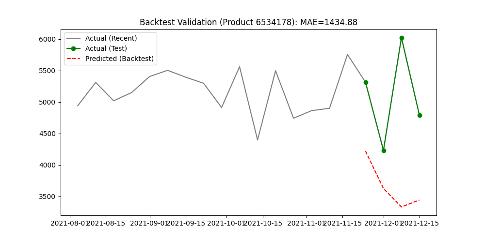

---

### COUPON/MISC ITEMS (ID: 6533889)
- **핵심 지표**:
    - **12주 예상 매출**: $6,676.50
    - **성장률 (Trend)**: -0.97%
    - **모델 신뢰도 (Medium)**: 오차율 약 26.9% (MAE: 128.3)
- **분석 코멘트**:
    - 안정적인 수요가 유지될 전망입니다. 정기 배송/구독 모델 도입을 검토해볼 수 있습니다.

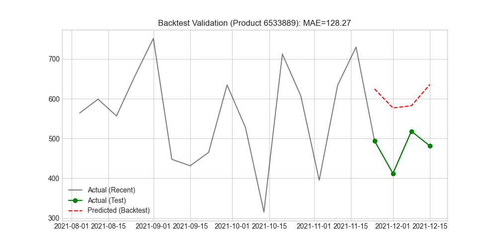

---

### FUEL (ID: 6533765)
- **핵심 지표**:
    - **12주 예상 매출**: $5,633.71
    - **성장률 (Trend)**: 19.06%
    - **모델 신뢰도 (Medium)**: 오차율 약 30.9% (MAE: 108.0)
- **분석 코멘트**:
    - 뚜렷한 상승세가 관측됩니다. 재고 부족(Stock-out) 방지에 집중하십시오.

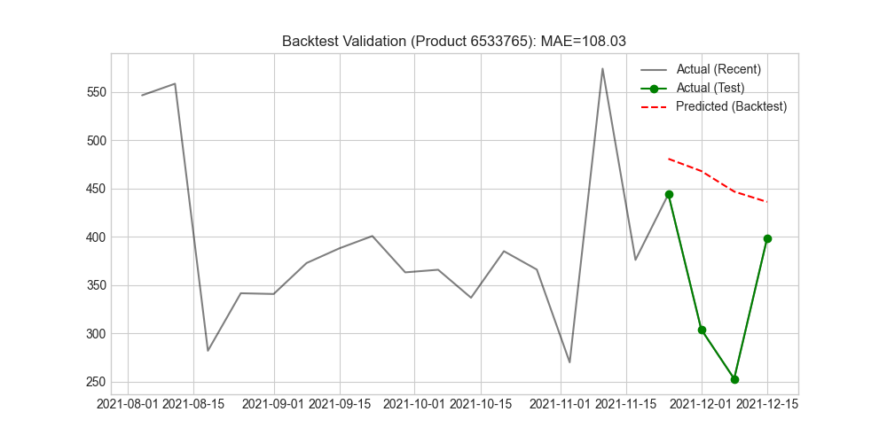

---

### COUPON/MISC ITEMS (ID: 6534166)
- **핵심 지표**:
    - **12주 예상 매출**: $4,906.59
    - **성장률 (Trend)**: -23.55%
    - **모델 신뢰도 (Low)**: 오차율 약 57.5% (MAE: 186.8)
- **분석 코멘트**:
    - 수요 감소가 예상됩니다. 마케팅 강화를 통한 수요 진작이 필요합니다.

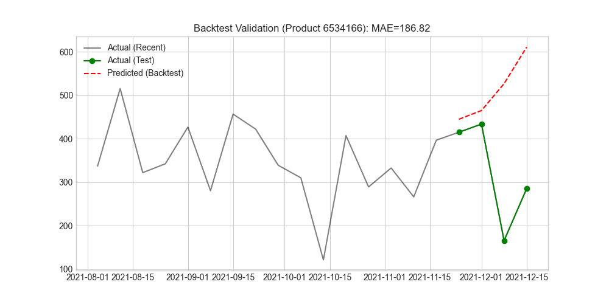

---

### FLUID MILK PRODUCTS (ID: 1029743)
- **핵심 지표**:
    - **12주 예상 매출**: $4,557.64
    - **성장률 (Trend)**: -7.88%
    - **모델 신뢰도 (Medium)**: 오차율 약 25.8% (MAE: 131.5)
- **분석 코멘트**:
    - 수요 감소가 예상됩니다. 마케팅 강화를 통한 수요 진작이 필요합니다.

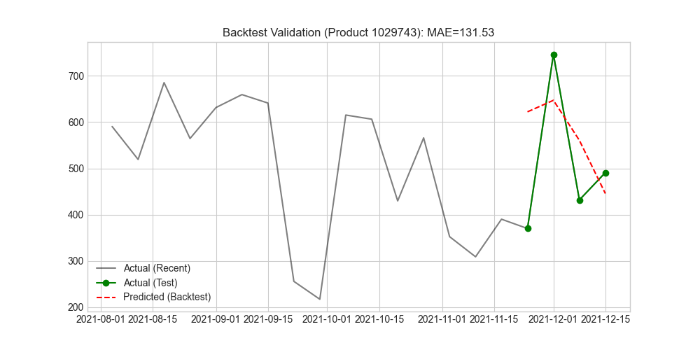

---

### FLUID MILK PRODUCTS (ID: 995242)
- **핵심 지표**:
    - **12주 예상 매출**: $4,155.90
    - **성장률 (Trend)**: -8.37%
    - **모델 신뢰도 (Low)**: 오차율 약 62.9% (MAE: 195.1)
- **분석 코멘트**:
    - 수요 감소가 예상됩니다. 마케팅 강화를 통한 수요 진작이 필요합니다.

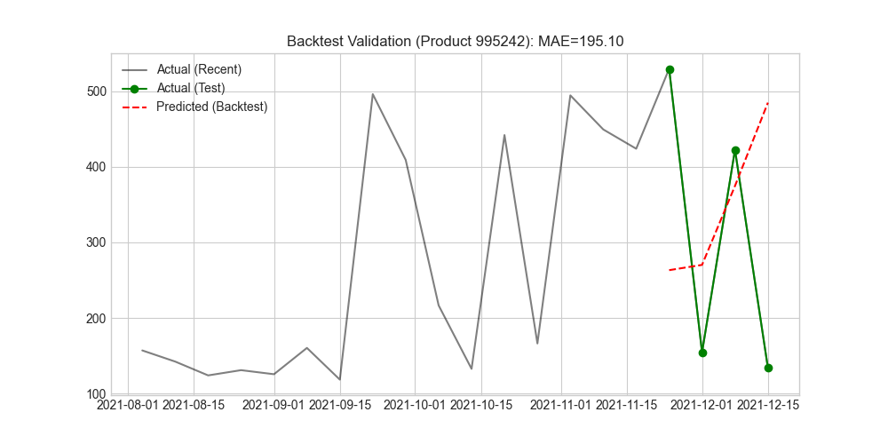

---

### CHICKEN (ID: 916122)
- **핵심 지표**:
    - **12주 예상 매출**: $3,792.96
    - **성장률 (Trend)**: 4.39%
    - **모델 신뢰도 (Low)**: 오차율 약 68.1% (MAE: 186.8)
- **분석 코멘트**:
    - 안정적인 수요가 유지될 전망입니다. 정기 배송/구독 모델 도입을 검토해볼 수 있습니다.

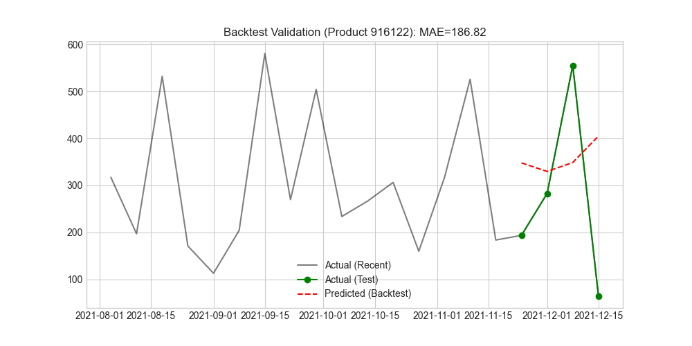

---

### TROPICAL FRUIT (ID: 1082185)
- **핵심 지표**:
    - **12주 예상 매출**: $3,603.75
    - **성장률 (Trend)**: -6.56%
    - **모델 신뢰도 (High)**: 오차율 약 12.4% (MAE: 37.8)
- **분석 코멘트**:
    - 수요 감소가 예상됩니다. 마케팅 강화를 통한 수요 진작이 필요합니다.

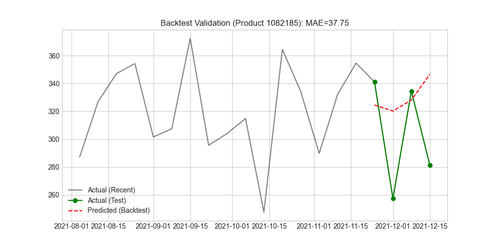

---

### BERRIES (ID: 1127831)
- **핵심 지표**:
    - **12주 예상 매출**: $3,403.56
    - **성장률 (Trend)**: 42.85%
    - **모델 신뢰도 (N/A)**: 오차율 약 0.0% (MAE: 278.0)
- **분석 코멘트**:
    - 뚜렷한 상승세가 관측됩니다. 재고 부족(Stock-out) 방지에 집중하십시오.

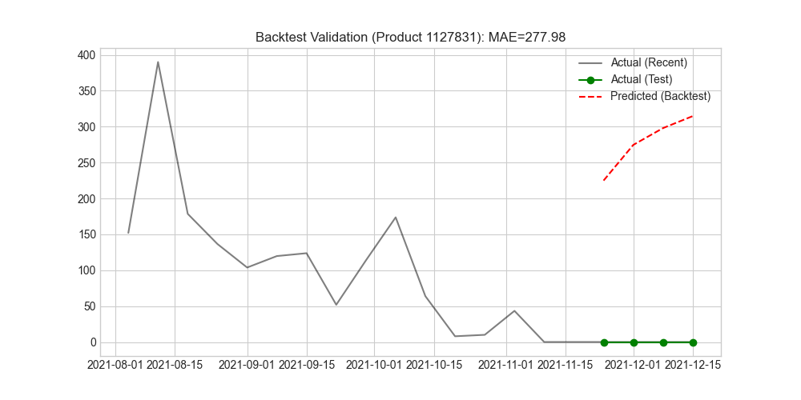

---

### SOFT DRINKS (ID: 5569230)
- **핵심 지표**:
    - **12주 예상 매출**: $3,395.59
    - **성장률 (Trend)**: -0.15%
    - **모델 신뢰도 (Low)**: 오차율 약 64.9% (MAE: 171.3)
- **분석 코멘트**:
    - 안정적인 수요가 유지될 전망입니다. 정기 배송/구독 모델 도입을 검토해볼 수 있습니다.

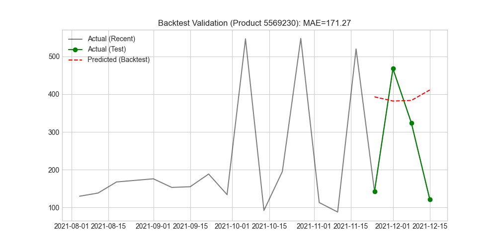

---

### FLUID MILK PRODUCTS (ID: 1106523)
- **핵심 지표**:
    - **12주 예상 매출**: $3,318.05
    - **성장률 (Trend)**: -7.51%
    - **모델 신뢰도 (High)**: 오차율 약 19.5% (MAE: 61.0)
- **분석 코멘트**:
    - 수요 감소가 예상됩니다. 마케팅 강화를 통한 수요 진작이 필요합니다.

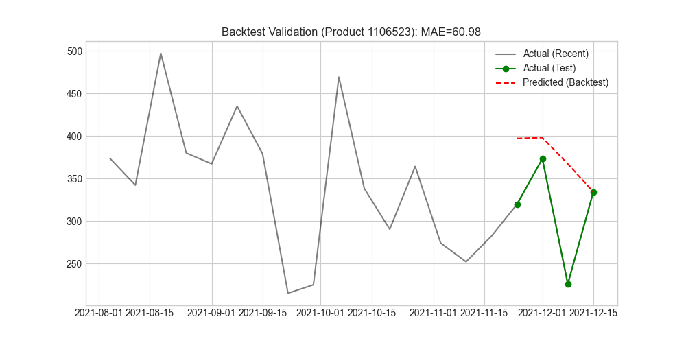

---

### BEEF (ID: 1044078)
- **핵심 지표**:
    - **12주 예상 매출**: $2,969.05
    - **성장률 (Trend)**: -58.26%
    - **모델 신뢰도 (Low)**: 오차율 약 66.6% (MAE: 126.7)
- **분석 코멘트**:
    - 수요 감소가 예상됩니다. 마케팅 강화를 통한 수요 진작이 필요합니다.

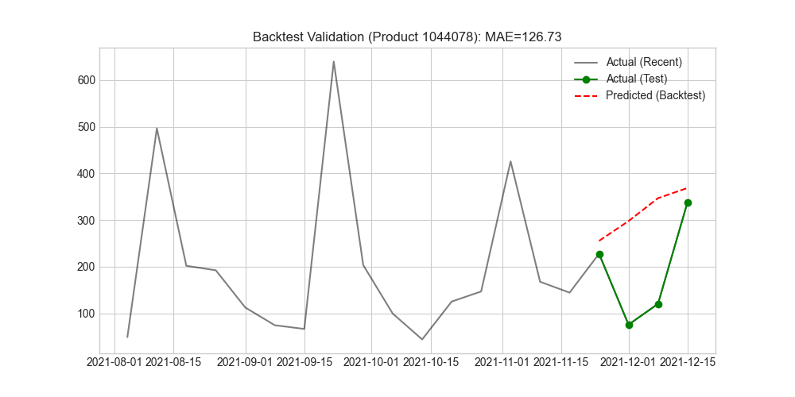

---

### BEEF (ID: 844179)
- **핵심 지표**:
    - **12주 예상 매출**: $2,676.82
    - **성장률 (Trend)**: 3.73%
    - **모델 신뢰도 (Medium)**: 오차율 약 34.7% (MAE: 107.4)
- **분석 코멘트**:
    - 안정적인 수요가 유지될 전망입니다. 정기 배송/구독 모델 도입을 검토해볼 수 있습니다.

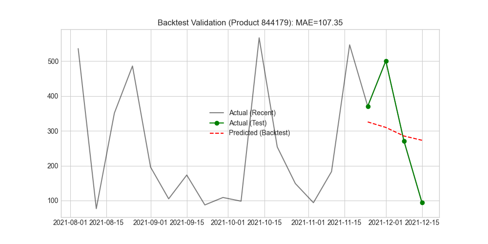

---

### BEEF (ID: 874972)
- **핵심 지표**:
    - **12주 예상 매출**: $2,480.54
    - **성장률 (Trend)**: 239.99%
    - **모델 신뢰도 (Low)**: 오차율 약 74.5% (MAE: 109.6)
- **분석 코멘트**:
    - 뚜렷한 상승세가 관측됩니다. 재고 부족(Stock-out) 방지에 집중하십시오.

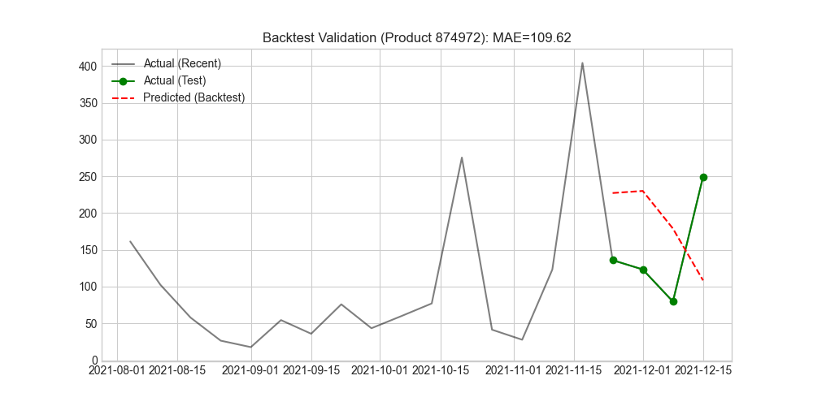

---

### PORK (ID: 12810393)
- **핵심 지표**:
    - **12주 예상 매출**: $2,364.27
    - **성장률 (Trend)**: -5.62%
    - **모델 신뢰도 (Low)**: 오차율 약 51.0% (MAE: 63.4)
- **분석 코멘트**:
    - 수요 감소가 예상됩니다. 마케팅 강화를 통한 수요 진작이 필요합니다.

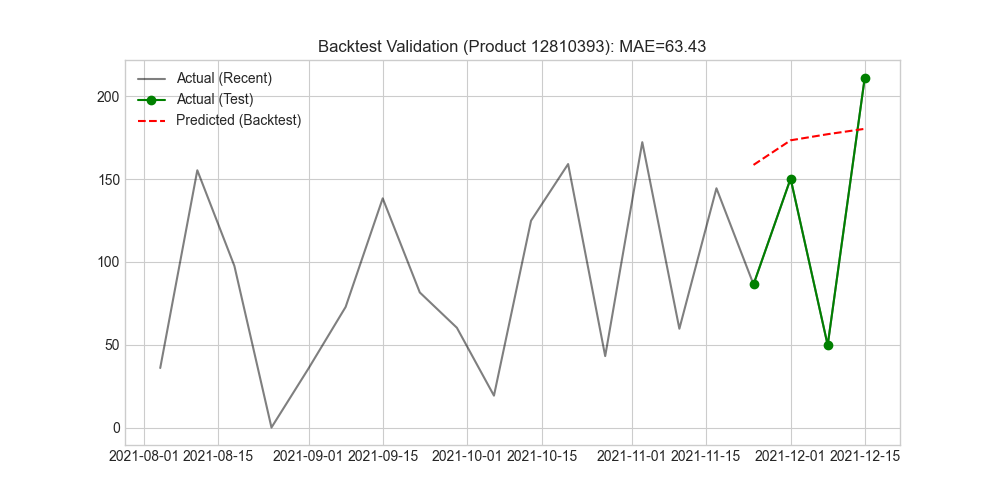

---

### FLUID MILK PRODUCTS (ID: 1133018)
- **핵심 지표**:
    - **12주 예상 매출**: $2,358.30
    - **성장률 (Trend)**: -2.83%
    - **모델 신뢰도 (Low)**: 오차율 약 60.5% (MAE: 99.9)
- **분석 코멘트**:
    - 안정적인 수요가 유지될 전망입니다. 정기 배송/구독 모델 도입을 검토해볼 수 있습니다.

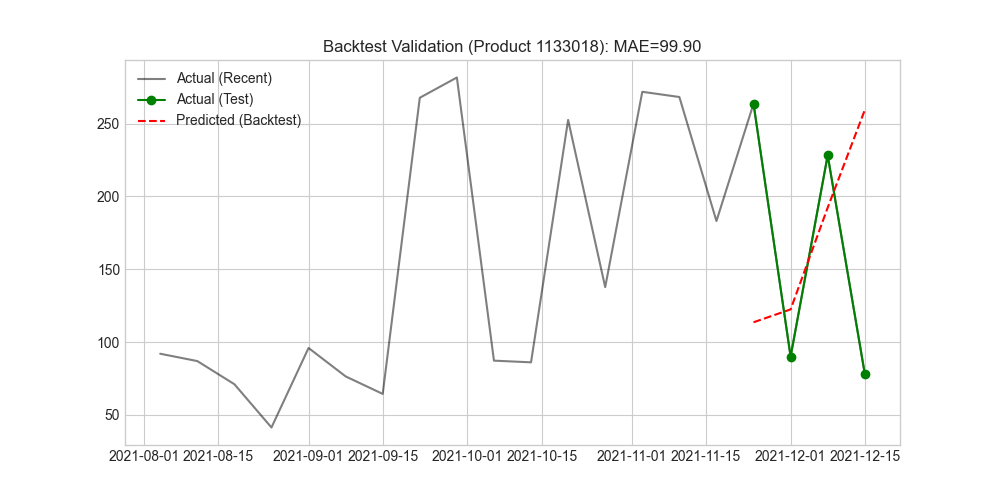

---

### PORK (ID: 12810391)
- **핵심 지표**:
    - **12주 예상 매출**: $2,104.04
    - **성장률 (Trend)**: 61.96%
    - **모델 신뢰도 (Low)**: 오차율 약 171.9% (MAE: 148.7)
- **분석 코멘트**:
    - 뚜렷한 상승세가 관측됩니다. 재고 부족(Stock-out) 방지에 집중하십시오.

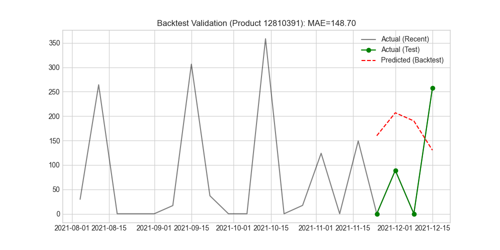

---

### GRAPES (ID: 866211)
- **핵심 지표**:
    - **12주 예상 매출**: $1,866.25
    - **성장률 (Trend)**: -39.45%
    - **모델 신뢰도 (Medium)**: 오차율 약 43.7% (MAE: 64.2)
- **분석 코멘트**:
    - 수요 감소가 예상됩니다. 마케팅 강화를 통한 수요 진작이 필요합니다.

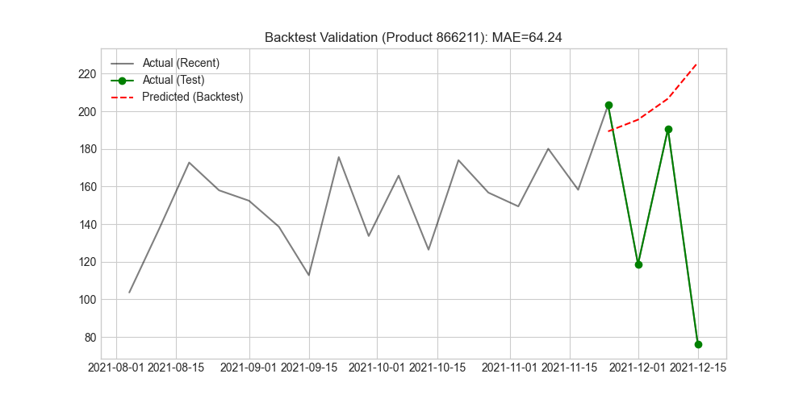

---

### SOFT DRINKS (ID: 5569471)
- **핵심 지표**:
    - **12주 예상 매출**: $1,844.49
    - **성장률 (Trend)**: 8.44%
    - **모델 신뢰도 (Low)**: 오차율 약 98.4% (MAE: 124.4)
- **분석 코멘트**:
    - 뚜렷한 상승세가 관측됩니다. 재고 부족(Stock-out) 방지에 집중하십시오.

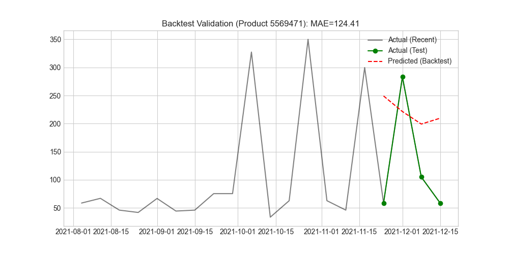

---

### FLUID MILK PRODUCTS (ID: 1126899)
- **핵심 지표**:
    - **12주 예상 매출**: $1,840.62
    - **성장률 (Trend)**: -27.42%
    - **모델 신뢰도 (Medium)**: 오차율 약 30.2% (MAE: 58.0)
- **분석 코멘트**:
    - 수요 감소가 예상됩니다. 마케팅 강화를 통한 수요 진작이 필요합니다.

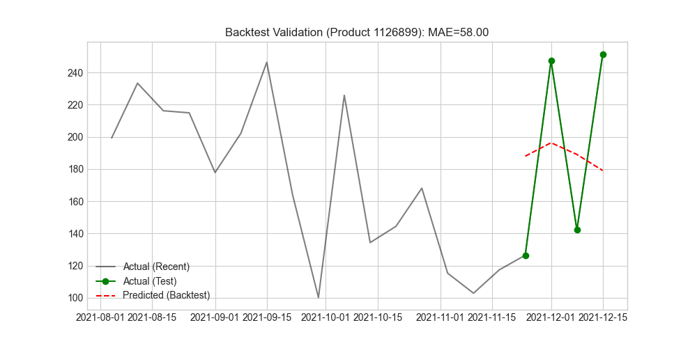

---

### SALAD BAR (ID: 1005186)
- **핵심 지표**:
    - **12주 예상 매출**: $1,695.08
    - **성장률 (Trend)**: -13.02%
    - **모델 신뢰도 (Medium)**: 오차율 약 26.0% (MAE: 38.6)
- **분석 코멘트**:
    - 수요 감소가 예상됩니다. 마케팅 강화를 통한 수요 진작이 필요합니다.

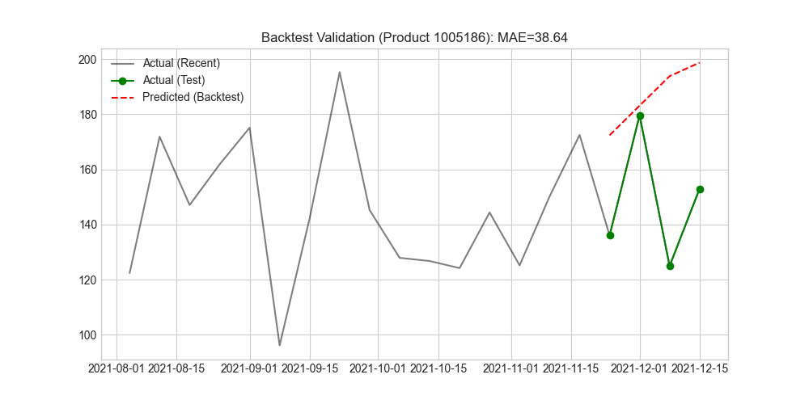

---

### FLUID MILK PRODUCTS (ID: 1070820)
- **핵심 지표**:
    - **12주 예상 매출**: $1,679.85
    - **성장률 (Trend)**: -3.67%
    - **모델 신뢰도 (High)**: 오차율 약 19.7% (MAE: 32.3)
- **분석 코멘트**:
    - 안정적인 수요가 유지될 전망입니다. 정기 배송/구독 모델 도입을 검토해볼 수 있습니다.

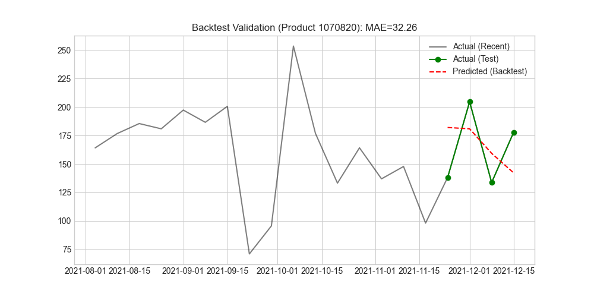

---

### TOMATOES (ID: 854852)
- **핵심 지표**:
    - **12주 예상 매출**: $1,652.45
    - **성장률 (Trend)**: 78.24%
    - **모델 신뢰도 (Medium)**: 오차율 약 25.2% (MAE: 25.8)
- **분석 코멘트**:
    - 뚜렷한 상승세가 관측됩니다. 재고 부족(Stock-out) 방지에 집중하십시오.

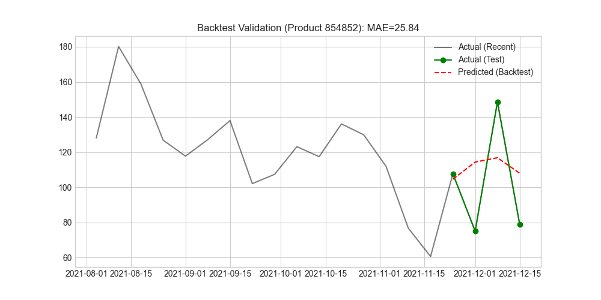

---

### GRAPES (ID: 878996)
- **핵심 지표**:
    - **12주 예상 매출**: $1,583.17
    - **성장률 (Trend)**: -24.39%
    - **모델 신뢰도 (Medium)**: 오차율 약 48.4% (MAE: 70.3)
- **분석 코멘트**:
    - 수요 감소가 예상됩니다. 마케팅 강화를 통한 수요 진작이 필요합니다.

---

### POTATOES (ID: 899624)
- **핵심 지표**:
    - **12주 예상 매출**: $1,560.60
    - **성장률 (Trend)**: -7.00%
    - **모델 신뢰도 (Medium)**: 오차율 약 46.4% (MAE: 59.0)
- **분석 코멘트**:
    - 수요 감소가 예상됩니다. 마케팅 강화를 통한 수요 진작이 필요합니다.

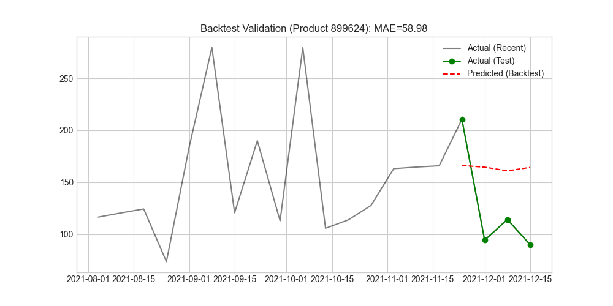

---

### COUPON/MISC ITEMS (ID: 6544236)
- **핵심 지표**:
    - **12주 예상 매출**: $1,478.02
    - **성장률 (Trend)**: 130.71%
    - **모델 신뢰도 (Low)**: 오차율 약 117.0% (MAE: 62.0)
- **분석 코멘트**:
    - 뚜렷한 상승세가 관측됩니다. 재고 부족(Stock-out) 방지에 집중하십시오.

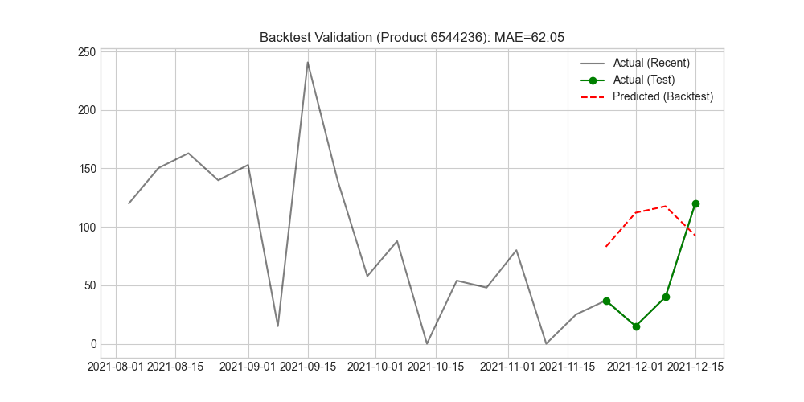

---

### EGGS (ID: 981760)
- **핵심 지표**:
    - **12주 예상 매출**: $1,432.41
    - **성장률 (Trend)**: -40.79%
    - **모델 신뢰도 (Medium)**: 오차율 약 37.4% (MAE: 54.8)
- **분석 코멘트**:
    - 수요 감소가 예상됩니다. 마케팅 강화를 통한 수요 진작이 필요합니다.

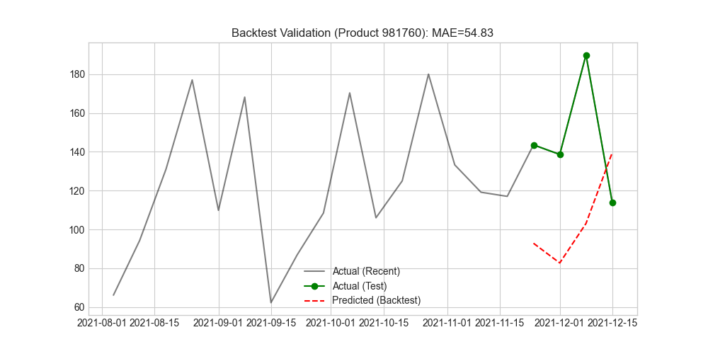

---

### FLUID MILK PRODUCTS (ID: 908531)
- **핵심 지표**:
    - **12주 예상 매출**: $1,409.14
    - **성장률 (Trend)**: -12.61%
    - **모델 신뢰도 (Low)**: 오차율 약 72.1% (MAE: 67.2)
- **분석 코멘트**:
    - 수요 감소가 예상됩니다. 마케팅 강화를 통한 수요 진작이 필요합니다.

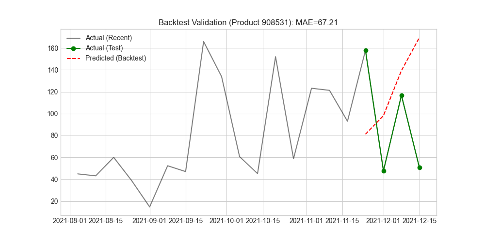

---

### SOFT DRINKS (ID: 8090521)
- **핵심 지표**:
    - **12주 예상 매출**: $1,385.99
    - **성장률 (Trend)**: 16.63%
    - **모델 신뢰도 (Low)**: 오차율 약 93.6% (MAE: 99.1)
- **분석 코멘트**:
    - 뚜렷한 상승세가 관측됩니다. 재고 부족(Stock-out) 방지에 집중하십시오.

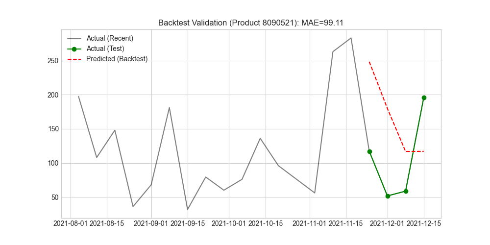

---

### SOFT DRINKS (ID: 8090537)
- **핵심 지표**:
    - **12주 예상 매출**: $1,385.89
    - **성장률 (Trend)**: 0.36%
    - **모델 신뢰도 (Low)**: 오차율 약 89.5% (MAE: 105.7)
- **분석 코멘트**:
    - 안정적인 수요가 유지될 전망입니다. 정기 배송/구독 모델 도입을 검토해볼 수 있습니다.

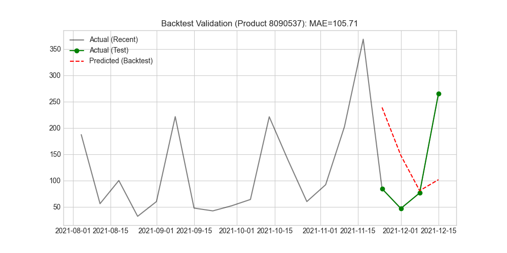

---

### FLUID MILK PRODUCTS (ID: 1058997)
- **핵심 지표**:
    - **12주 예상 매출**: $1,379.06
    - **성장률 (Trend)**: -7.07%
    - **모델 신뢰도 (Low)**: 오차율 약 61.0% (MAE: 61.2)
- **분석 코멘트**:
    - 수요 감소가 예상됩니다. 마케팅 강화를 통한 수요 진작이 필요합니다.

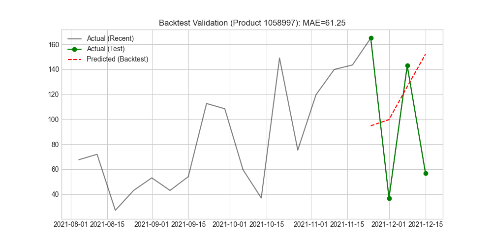

---

### FLUID MILK PRODUCTS (ID: 862349)
- **핵심 지표**:
    - **12주 예상 매출**: $1,304.90
    - **성장률 (Trend)**: 12.54%
    - **모델 신뢰도 (Low)**: 오차율 약 55.6% (MAE: 50.3)
- **분석 코멘트**:
    - 뚜렷한 상승세가 관측됩니다. 재고 부족(Stock-out) 방지에 집중하십시오.

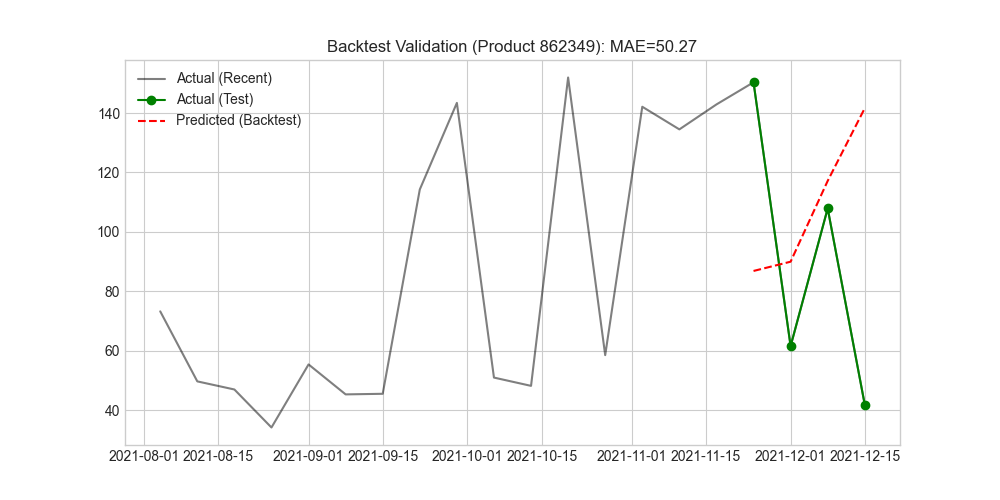

---

### POTATOES (ID: 1004906)
- **핵심 지표**:
    - **12주 예상 매출**: $1,268.19
    - **성장률 (Trend)**: 6.99%
    - **모델 신뢰도 (Medium)**: 오차율 약 44.8% (MAE: 48.3)
- **분석 코멘트**:
    - 뚜렷한 상승세가 관측됩니다. 재고 부족(Stock-out) 방지에 집중하십시오.

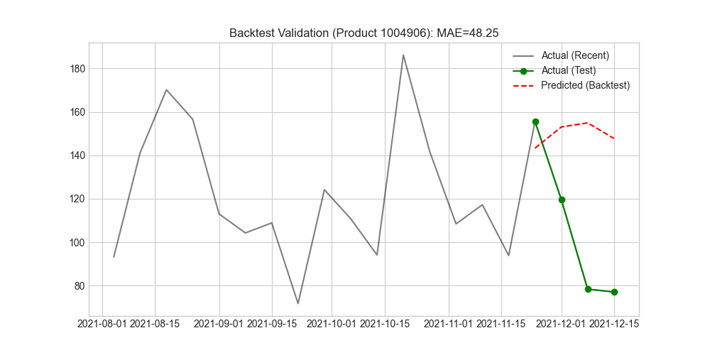

---

### BAKED BREAD/BUNS/ROLLS (ID: 951590)
- **핵심 지표**:
    - **12주 예상 매출**: $1,226.23
    - **성장률 (Trend)**: -26.64%
    - **모델 신뢰도 (Medium)**: 오차율 약 33.5% (MAE: 37.7)
- **분석 코멘트**:
    - 수요 감소가 예상됩니다. 마케팅 강화를 통한 수요 진작이 필요합니다.

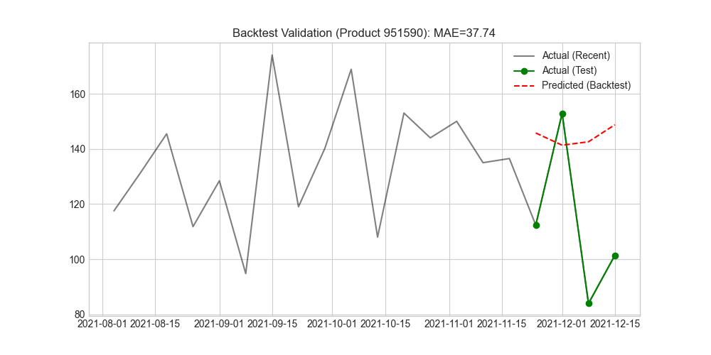

---

### BEEF (ID: 1000753)
- **핵심 지표**:
    - **12주 예상 매출**: $1,095.53
    - **성장률 (Trend)**: 0.28%
    - **모델 신뢰도 (Low)**: 오차율 약 105.4% (MAE: 67.3)
- **분석 코멘트**:
    - 안정적인 수요가 유지될 전망입니다. 정기 배송/구독 모델 도입을 검토해볼 수 있습니다.

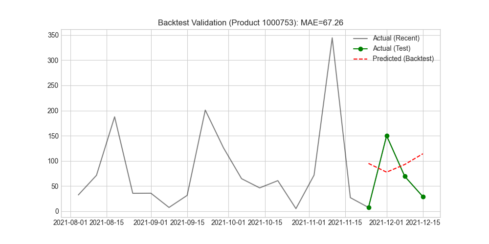

---

### BAKED BREAD/BUNS/ROLLS (ID: 883404)
- **핵심 지표**:
    - **12주 예상 매출**: $1,065.68
    - **성장률 (Trend)**: 1.45%
    - **모델 신뢰도 (High)**: 오차율 약 20.0% (MAE: 20.7)
- **분석 코멘트**:
    - 안정적인 수요가 유지될 전망입니다. 정기 배송/구독 모델 도입을 검토해볼 수 있습니다.

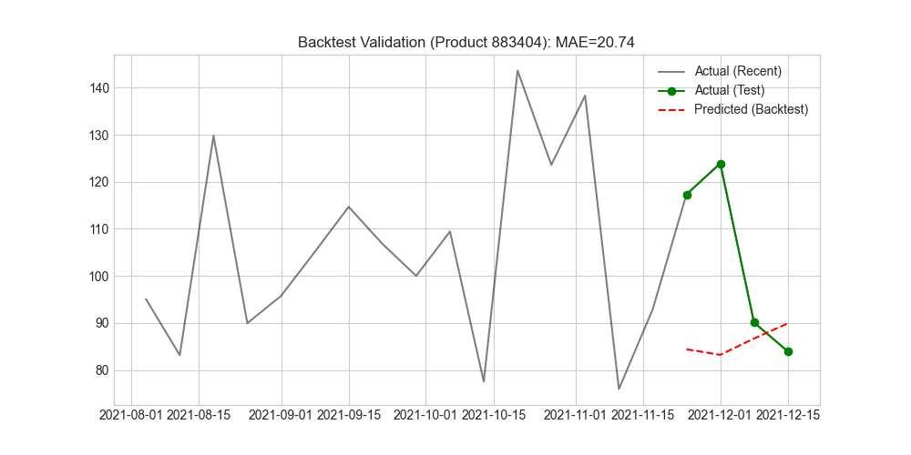

---

### CHEESE (ID: 859075)
- **핵심 지표**:
    - **12주 예상 매출**: $1,059.90
    - **성장률 (Trend)**: -3.67%
    - **모델 신뢰도 (Medium)**: 오차율 약 26.2% (MAE: 21.1)
- **분석 코멘트**:
    - 안정적인 수요가 유지될 전망입니다. 정기 배송/구독 모델 도입을 검토해볼 수 있습니다.

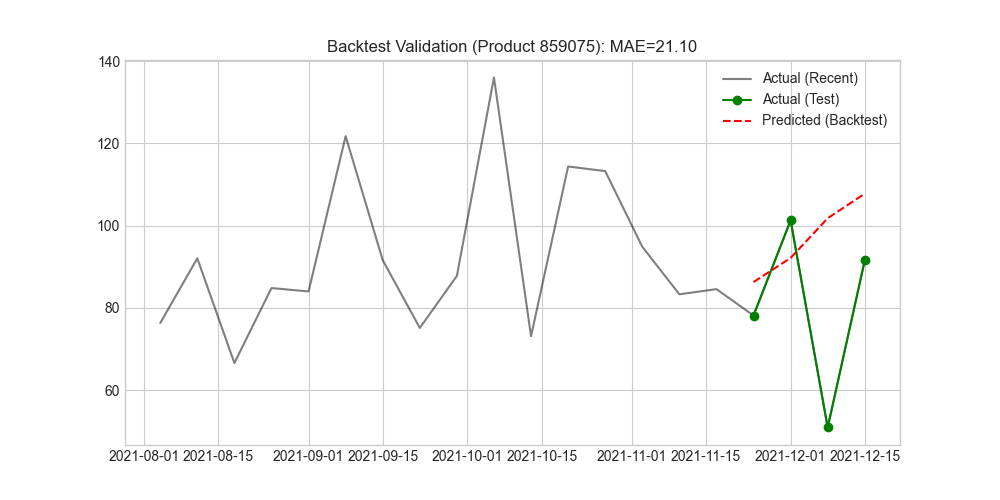

---

### MEAT - MISC (ID: 839419)
- **핵심 지표**:
    - **12주 예상 매출**: $991.29
    - **성장률 (Trend)**: 46.54%
    - **모델 신뢰도 (Medium)**: 오차율 약 35.1% (MAE: 27.6)
- **분석 코멘트**:
    - 뚜렷한 상승세가 관측됩니다. 재고 부족(Stock-out) 방지에 집중하십시오.

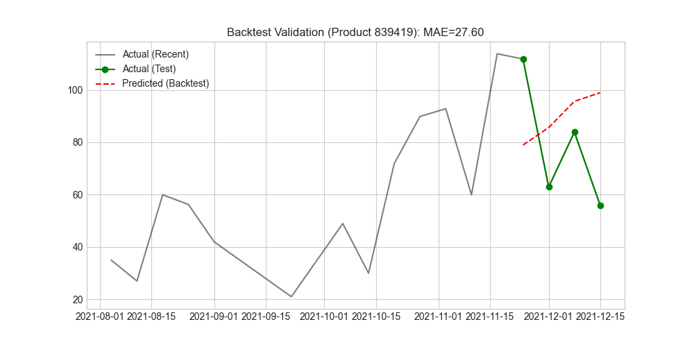

---

### PREPARED FOOD (ID: 986912)
- **핵심 지표**:
    - **12주 예상 매출**: $979.08
    - **성장률 (Trend)**: -18.56%
    - **모델 신뢰도 (Medium)**: 오차율 약 29.9% (MAE: 29.2)
- **분석 코멘트**:
    - 수요 감소가 예상됩니다. 마케팅 강화를 통한 수요 진작이 필요합니다.

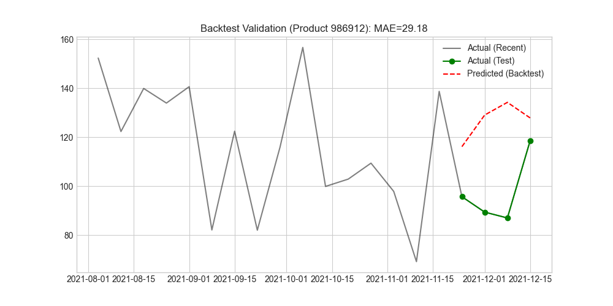

---

### BEEF (ID: 1070702)
- **핵심 지표**:
    - **12주 예상 매출**: $929.01
    - **성장률 (Trend)**: 9.82%
    - **모델 신뢰도 (Low)**: 오차율 약 117.4% (MAE: 125.1)
- **분석 코멘트**:
    - 뚜렷한 상승세가 관측됩니다. 재고 부족(Stock-out) 방지에 집중하십시오.

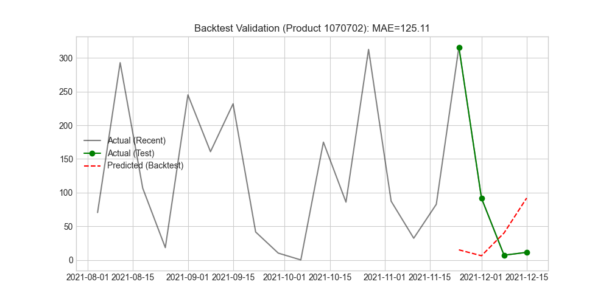

---

### CARROTS (ID: 961554)
- **핵심 지표**:
    - **12주 예상 매출**: $927.69
    - **성장률 (Trend)**: -6.52%
    - **모델 신뢰도 (High)**: 오차율 약 17.0% (MAE: 15.9)
- **분석 코멘트**:
    - 수요 감소가 예상됩니다. 마케팅 강화를 통한 수요 진작이 필요합니다.

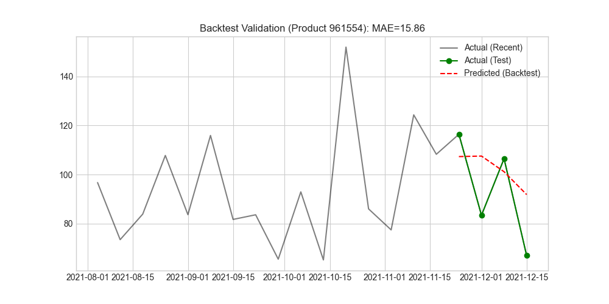

---

### CIGARETTES (ID: 1075368)
- **핵심 지표**:
    - **12주 예상 매출**: $893.87
    - **성장률 (Trend)**: -24.39%
    - **모델 신뢰도 (Medium)**: 오차율 약 42.9% (MAE: 39.8)
- **분석 코멘트**:
    - 수요 감소가 예상됩니다. 마케팅 강화를 통한 수요 진작이 필요합니다.

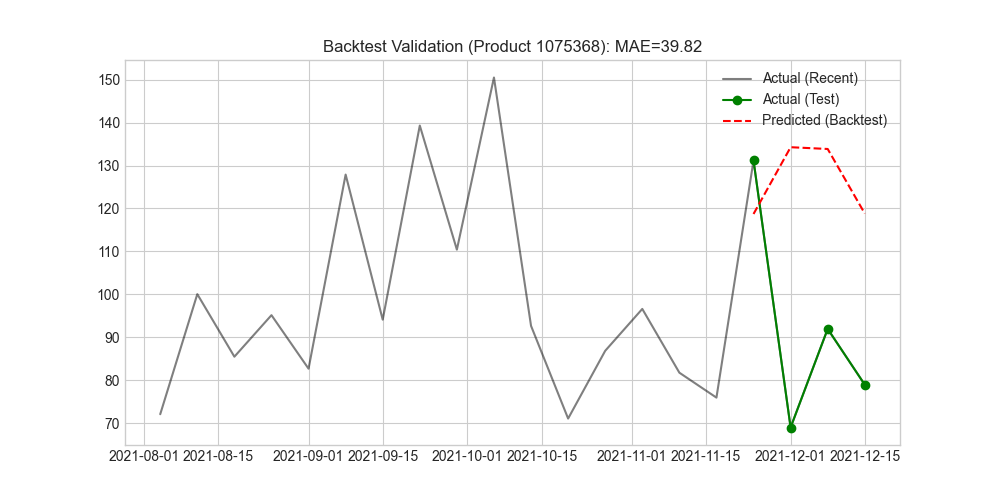

---

### TICKETS (ID: 948670)
- **핵심 지표**:
    - **12주 예상 매출**: $891.68
    - **성장률 (Trend)**: 19.91%
    - **모델 신뢰도 (Medium)**: 오차율 약 44.0% (MAE: 23.9)
- **분석 코멘트**:
    - 뚜렷한 상승세가 관측됩니다. 재고 부족(Stock-out) 방지에 집중하십시오.

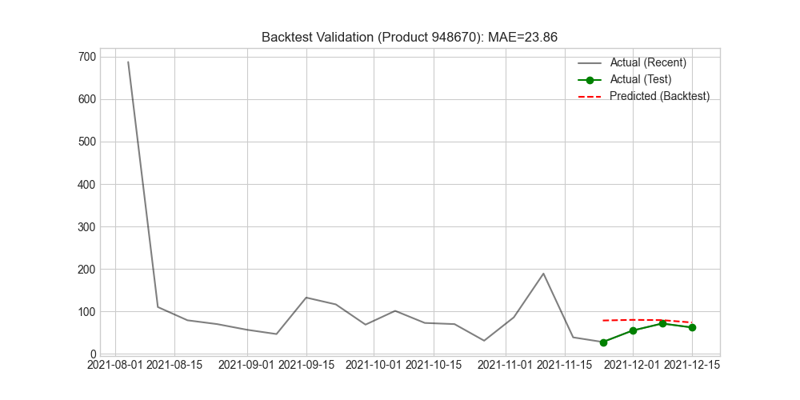

---

### TOMATOES (ID: 1081177)
- **핵심 지표**:
    - **12주 예상 매출**: $891.20
    - **성장률 (Trend)**: 39.09%
    - **모델 신뢰도 (Low)**: 오차율 약 91.0% (MAE: 59.5)
- **분석 코멘트**:
    - 뚜렷한 상승세가 관측됩니다. 재고 부족(Stock-out) 방지에 집중하십시오.

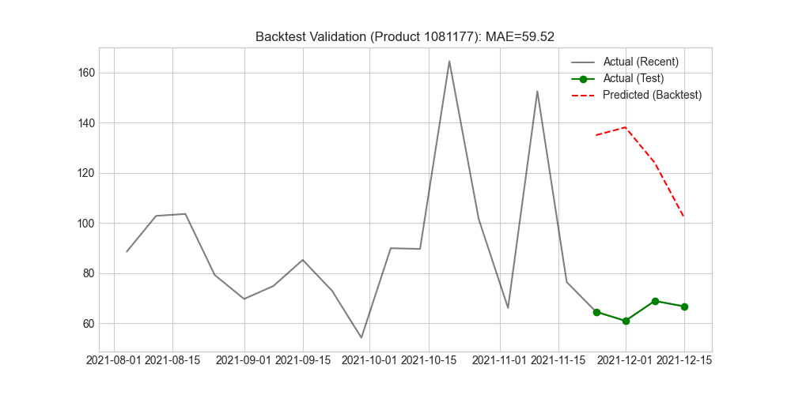

---

### BEEF (ID: 863447)
- **핵심 지표**:
    - **12주 예상 매출**: $760.20
    - **성장률 (Trend)**: -15.42%
    - **모델 신뢰도 (Low)**: 오차율 약 225.6% (MAE: 223.5)
- **분석 코멘트**:
    - 수요 감소가 예상됩니다. 마케팅 강화를 통한 수요 진작이 필요합니다.

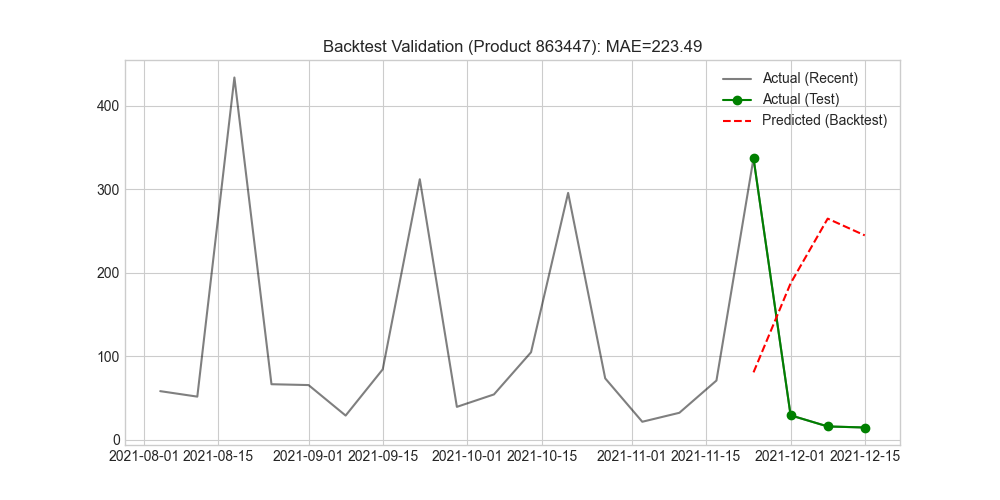

---

### EGGS (ID: 923746)
- **핵심 지표**:
    - **12주 예상 매출**: $674.60
    - **성장률 (Trend)**: 35.46%
    - **모델 신뢰도 (High)**: 오차율 약 9.6% (MAE: 7.8)
- **분석 코멘트**:
    - 뚜렷한 상승세가 관측됩니다. 재고 부족(Stock-out) 방지에 집중하십시오.

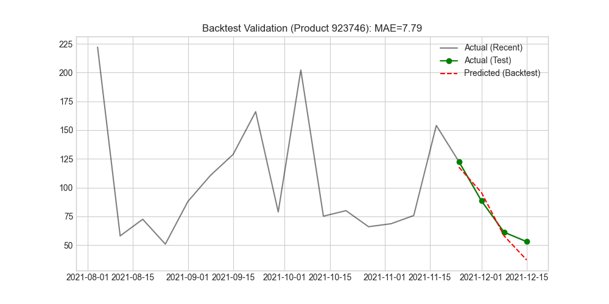

---

### SUGARS/SWEETNERS (ID: 1068719)
- **핵심 지표**:
    - **12주 예상 매출**: $661.48
    - **성장률 (Trend)**: -3.63%
    - **모델 신뢰도 (Medium)**: 오차율 약 29.4% (MAE: 16.6)
- **분석 코멘트**:
    - 안정적인 수요가 유지될 전망입니다. 정기 배송/구독 모델 도입을 검토해볼 수 있습니다.

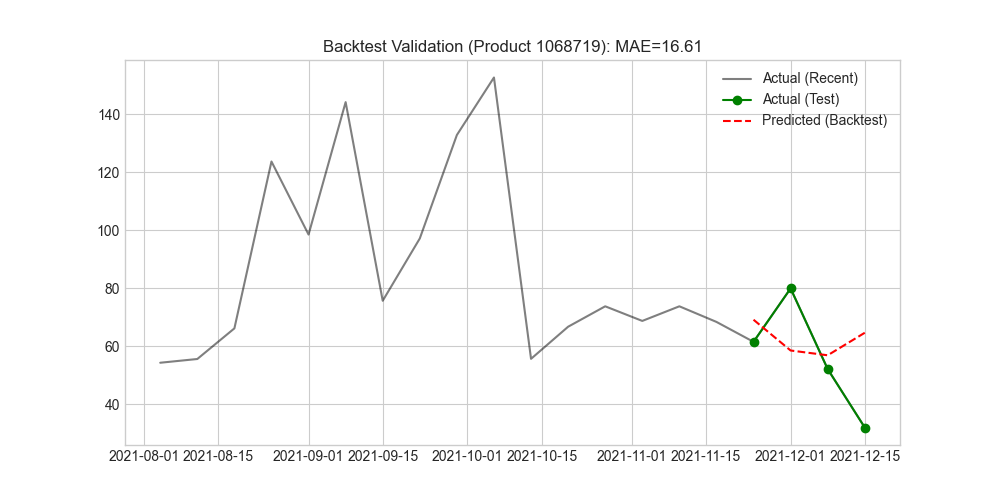

---

### CHICKEN (ID: 985999)
- **핵심 지표**:
    - **12주 예상 매출**: $641.95
    - **성장률 (Trend)**: -18.90%
    - **모델 신뢰도 (Low)**: 오차율 약 193.0% (MAE: 104.9)
- **분석 코멘트**:
    - 수요 감소가 예상됩니다. 마케팅 강화를 통한 수요 진작이 필요합니다.

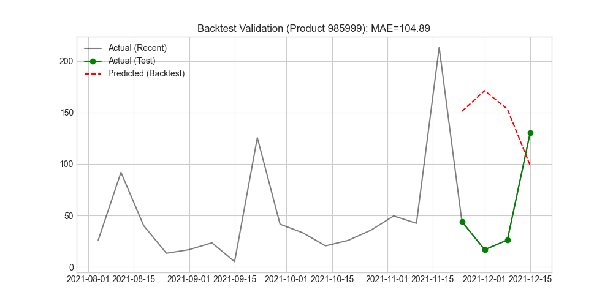

---

### DELI MEATS (ID: 933835)
- **핵심 지표**:
    - **12주 예상 매출**: $612.13
    - **성장률 (Trend)**: -27.44%
    - **모델 신뢰도 (Medium)**: 오차율 약 38.3% (MAE: 18.7)
- **분석 코멘트**:
    - 수요 감소가 예상됩니다. 마케팅 강화를 통한 수요 진작이 필요합니다.

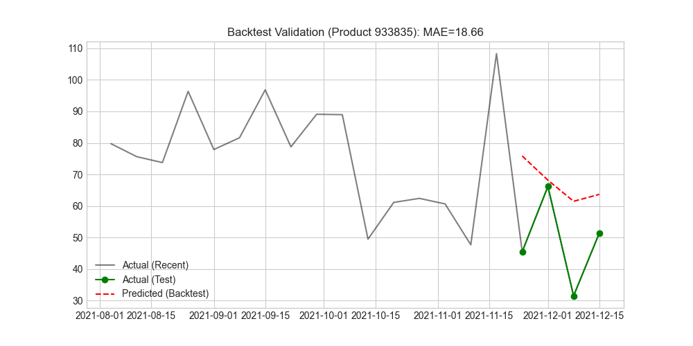

---

### MEAT - MISC (ID: 854405)
- **핵심 지표**:
    - **12주 예상 매출**: $576.96
    - **성장률 (Trend)**: -37.52%
    - **모델 신뢰도 (Low)**: 오차율 약 62.2% (MAE: 34.2)
- **분석 코멘트**:
    - 수요 감소가 예상됩니다. 마케팅 강화를 통한 수요 진작이 필요합니다.

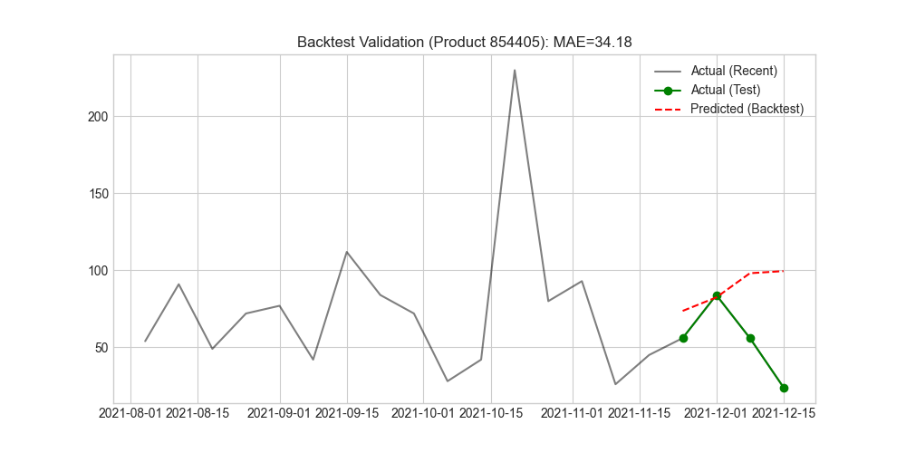

---

