# 향후 수요 예측 상세 분석 보고서

## 1. 분석 방법론
- **데이터셋**: 총 매출 기준 상위 50개 상품의 주간(Weekly) 집계 매출 데이터
- **데이터 전처리**:
    - **집계 방식**: `WEEK_NO`별 `SALES_VALUE` 합계.
    - **결측치 처리**: 매출이 없는 주차는 `0`으로 보간하여 시계열 연속성 유지.
    - **분석 대상**: 전체 기간 데이터를 학습(Train)에 사용하여 예측 정확도 극대화.

## 2. 모델링 상세
### A. Prophet (Main Model)
- **특징**: Facebook이 개발한 시계열 예측 라이브러리로, 트렌드 변화와 주기성(계절성)을 분해하여 분석.
- **설정**:
    - `yearly_seasonality=True`: 소매 데이터 특성상 연간 주기를 반영.
    - `weekly_seasonality=False`: 주간 데이터이므로 주 단위 계절성은 제외.
    - `changepoint_prior_scale`: 기본값 사용 (트렌드 변화 감지 민감도).
- **장점**: 결측치나 이상치에 강건하며, 비선형적인 성장 추세도 유연하게 포착.

### B. SARIMA (Reference Model)
- **특징**: 자기회귀(AR), 누적(I), 이동평균(MA)을 결합한 통계적 시계열 모델.
- **설정 (Fast Mode)**:
    - `auto_arima`를 통한 최적 파라미터(`p,d,q`) 자동 탐색.
    - **Non-seasonal**: 대량 처리를 위해 계절성 파라미터(`m`) 탐색 과정을 생략하고 단기 추세 중심 예측 수행.
- **역할**: Prophet 모델의 예측값이 통계적 추세와 크게 벗어나지 않는지 검증하는 기준선(Baseline) 활용.

## 3. 상품별 상세 예측 결과
> **참고**: 그래프는 `plots/future_forecasts/` 디렉토리에 저장되어 있습니다.

### COUPON/MISC ITEMS (ID: 6534178)
- **Total Forecast (12w)**: $55,900.27
- **Trend (Growth)**: 3.74%
- **Models Comparison**:
    - Prophet: $55,900.27
    - SARIMA: $62,110.29

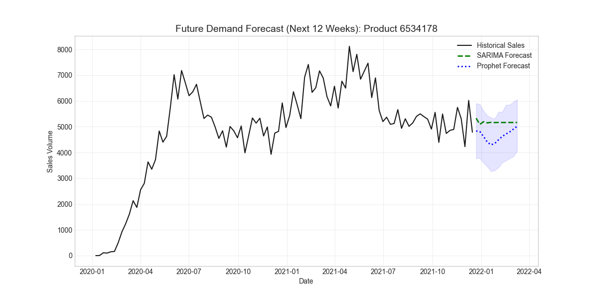

---

### COUPON/MISC ITEMS (ID: 6533889)
- **Total Forecast (12w)**: $6,676.50
- **Trend (Growth)**: -0.97%
- **Models Comparison**:
    - Prophet: $6,676.50
    - SARIMA: $6,044.18

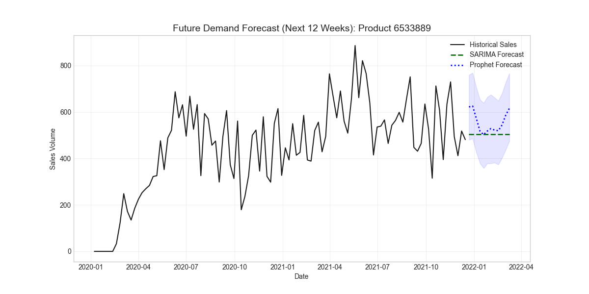

---

### FUEL (ID: 6533765)
- **Total Forecast (12w)**: $5,633.71
- **Trend (Growth)**: 19.06%
- **Models Comparison**:
    - Prophet: $5,633.71
    - SARIMA: $4,798.50

---

### COUPON/MISC ITEMS (ID: 6534166)
- **Total Forecast (12w)**: $4,906.59
- **Trend (Growth)**: -23.55%
- **Models Comparison**:
    - Prophet: $4,906.59
    - SARIMA: $3,955.61

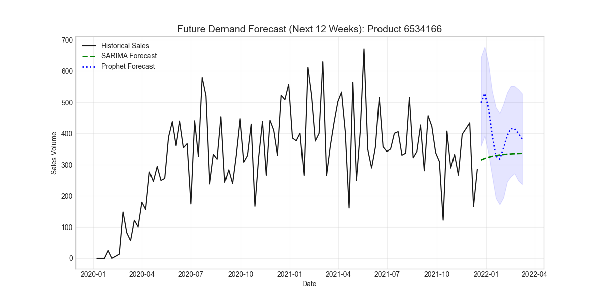

---

### FLUID MILK PRODUCTS (ID: 1029743)
- **Total Forecast (12w)**: $4,557.64
- **Trend (Growth)**: -7.88%
- **Models Comparison**:
    - Prophet: $4,557.64
    - SARIMA: $5,592.70

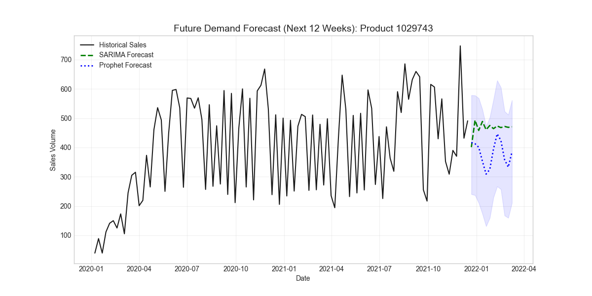

---

### FLUID MILK PRODUCTS (ID: 995242)
- **Total Forecast (12w)**: $4,155.90
- **Trend (Growth)**: -8.37%
- **Models Comparison**:
    - Prophet: $4,155.90
    - SARIMA: $3,627.54

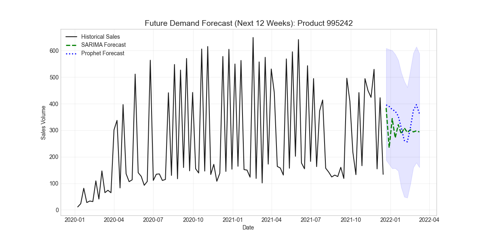

---

### CHICKEN (ID: 916122)
- **Total Forecast (12w)**: $3,792.96
- **Trend (Growth)**: 4.39%
- **Models Comparison**:
    - Prophet: $3,792.96
    - SARIMA: $3,440.06

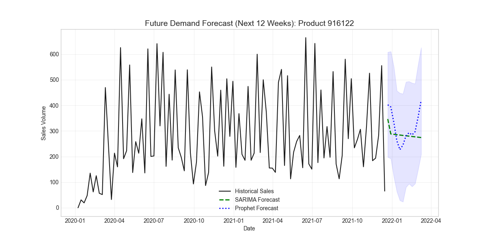

---

### TROPICAL FRUIT (ID: 1082185)
- **Total Forecast (12w)**: $3,603.75
- **Trend (Growth)**: -6.56%
- **Models Comparison**:
    - Prophet: $3,603.75
    - SARIMA: $3,848.61

---

### BERRIES (ID: 1127831)
- **Total Forecast (12w)**: $3,403.56
- **Trend (Growth)**: 42.85%
- **Models Comparison**:
    - Prophet: $3,403.56
    - SARIMA: $32.80

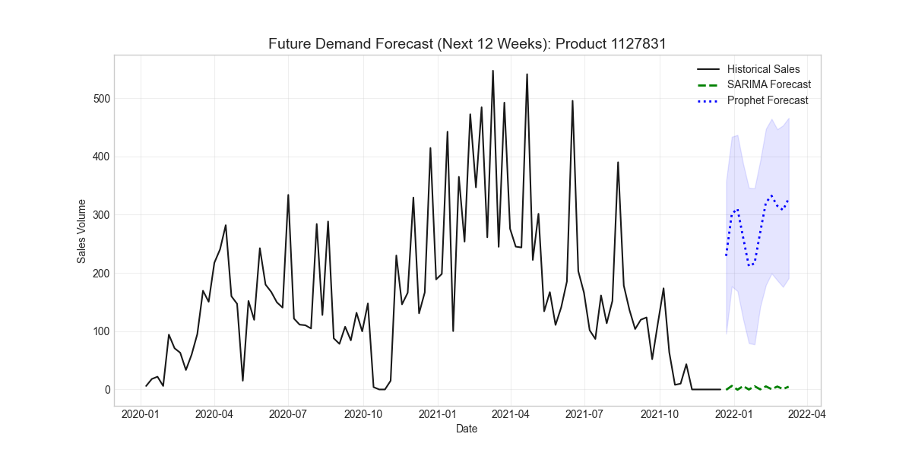

---

### SOFT DRINKS (ID: 5569230)
- **Total Forecast (12w)**: $3,395.59
- **Trend (Growth)**: -0.15%
- **Models Comparison**:
    - Prophet: $3,395.59
    - SARIMA: $2,782.54

---

### FLUID MILK PRODUCTS (ID: 1106523)
- **Total Forecast (12w)**: $3,318.05
- **Trend (Growth)**: -7.51%
- **Models Comparison**:
    - Prophet: $3,318.05
    - SARIMA: $3,593.34

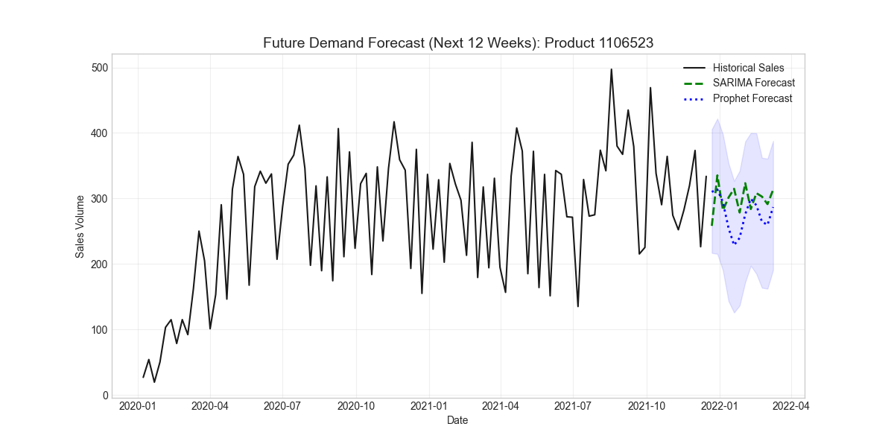

---

### BEEF (ID: 1044078)
- **Total Forecast (12w)**: $2,969.05
- **Trend (Growth)**: -58.26%
- **Models Comparison**:
    - Prophet: $2,969.05
    - SARIMA: $2,223.11

---

### BEEF (ID: 844179)
- **Total Forecast (12w)**: $2,676.82
- **Trend (Growth)**: 3.73%
- **Models Comparison**:
    - Prophet: $2,676.82
    - SARIMA: $2,953.39

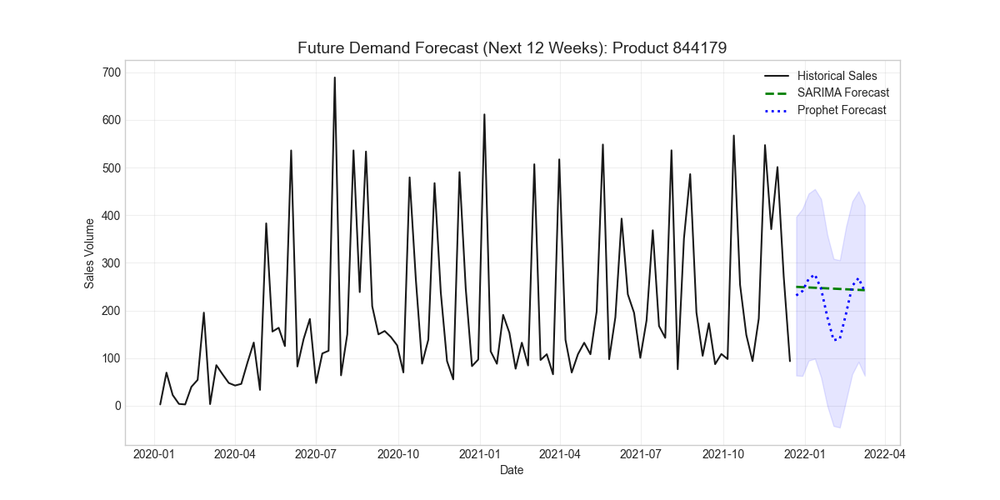

---

### BEEF (ID: 874972)
- **Total Forecast (12w)**: $2,480.54
- **Trend (Growth)**: 239.99%
- **Models Comparison**:
    - Prophet: $2,480.54
    - SARIMA: $1,825.12

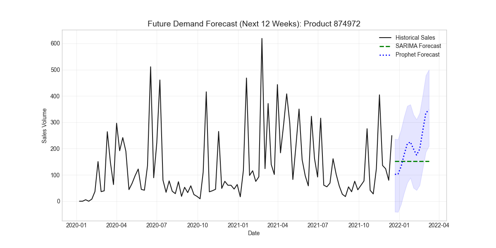

---

### PORK (ID: 12810393)
- **Total Forecast (12w)**: $2,364.27
- **Trend (Growth)**: -5.62%
- **Models Comparison**:
    - Prophet: $2,364.27
    - SARIMA: $1,427.21

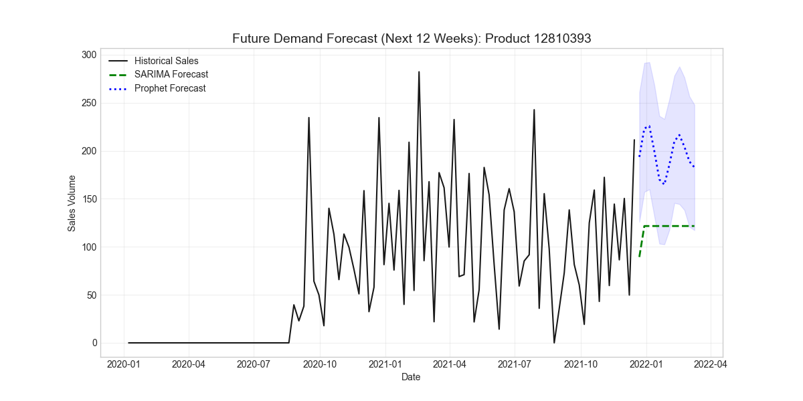

---

### FLUID MILK PRODUCTS (ID: 1133018)
- **Total Forecast (12w)**: $2,358.30
- **Trend (Growth)**: -2.83%
- **Models Comparison**:
    - Prophet: $2,358.30
    - SARIMA: $1,764.71

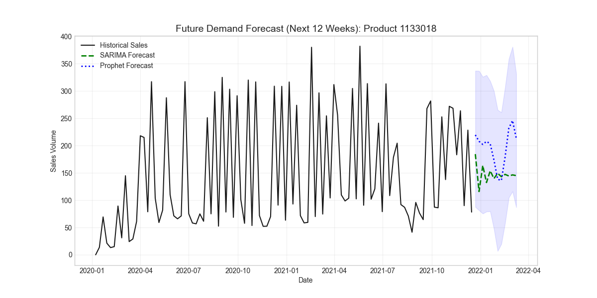

---

### PORK (ID: 12810391)
- **Total Forecast (12w)**: $2,104.04
- **Trend (Growth)**: 61.96%
- **Models Comparison**:
    - Prophet: $2,104.04
    - SARIMA: $905.99

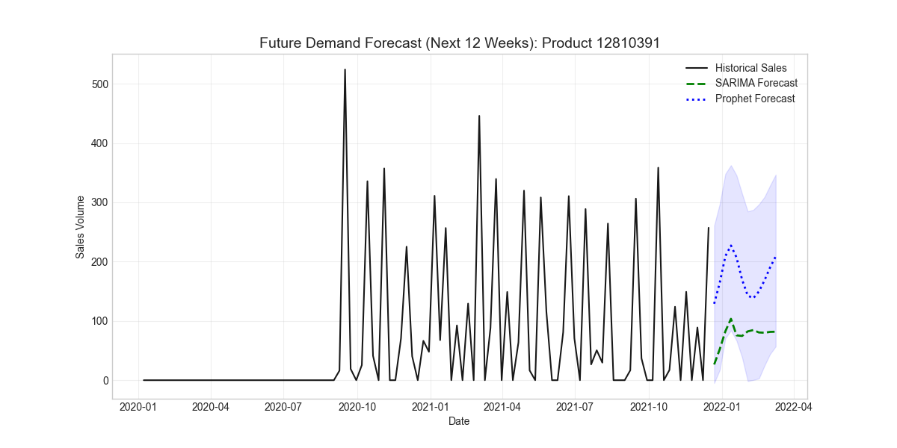

---

### GRAPES (ID: 866211)
- **Total Forecast (12w)**: $1,866.25
- **Trend (Growth)**: -39.45%
- **Models Comparison**:
    - Prophet: $1,866.25
    - SARIMA: $1,582.02

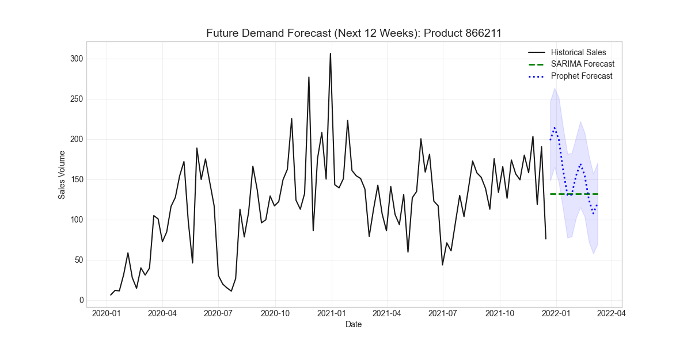

---

### SOFT DRINKS (ID: 5569471)
- **Total Forecast (12w)**: $1,844.49
- **Trend (Growth)**: 8.44%
- **Models Comparison**:
    - Prophet: $1,844.49
    - SARIMA: $1,513.30

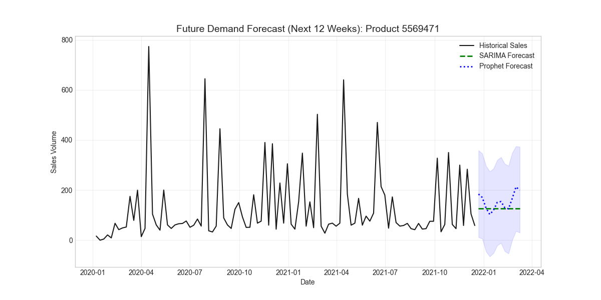

---

### FLUID MILK PRODUCTS (ID: 1126899)
- **Total Forecast (12w)**: $1,840.62
- **Trend (Growth)**: -27.42%
- **Models Comparison**:
    - Prophet: $1,840.62
    - SARIMA: $2,201.23

---

### SALAD BAR (ID: 1005186)
- **Total Forecast (12w)**: $1,695.08
- **Trend (Growth)**: -13.02%
- **Models Comparison**:
    - Prophet: $1,695.08
    - SARIMA: $1,810.80

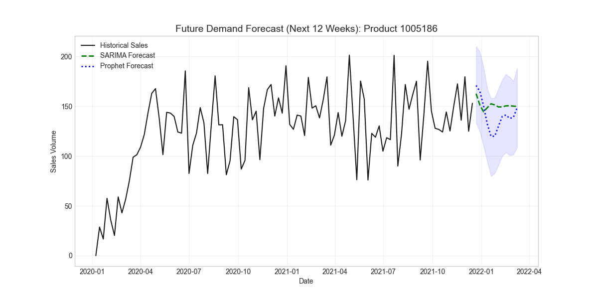

---

### FLUID MILK PRODUCTS (ID: 1070820)
- **Total Forecast (12w)**: $1,679.85
- **Trend (Growth)**: -3.67%
- **Models Comparison**:
    - Prophet: $1,679.85
    - SARIMA: $1,726.40

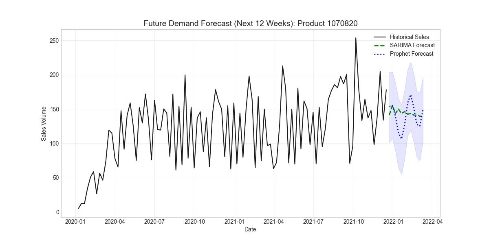

---

### TOMATOES (ID: 854852)
- **Total Forecast (12w)**: $1,652.45
- **Trend (Growth)**: 78.24%
- **Models Comparison**:
    - Prophet: $1,652.45
    - SARIMA: $1,230.95

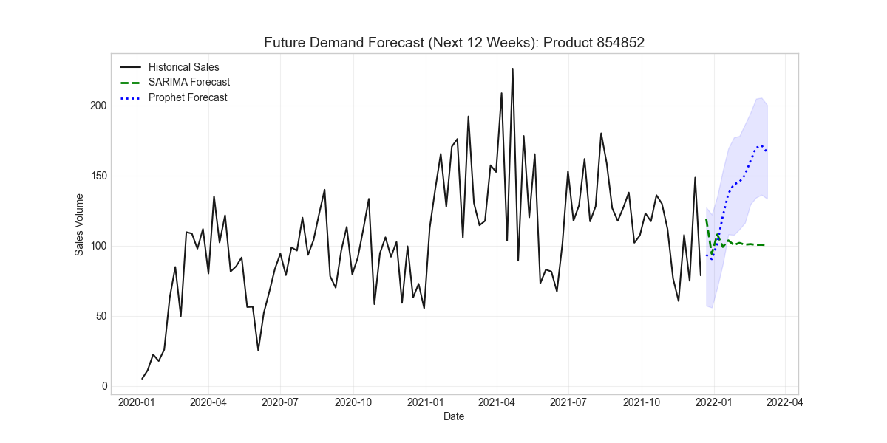

---

### GRAPES (ID: 878996)
- **Total Forecast (12w)**: $1,583.17
- **Trend (Growth)**: -24.39%
- **Models Comparison**:
    - Prophet: $1,583.17
    - SARIMA: $1,180.74

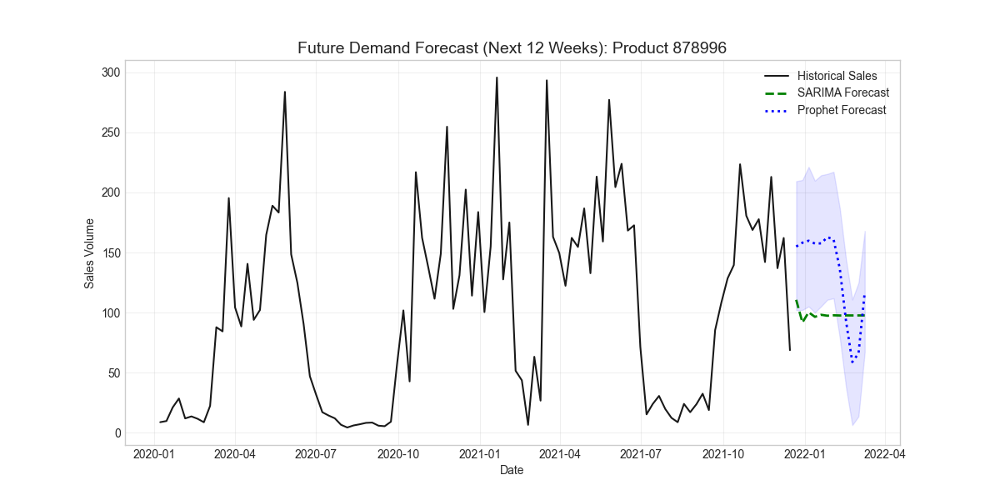

---

### POTATOES (ID: 899624)
- **Total Forecast (12w)**: $1,560.60
- **Trend (Growth)**: -7.00%
- **Models Comparison**:
    - Prophet: $1,560.60
    - SARIMA: $1,301.62

---

### COUPON/MISC ITEMS (ID: 6544236)
- **Total Forecast (12w)**: $1,478.02
- **Trend (Growth)**: 130.71%
- **Models Comparison**:
    - Prophet: $1,478.02
    - SARIMA: $645.18

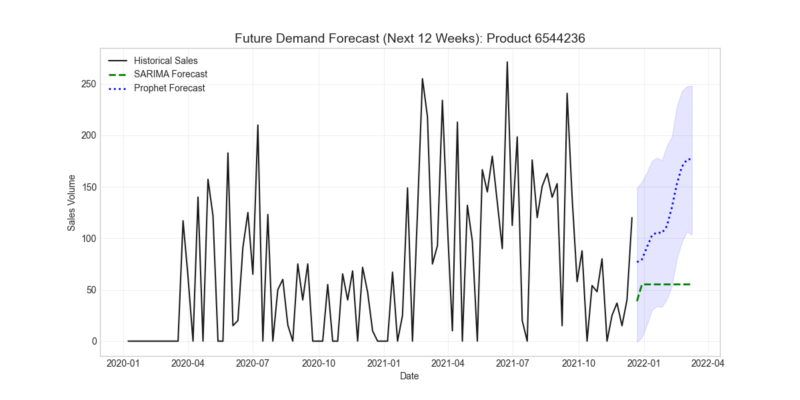

---

### EGGS (ID: 981760)
- **Total Forecast (12w)**: $1,432.41
- **Trend (Growth)**: -40.79%
- **Models Comparison**:
    - Prophet: $1,432.41
    - SARIMA: $1,600.11

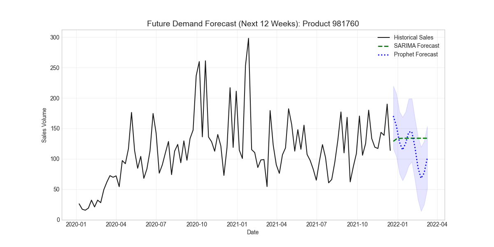

---

### FLUID MILK PRODUCTS (ID: 908531)
- **Total Forecast (12w)**: $1,409.14
- **Trend (Growth)**: -12.61%
- **Models Comparison**:
    - Prophet: $1,409.14
    - SARIMA: $1,059.73

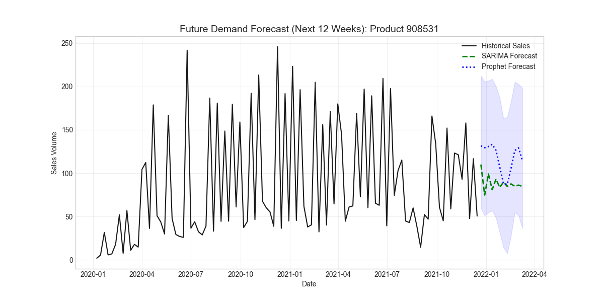

---

### SOFT DRINKS (ID: 8090521)
- **Total Forecast (12w)**: $1,385.99
- **Trend (Growth)**: 16.63%
- **Models Comparison**:
    - Prophet: $1,385.99
    - SARIMA: $1,368.70

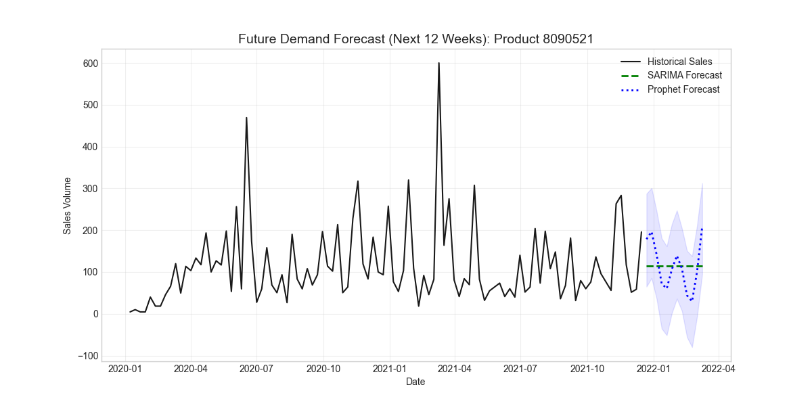

---

### SOFT DRINKS (ID: 8090537)
- **Total Forecast (12w)**: $1,385.89
- **Trend (Growth)**: 0.36%
- **Models Comparison**:
    - Prophet: $1,385.89
    - SARIMA: $1,291.12

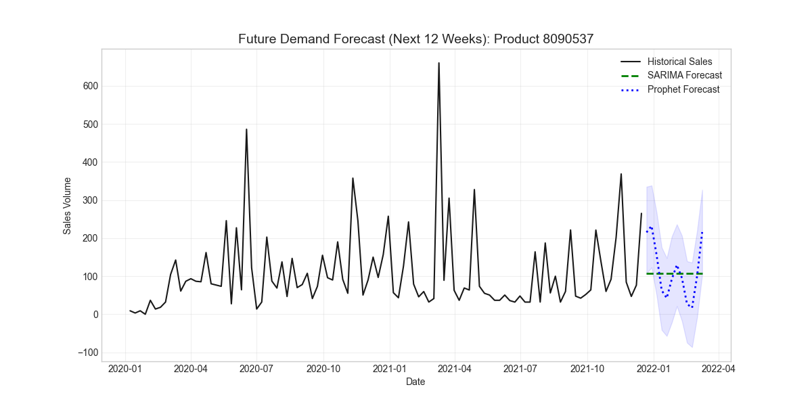

---

### FLUID MILK PRODUCTS (ID: 1058997)
- **Total Forecast (12w)**: $1,379.06
- **Trend (Growth)**: -7.07%
- **Models Comparison**:
    - Prophet: $1,379.06
    - SARIMA: $1,165.15

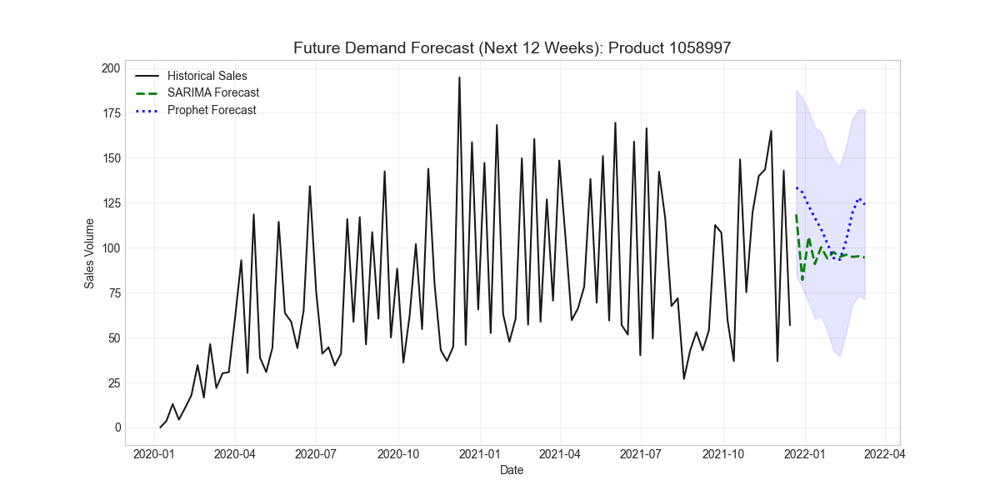

---

### FLUID MILK PRODUCTS (ID: 862349)
- **Total Forecast (12w)**: $1,304.90
- **Trend (Growth)**: 12.54%
- **Models Comparison**:
    - Prophet: $1,304.90
    - SARIMA: $1,094.79

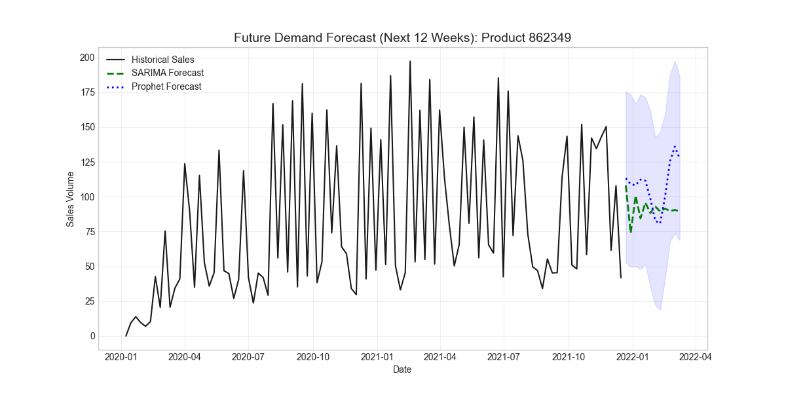

---

### POTATOES (ID: 1004906)
- **Total Forecast (12w)**: $1,268.19
- **Trend (Growth)**: 6.99%
- **Models Comparison**:
    - Prophet: $1,268.19
    - SARIMA: $1,067.95

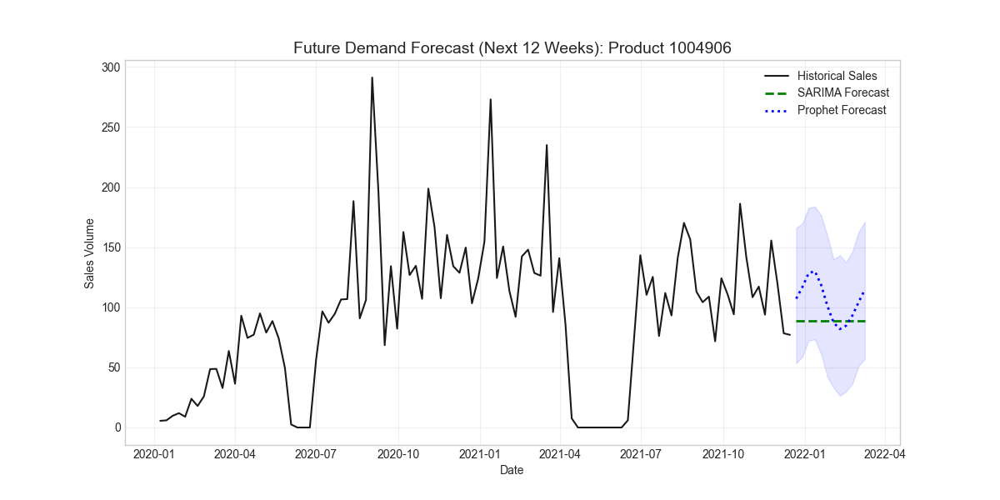

---

### BAKED BREAD/BUNS/ROLLS (ID: 951590)
- **Total Forecast (12w)**: $1,226.23
- **Trend (Growth)**: -26.64%
- **Models Comparison**:
    - Prophet: $1,226.23
    - SARIMA: $1,016.61

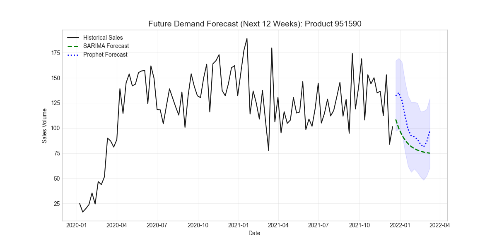

---

### BEEF (ID: 1000753)
- **Total Forecast (12w)**: $1,095.53
- **Trend (Growth)**: 0.28%
- **Models Comparison**:
    - Prophet: $1,095.53
    - SARIMA: $1,133.09

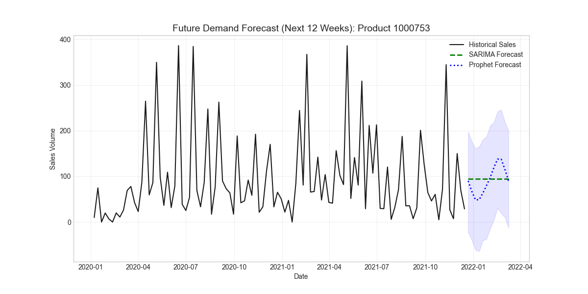

---

### BAKED BREAD/BUNS/ROLLS (ID: 883404)
- **Total Forecast (12w)**: $1,065.68
- **Trend (Growth)**: 1.45%
- **Models Comparison**:
    - Prophet: $1,065.68
    - SARIMA: $1,174.13

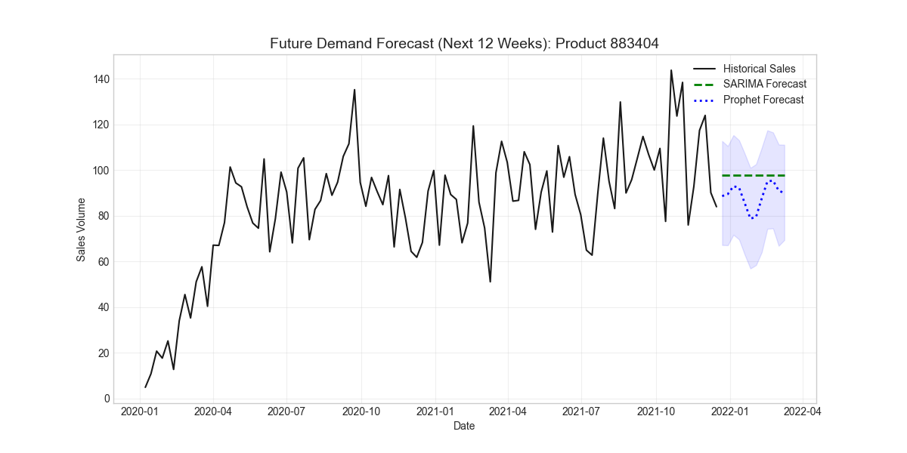

---

### CHEESE (ID: 859075)
- **Total Forecast (12w)**: $1,059.90
- **Trend (Growth)**: -3.67%
- **Models Comparison**:
    - Prophet: $1,059.90
    - SARIMA: $951.72

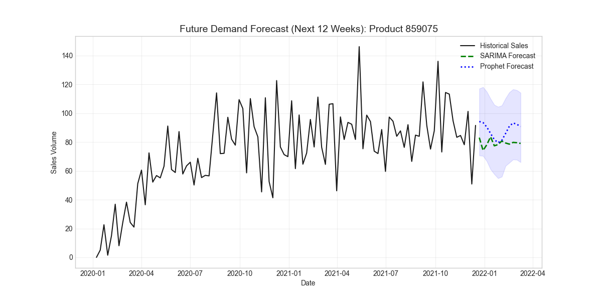

---

### MEAT - MISC (ID: 839419)
- **Total Forecast (12w)**: $991.29
- **Trend (Growth)**: 46.54%
- **Models Comparison**:
    - Prophet: $991.29
    - SARIMA: $813.97

---

### PREPARED FOOD (ID: 986912)
- **Total Forecast (12w)**: $979.08
- **Trend (Growth)**: -18.56%
- **Models Comparison**:
    - Prophet: $979.08
    - SARIMA: $1,190.51

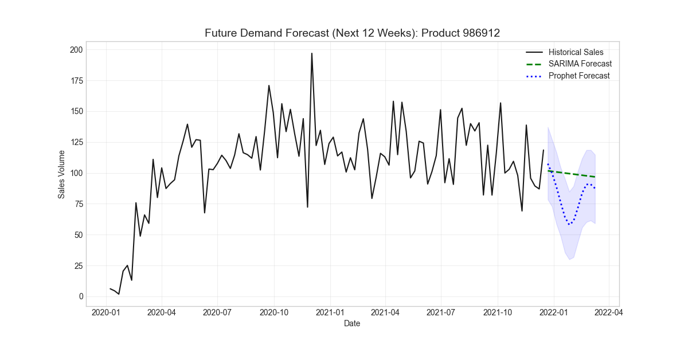

---

### BEEF (ID: 1070702)
- **Total Forecast (12w)**: $929.01
- **Trend (Growth)**: 9.82%
- **Models Comparison**:
    - Prophet: $929.01
    - SARIMA: $1,057.61

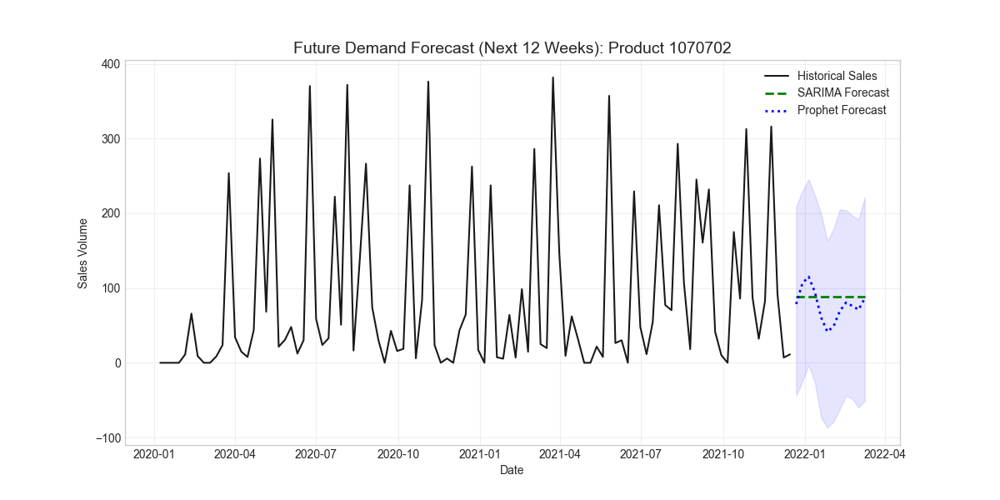

---

### CARROTS (ID: 961554)
- **Total Forecast (12w)**: $927.69
- **Trend (Growth)**: -6.52%
- **Models Comparison**:
    - Prophet: $927.69
    - SARIMA: $1,262.80

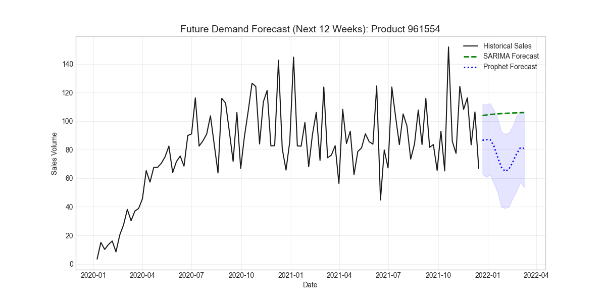

---

### CIGARETTES (ID: 1075368)
- **Total Forecast (12w)**: $893.87
- **Trend (Growth)**: -24.39%
- **Models Comparison**:
    - Prophet: $893.87
    - SARIMA: $1,034.36

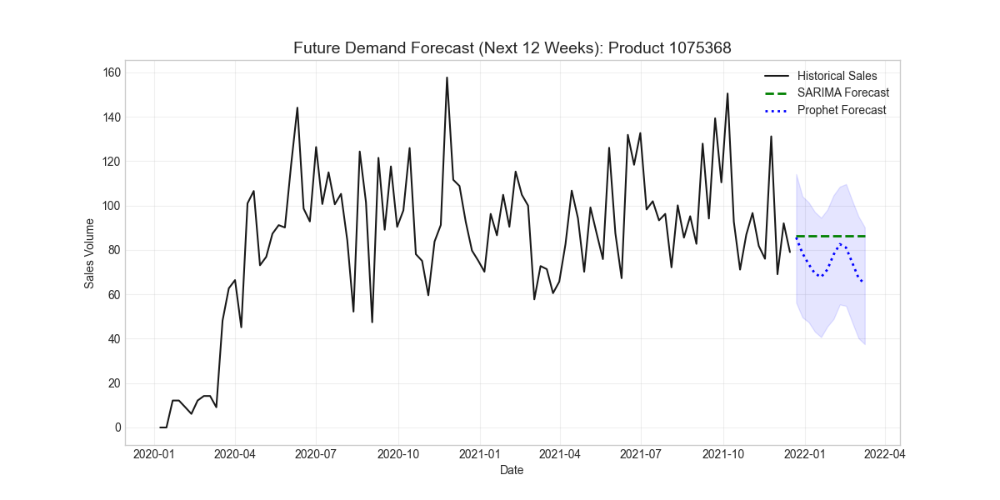

---

### TICKETS (ID: 948670)
- **Total Forecast (12w)**: $891.68
- **Trend (Growth)**: 19.91%
- **Models Comparison**:
    - Prophet: $891.68
    - SARIMA: $813.58

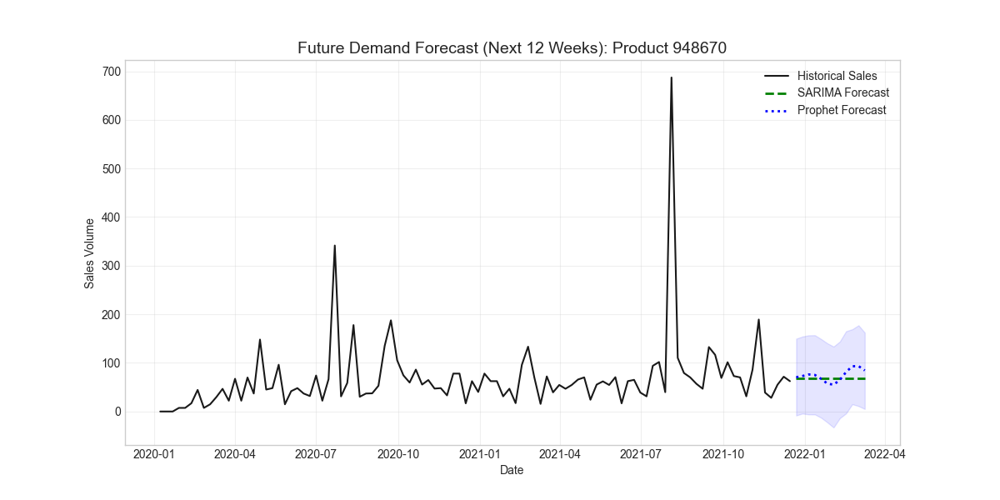

---

### TOMATOES (ID: 1081177)
- **Total Forecast (12w)**: $891.20
- **Trend (Growth)**: 39.09%
- **Models Comparison**:
    - Prophet: $891.20
    - SARIMA: $895.25

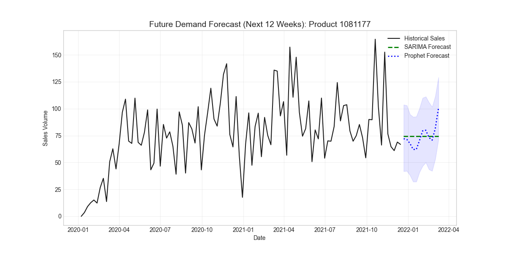

---

### BEEF (ID: 863447)
- **Total Forecast (12w)**: $760.20
- **Trend (Growth)**: -15.42%
- **Models Comparison**:
    - Prophet: $760.20
    - SARIMA: $1,066.28

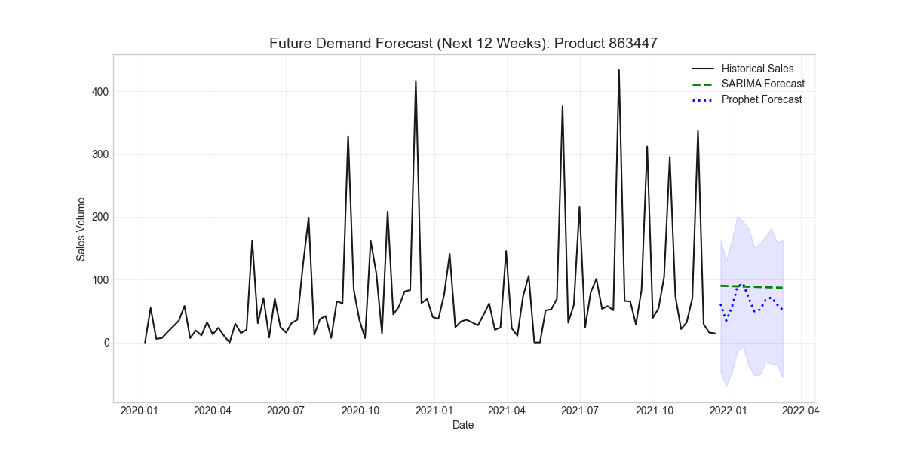

---

### EGGS (ID: 923746)
- **Total Forecast (12w)**: $674.60
- **Trend (Growth)**: 35.46%
- **Models Comparison**:
    - Prophet: $674.60
    - SARIMA: $925.56

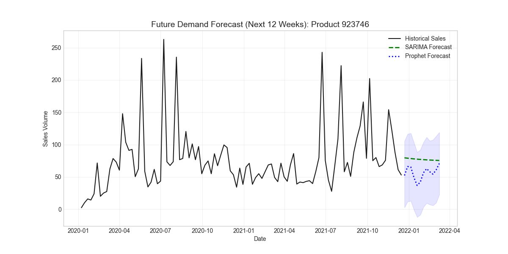

---

### SUGARS/SWEETNERS (ID: 1068719)
- **Total Forecast (12w)**: $661.48
- **Trend (Growth)**: -3.63%
- **Models Comparison**:
    - Prophet: $661.48
    - SARIMA: $715.14

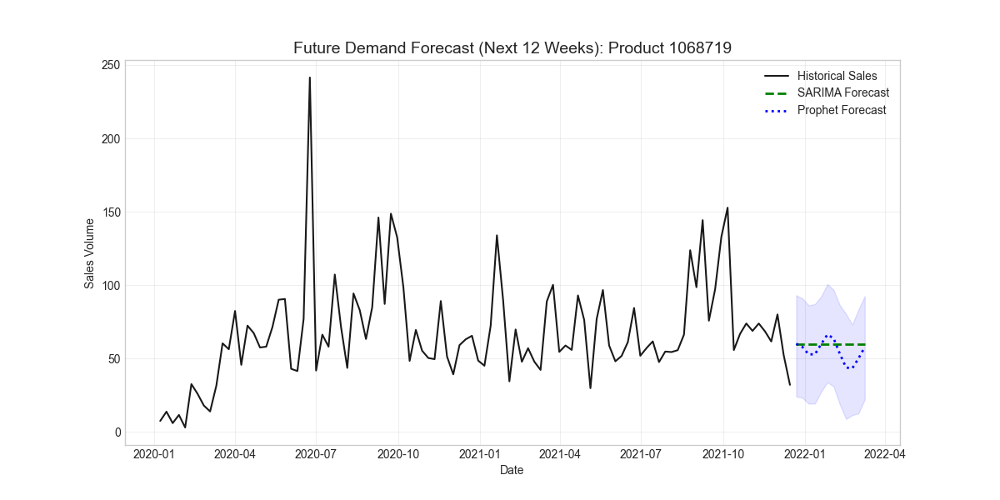

---

### CHICKEN (ID: 985999)
- **Total Forecast (12w)**: $641.95
- **Trend (Growth)**: -18.90%
- **Models Comparison**:
    - Prophet: $641.95
    - SARIMA: $816.47

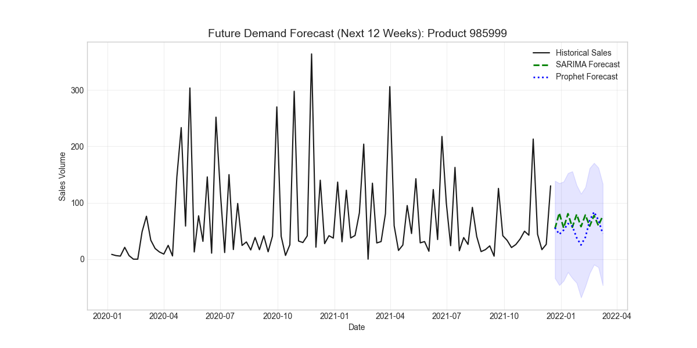

---

### DELI MEATS (ID: 933835)
- **Total Forecast (12w)**: $612.13
- **Trend (Growth)**: -27.44%
- **Models Comparison**:
    - Prophet: $612.13
    - SARIMA: $651.71

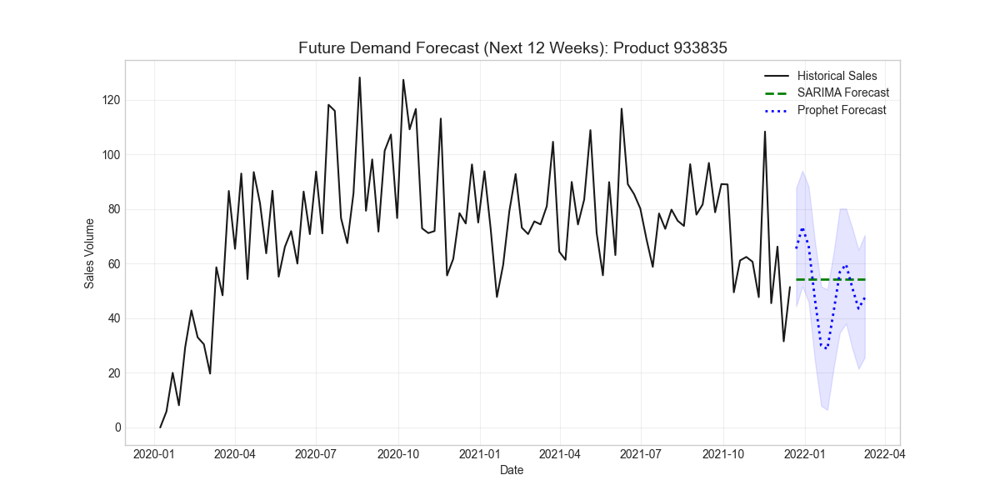

---

### MEAT - MISC (ID: 854405)
- **Total Forecast (12w)**: $576.96
- **Trend (Growth)**: -37.52%
- **Models Comparison**:
    - Prophet: $576.96
    - SARIMA: $910.21

---

